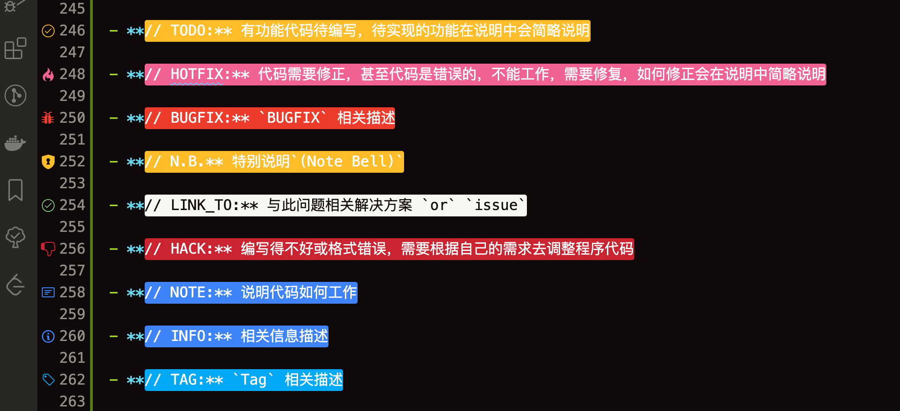
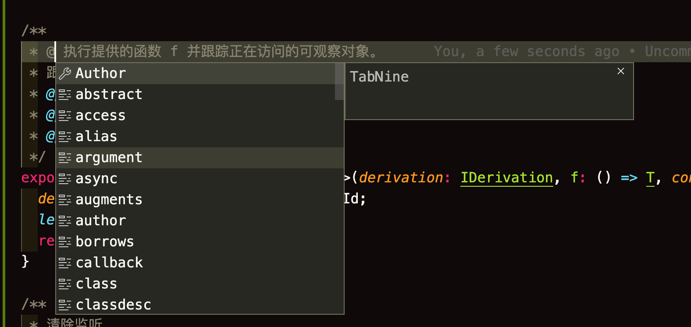
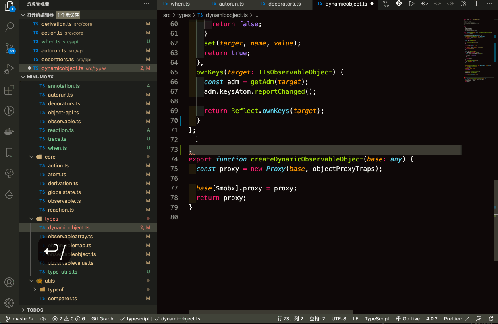
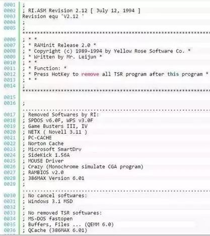
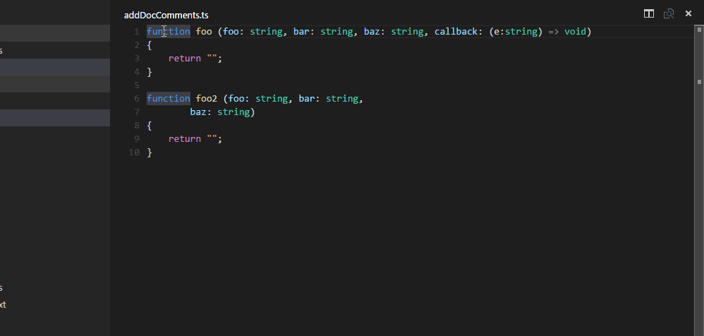
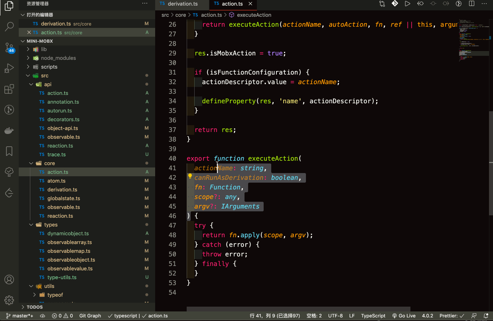
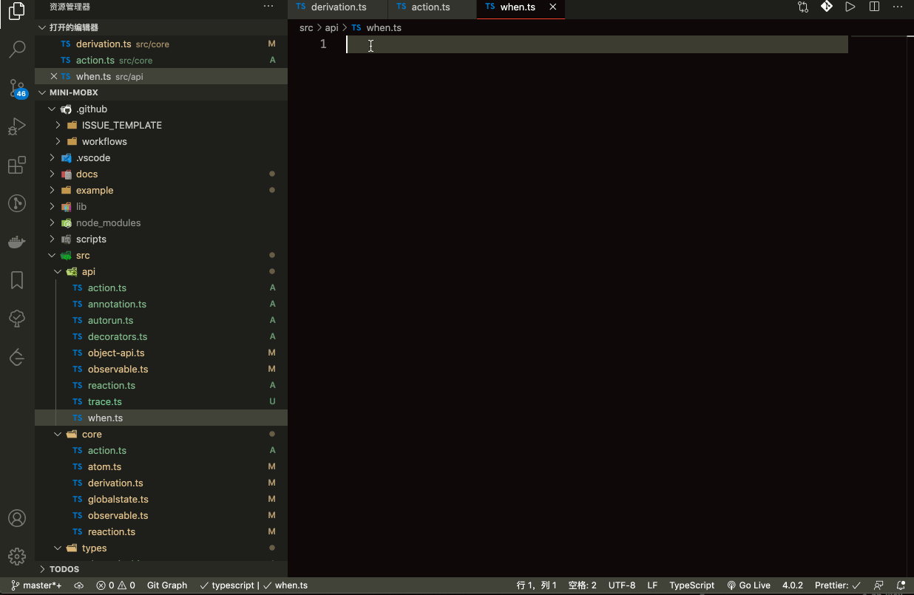
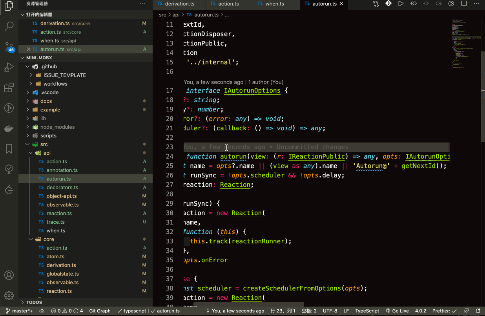

### 什么是注释

> 在[计算机语言](https://zh.wikipedia.org/wiki/计算机语言)中，**注释**是[计算机语言](https://zh.wikipedia.org/wiki/计算机语言)的一个重要组成部分，用于在[源代码](https://zh.wikipedia.org/wiki/源代码)中解释代码的功用，可以增强程序的可读性，可维护性，或者用于在源代码中处理不需运行的代码段，来调试程序的功能执行。
>
> 注释在随源代码进入[预处理器](https://zh.wikipedia.org/wiki/预处理器)或[编译器](https://zh.wikipedia.org/wiki/编译器)处理后会被移除，不会在[目标代码](https://zh.wikipedia.org/wiki/目标代码)中保留其相关信息。

### 写代码到底要不要写注释

> Clean code should read like well-written prose. — Robert C. Martin(罗伯特·塞西尔·马丁)
>
> — Robert C. Martin(罗伯特·塞西尔·马丁)

著名诗人**雷某**也说


那么像诗一样优雅的代码，要不要写 **标注** `or` **注释**呢？为什么呢？

也许你会说

- **代码即注释** ( 我 🔪 呢，让我手刃了你这货 )
- **注释很重要，每一个地方都需要留注释** ( emm, 看来很闲，闲出病来了，来，把这几个需求实现了 💻   )

这些想法多半是偷懒的思路，你还别想了，**Now**，是时候展现我真正的技术了，📽📽📽

我觉得注释是**必须要**的, 也是**不需要**的。

很多开发者，由于需求更新迭代太快 `or` 个人习惯等一系列的原因，**手撸千万行，都不曾留下一言半语的注释**，**Maybe 你的代码和雷老板的诗一样优雅吧**，`but` 你能确保很长一段时间后你还能看得懂吗？你能保证接你代码的人能看得懂你的代码嘛？你能，你能，你能，🙅‍♀️不不不，你不行。所以必须要注释，那为什么又说不需要注释呢？

注释就是对代码的解释和说明。用于**代码内容的总结**<sup>①</sup>、**表达开发者的意图**<sup>②</sup>， 为了让别人和自己很容易看懂，一看就知道这段代码是做什么用的。

**Note:**

**① 代码中的总结**

  简化代码为一句或两句话，这种注释比重复代码更有价值，能帮助人快速理解代码

**② 代码意图的描述**

  解释代码的目的。意图注释在问题一级上，而不是在答案一级，是一句利用答案的总结描述。『理解最初的编程意图是最难的问题』

那就要知道什么注释需要注释，什么不需要？什么才是好的注释，什么是坏的注释？

### 正确注释 VS 错误注释 <sup>参考 代码整洁之道</sup>

正确的注释一般包括**序言性注释**和**功能性注释**。

-   序言性注释的主要内容包括 **模块的接口、数据的描述和模块的功能**。

-   模块的功能性注释的主要内容包括 **程序段的功能、语句的功能和数据的状态**。

当然了，代码注释也可能存在误导、不适用或者提供错误信息，那么坏的注释都有哪些特性？

-   **多余的注释**

  简单明了的函数，其函数注释说明纯属多余，读注释的时间可能多余读函数代码的时间

-   **误导性注释**

  注释不够精确，存在与实际运行不相符的情况，误导使用者进行错误的处理

-   **日志性注释**

  在每个模块开始添加每一次修改的注释性日志已经没有必要，现在很多代码维护工具提供更好的修改记录

-   **废话注释**

  见名知意的就不要废话了，`Eg:`

  ```js
  // 获取名字 ------> 废话
  const getUserName = profile.name;
  ```

-   **循规式注释**

  每个函数或者每个变量都有标准的注释完全没有必要，除非是编写公共 API

### 注释的种类 <sup>参考代码大全</sup>

注释可以分成五类

- 代码的重复

  重复的注释，用不同的词重申了代码的内容。它没有给读者提供代码的附加信息。

- 代码的解释

  解释性注释，典型地用于解释复杂的，有效的和灵敏的代码段。这种情况下，他们是有用的，但常常是由于代码是易混淆的。假如代码复杂到需要解释，那么改进代码总比增加注释更 好些。使代码本身清晰，然后使用总结或注释。

- 代码中的标记

  标记注释并非是故意留在代码中的注释。它是给开发者的记录，表示工作还未做。一些开发者的标记注释为语法错误的标记（例如**// TODO**），因而编译程序标记它并提醒他们要 做更多的工作。其它开发者把一套特殊字符放人注释中，因而他们可以发现它们，但编译程序 不能识别它们。

- 代码的总结

  总结代码的注释做法是；它简化一些代码行成一或两句话。这样的注释比起仅重复代码而 使读者比读代码更快的那种注释更有价值了。总结注释是相当有用的，特别是当其它人但不是 代码的编者试图修改代码时。

- 代码意图的描述

  意图这一层上的注释，解释了代码的目的。意图注释在问题一级上，而不是在答案一级操作。

### 注释的分类

>  PS: 我还查了下这个 👉👉👉 “分类”是按某种规则划分，而“种类”是划分后的一个结果。

#### 行注释

在符号后那一行不会被编译(显示), 行代码可以写在语句上面，也可以写在语句后面，看个人习惯，我个人习惯在上面👆，因为好看啊。😛😛😛

#### 块注释

被块注释符号中间的部分不会被编译。

### 如何写注释

#### 注释风格

`//` 或 `/* */` 都可以; 但 `//` **更常用**。 要在如何注释及注释风格上确保统一。

#### 文件注释

每个文件都应该包含许可证引用. 为项目选择合适的许可证版本。(比如, Apache 2.0, BSD, LGPL, GPL)

如果你对原始作者的文件做了重大修改, 请考虑删除原作者信息。

`Eg: mobx`

```js
/**
 * (c) Michel Weststrate 2015 - 2020
 * MIT Licensed
 *
 * Welcome to the mobx sources! To get an global overview of how MobX internally works,
 * this is a good place to start:
 * https://medium.com/@mweststrate/becoming-fully-reactive-an-in-depth-explanation-of-mobservable-55995262a254#.xvbh6qd74
 *
 * Source folders:
 * ===============
 *
 * - api/     Most of the public static methods exposed by the module can be found here.
 * - core/    Implementation of the MobX algorithm; atoms, derivations, reactions, dependency trees, optimizations. Cool stuff can be found here.
 * - types/   All the magic that is need to have observable objects, arrays and values is in this folder. Including the modifiers like `asFlat`.
 * - utils/   Utility stuff.
 *
 */
```

或者这样

```js
/*
 * @Description 这是一个文件注释, 描述这个文件是干嘛的
 * @Author: Rainy
 * @Date: 2020-09-20 22:04:20
 * @LastEditors: Rainy
 * @LastEditTime: 2020-09-30 16:17:20
 */
```

#### 代码注释

由于本人是`FE er`, 所以本人只介绍前端相关的注释。

**HTML**

```html
<div>
  <!-- 这是 HTML 的注释 -->
</div>
```

**CSS**

```css
.root {
  /* 这是 CSS 的注释 */
}
```

**SCSS**

```scss
.root {
  /* 这是 SCSS 的注释 */
  // 这也是 SCSS 的注释
}
```

**LESS**

```less
.root {
  /* 这是 LESS 的注释 */
  // 这也是 LESS 的注释
}
```

**JS**

内容注释

```JS
const profile = {
  /* 这是 JS 的注释，我喜欢这种方式，因为当👇代码太长了，在后面注释就在当前屏幕内看不到了 */
  name: 'Rain120', // 这也是 JS 的注释
  github: 'https://github.com/rain120'
}
```

函数注释

```js
/**
 * @description 执行 Action
 * @param  {string} actionName
 * @param  {boolean} canRunAsDerivation
 * @param  {Function} fn
 * @param  {any} scope?
 * @param  {IArguments} argv?
 */
export function executeAction(
    actionName: string,
    canRunAsDerivation: boolean,
    fn: Function,
    scope?: any,
    argv?: IArguments
) {
    try {
        return fn.apply(scope, argv);
    } catch (error) {
        throw error;
    } finally {
    }
}
```

常量注释

```ts
// 推导状态
export enum IDerivationState {
  // 在运行之前或(在外部批处理中且未观察到)之前, 派生未保存有关 依赖项 树的任何数据
  NOT_TRACKING = -1,

  // 自从上次计算不会重新计算导数以来, 浅层依赖关系没有变化, 这就是使mobx快速运行的原因
  UP_TO_DATE = 0,

  // 一些深层依赖关系已更改, 但不知道是否浅层依赖关系已更改
  // 将需要首先检查 UP_TO_DATE 或 POSSIBLY_STALE 当前是否只有 ComputedValue
  // 将传播具有此状态的 POSSIBLY_STALE
  // 不必在每次依赖关系更改时都重新计算
  POSSIBLY_STALE = 1,

  // 自上次计算以来, 浅层依赖性已发生变化, 并且下一次需要推导时, 需要重新推导。
  STALE = 2
}
```

**Shell**

```sh
# 这是 shell 的注释
echo "I'm so handsome!"
```

#### 特殊标记注释

- **// TODO:** 有功能代码待编写，待实现的功能在说明中会简略说明

- **// HOTFIX:** 代码需要修正，甚至代码是错误的，不能工作，需要修复，如何修正会在说明中简略说明

- **// BUGFIX:** `BUGFIX` 相关描述

- **// N.B.** 特别说明`(Note Bell)`

- **// LINK_TO:** 与此问题相关解决方案 `or` `issue`

- **// HACK:** 编写得不好或格式错误，需要根据自己的需求去调整程序代码

- **// NOTE:** 说明代码如何工作

- **// INFO:** 相关信息描述

- **// TAG:** `Tag` 相关描述




#### 注释常用标签 <sup>参考 JS Doc</sup>

**@author Rain120 [1085131904@qq.com]**

代码的作者, 在姓名后面用尖括号加上邮箱会被自动转成 `mailto:` 的链接

**@type {typeName}**

`*`表示任何类型, `?`表示可以为 `null`, `!`表示不能为 `null`

数组用`[]`表示, 类型有多种情况需用`|`进行分隔，并加上`()`, 可以使用 `@callback` 或 `@typedef` 定义的类型

**@description**

对某个部分的详细描述和说明

**@param**

非必传参数需给参数名加上`[]`, 参数如有默认值需用`=`表示

如果参数是`object`，可继续用 `@param` 对其属性进行详细说明, 若干个参数用`...`表示

**@returns**
描述一个函数的返回值





了解更多 👉👉👉[Here JS Doc Guide](http://yuri4ever.github.io/jsdoc/)

说到这了，让我们来看看 **雷老板** 写的诗。



### VS Code 技巧

[addDocComments 插件](https://marketplace.visualstudio.com/items?itemName=stevencl.addDocComments)





[koroFileheader](https://marketplace.visualstudio.com/items?itemName=OBKoro1.korofileheader)

#### 快捷键

**文件头部添加注释**

```
window: ctrl + alt + i
mac: ctrl + cmd + i
linux: ctrl + meta + i
```



**在光标处添加函数注释**

```
window: ctrl + alt + t
mac: ctrl + cmd + t
linux: ctrl + meta + t
```



```json
{
    "fileheader.customMade": {
        "Author": "Rainy",
        "Date": "Do not edit",
        "LastEditors": "Rainy",
        "LastEditTime": "Do not edit"
    },
    // 新建文件自动添加
    "fileheader.configObj": {
        "autoAdd": false
    }
}
```

[插件: TODO Tree](https://marketplace.visualstudio.com/items?itemName=Gruntfuggly.todo-tree)

[TODO Tree Icon](https://primer.style/octicons/)

#### TODO Tree 配置

```json
{
    "todo-tree.tree.showScanModeButton": false,
    // TODO Tree Setting
    // "todo-tree.regex.regex": "((//|#|<!--|;|/\\*|^)\\s*($TAGS):|^\\s*- \\[ \\])",
    "todo-tree.general.tags": [
        "TODO:",
        "HOTFIX:",
        "BUGFIX",
        "DONE:",
        "NOTE:",
        "INFO:",
        "LINK_TO",
        "TAG",
        "N.B.",
        "HACK"
    ],
    "todo-tree.highlights.defaultHighlight": {
        "gutterIcon": true,
        "type": "tag"
        // tag - 仅突出显示标签
        // text - 突出显示标签以及标签后的所有文本
        // tag-and-comment - 突出显示注释字符（或比赛开始）和标签
        // text-and-comment - 突出显示注释字符（或匹配的开始），标签以及标签后的文字
        // line - 突出显示包含标签的整行
        // whole-line - 将包含标签的整行突出显示到编辑器的整个宽度
    },
    // LINK_TO: https://primer.style/octicons/
    "todo-tree.highlights.customHighlight": {
        "TODO:": {
            "foreground": "#fff",
            "background": "#ffbd2a",
            "iconColour": "#ffbd2a"
        },
        "HOTFIX:": {
            "foreground": "#fff",
            "background": "#f06292",
            "icon": "flame",
            "iconColour": "#f06292"
        },
        "DONE": {
            "background": "#2BBE4E",
            "icon": "issue-closed",
            "rulerColour": "#2BBE4E",
            "iconColour": "#2BBE4E"
        },
        "INFO:": {
            "foreground": "#fff",
            "background": "#3f83f8",
            "icon": "info",
            "iconColour": "#3f83f8"
        },
        "LINK_TO:": {
            "foreground": "#fff",
            "background": "#3f33f8",
            "icon": "info",
            "iconColour": "#3f33f8"
        },
        "NOTE:": {
            "foreground": "#fff",
            "background": "#3f83f8",
            "icon": "note",
            "iconColour": "#3f83f8"
        },
        "TAG": {
            "foreground": "#fff",
            "background": "#03A9F4",
            "icon": "tag",
            "rulerColour": "#03A9F4",
            "iconColour": "#03A9F4",
            "rulerLane": "full"
        },
        "BUGFIX": {
            "foreground": "#fff",
            "background": "#ee3c2c",
            "icon": "bug",
            "rulerColour": "#ee3c2c",
            "iconColour": "#ee3c2c",
            "rulerLane": "full"
        },
        "N.B.": {
            "foreground": "#fff",
            "background": "#ffbd2a",
            "icon": "shield",
            "rulerColour": "#ffbd2a",
            "iconColour": "#ffbd2a",
            "rulerLane": "full"
        },
        "HACK": {
            "foreground": "#fff",
            "background": "#cb2431",
            "icon": "thumbsdown",
            "rulerColour": "#cb2431",
            "iconColour": "#cb2431",
            "rulerLane": "full"
        }
    }
}
```

了解更多 `VS Code` 技巧 `or` `Tips` 👉👉👉  [Here](notes/vscode/guide)

### 参考资料

[Google 开源项目风格指南 注释](https://zh-google-styleguide.readthedocs.io/en/latest/google-cpp-styleguide/comments/)

[编写高质量可维护的代码：一目了然的注释](https://juejin.im/post/6877155538430328845)

[JS Doc 官方文档](https://jsdoc.app/index.html)

[代码整洁之道 - 第 4 章 注释](http://gdut_yy.gitee.io/doc-cleancode/ch4.html)

[代码大全 19.4 有效注释的关键](https://github.com/Rain120/study-notes/blob/master/docs/knowledge-map/code-complete.pdf)
