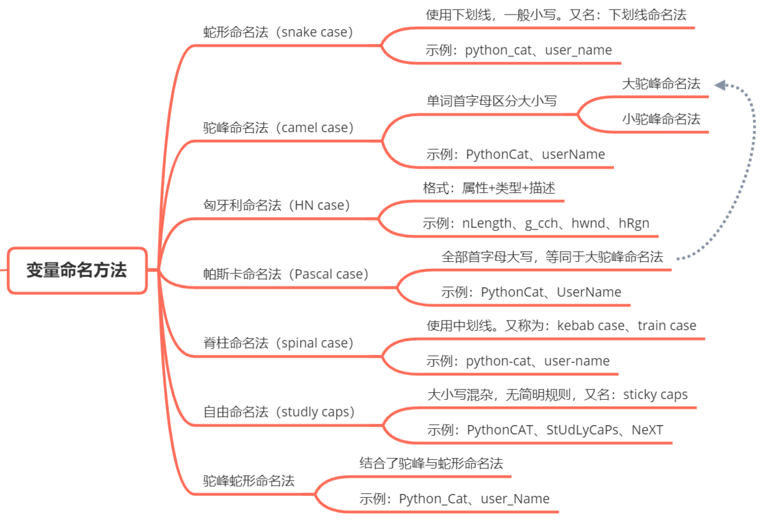

#### 前言

**代码风格** (`Programming style` / `code style`)即[程序](https://zh.wikipedia.org/wiki/程序)开发人员所编写源代码的书写风格。良好代码风格的特点是使代码易读。

总结程序设计实践中的经验，代码风格的要素包括（但不限于）以下几点：

- 名字的使用（参见：[驼峰式大小写](https://zh.wikipedia.org/wiki/駝峰式大小寫)、[标识符命名约定](https://zh.wikipedia.org/w/index.php?title=标识符命名约定&action=edit&redlink=1)、[匈牙利命名法](https://zh.wikipedia.org/wiki/匈牙利命名法)）
- 常量的使用
- [表达式](https://zh.wikipedia.org/wiki/表达式)与语句
- 注释的使用
- [缩进](https://zh.wikipedia.org/wiki/缩进)（参见：[缩进风格](https://zh.wikipedia.org/wiki/缩进风格)）
- 代码的布局

下面我们将通过以上几点来介绍我对 **代码风格** 的一些理解和个人建议。

#### 命名

我们知道，对于一样物品，一个生物来说，一个好的名字可以让你更快的记住他，认识他，这个规则，在代码里面也适应。

##### 命名风格



[`@tinyfe/naming-transform` 文档](https://github.com/tinyfe/one-utils/blob/main/packages/naming-transform/README.md#%E5%91%BD%E5%90%8D%E9%A3%8E%E6%A0%BCnaming-style)

##### 命名习惯建议

规则: **动词 + 名词(描述) + 状态**，规则同样适合函数。

- 观察变量意思是什么，比如说，变量大概是要表示工作的意思。
- 观察变量状态是什么，比如说，工作的状态是正在进行中，还是表示工作过。
- 观察变量类型是什么，比如说，数字，字符串，`Boolean `, etc.

从上面的规则，我们可以这么拆解这个变量，**是否( --> is)** **正在(ing)** **工作(work)**，所以可以命名为 `isWorking` 。

一个变量叫什么，取决于，你对他怎么定性，就好像，你给一个小姐姐去别名，不会叫二狗子吧(你肯定会被打死的)，你会取一个，女性，和她性格很近的名字，比如说 **猪猪(🐷)女孩** 。

**命名个人推荐**

- 变量
  - 开头: `is` `has` `get` `can` `blabla....`, etc: `isStudent`, `hasGF`, `canSet` ...
  - 结尾: 动词，名词，`ing` `ed` etc: `isEditing`, `isDisabled`
- 函数
  - 开头: `get` `set` `on` `handle`  `blabla....`, etc: `getUserName`, `setUserInfo`, `onClick`, `handleOnTreeProcess` ....
  - 结尾: 动词，名词

##### 常见词汇

- 数据操作：`get` / `set` / `open` / `close` / `handle` / `make` / `computed` 
- 增加：`add` / `create` / `insert` / `push` 
- 删除：`remove` / `destory` / `delete` / `split` 
- 判断: `is` /  `has` / `can` / `should` / `check` / `enable` / `with` / `allow` / `could`

##### 场景分类

- 事件处理

  原生事件，主动监听，采用 `onXXX`, e.g. `onClick`

  自定义事件,被动处理，采用 `handleXXX`, e.g. `handleInputChange`

- 状态

  通常用来描述实体（例如：HTML标签、组件、对象）的功能属性，而且定法比较固定，当然了，这里

  ```json
  {
    disabled: '是否禁用',
    editable: '是否可编辑',
    clearable: '是否可清除',
    readonly: '只读',
    expandable: '是否可展开',
    checked: '是否选中',
    enumberable: '是否可枚举',
    iterable: '是否可迭代',
    clickable: '是否可点击',
    draggable: '是否可拖拽'
  }
  ```

- 进行中，过去式

  可以使用`ed` `ing`等有关于状态进行时的描述。

  ```json
  {
      isEditing: '是否编辑中',
      isEdited: '是否已编辑',
  
      isChecked: '是否选中',
      isChecking: '是否正在选择中',
  
      isCleared: '是否已清除',
      isShow: '是否显示',
      isVisible: '是否可见',
      isLoading: '是否处于加载中',
      isConnecting: '是否处于连接中',
      isValidating: '正在验证中',
      isRunning: '正在运行中',
      isListening: '正在监听中'
  }
  ```

- 配置类、选项类

  主要是指组件功能的开启与关闭，功能属性的配置。可以使用的：`with`/`enable`/`allow`/`can`/`check`

  ```json
  {
    withTab: '是否带选项卡',
    withoutTab: '不带选项卡',
    enableFilter: '开启过滤',
    allownCustomScale: '允许自定义缩放',
    shouldClear: '是否清除',
    canSelectItem: '是否能选中元素',
    noColon: '不显示label后面的冒号',
    checkJs: '检查Js',
  }
  ```

  如果嫌分类太多，可以只使用其中一种方式，比如在`Typescript`中使用了 `allownXx`,`checkJs` 和 `noXx`。

- 异步处理

  主要是指在写数据层服务、状态管理中的`Action`命名，以及`Ajax`回调的命名规则，命名主要围绕数据的增删查找来划分，获取数据通常是 `getXx` 和 `fetchXx`，看个人喜好但是要统一

  ```json
  {
      getUsers: '获取用户列表',
      fetchUsers: '获取用户列表',
  }
  ```

- 跳转

  常见动作：`to` / `navigate` / `jump` / `go` / `redirect` / `switch` / `back`

  ```json
  {
    toTplDetail: '跳转到模板详情页面',
    navigateToHome: '导航到首页',
    jumpHome: '跳转首页',
    goHome: '跳转首页',
    redirectToLogin: '重定向到登录页',
    switchTab: '切换Tab选项卡',
    backHome: '回到主页'
  }
  ```

  

#### 变量

##### 定义变量

- 总是使用`const`或 `let` 来声明变量。不这样做会导致全局变量。我们希望避免污染全局名称空间。`eslint: no-undef no-var prefer-const`

  ```js
  // bad
  superPower = new SuperPower();
  var captain = new Captain();
  
  // good
  const superPower = new SuperPower();
  let captain = new Captain();
  ```

- 总是单独声明变量，不建议分组。

  为什么？因为这样在重构，调整位置，删除，`debugger`等场景下，你都会有很好的体验，也不会有分隔符`,` ，`;`等其他分隔符的差异。

  ```js
  // bad
  const items = getItems(),
      goSportsTeam = true,
      dragonball = 'z';
  
  // bad
  // (compare to above, and try to spot the mistake)
  const items = getItems(),
      goSportsTeam = true;
      dragonball = 'z';
  
  // good
  const items = getItems();
  const goSportsTeam = true;
  const dragonball = 'z';
  
  ```

- 不许链式声明一个变量 `eslint: no-multi-assign `

  为什么?链接变量赋值会创建隐式全局变量。

  ```js
  // bad
  (function example() {
    // JavaScript interprets this as
    // let a = ( b = ( c = 1 ) );
    // The let keyword only applies to variable a; variables b and c become
    // global variables.
    let a = b = c = 1;
  }());
  
  console.log(a); // throws ReferenceError
  console.log(b); // 1
  console.log(c); // 1
  
  // good
  (function example() {
    let a = 1;
    let b = a;
    let c = a;
  }());
  
  console.log(a); // throws ReferenceError
  console.log(b); // throws ReferenceError
  console.log(c); // throws ReferenceError
  
  // the same applies for `const`
  ```

#### 常量

- 定义常量使用`const`关键词
- 定义常量使用**大写英文字母**, 尽量见名知意，每个单词之间用 `_` 分隔。
- 常量不能重复定义和不能被改变

```js
const SOME_DAY_I_CAN_GET_IT = true;
```

#### 语句

在计算机程序设计中，语句是命令式编程语言的一个语法单元，它表达了要执行的一些动作，语句可以有内部组件(例如，表达式)。它分为块语句(多行)和单行语句。

##### 行长度

在语句中，我们习惯的是，尽量保证单行语句在 `80-120`字的范围内。为什么要局限于某一个范围呢？我的理解是，让重点在可视区域。举个🌰：

👇 是一个筛选的例子，我们会从学生列表中取出 男性，年龄大于25岁，工作年限大于3年 `(没有性别歧视，就是随机想的一个🌰)`

```js
function getInfoByMoreFilterFromStudentListAndFormat(list) {
  return list.filter(Boolean).filter(item => item.age > 25 && item.gender === 'male' && item.work > 3);
}
```

当你看到这串代码的时候，大家默认是从左往右读，这样不是说看不懂，一个就简单的问题，你的脖子累不累，哈哈哈，开玩笑。歧视我想表达的是，这样你会很容易丢失重要信息，也会遗忘之前看了什么。

```js
function getInfoByMoreFilterFromStudentListAndFormat(list) {
  return list
    .filter(Boolean)
    .filter(
    	item => item.age > 25
    	&& item.gender === 'male'
    	&& item.work > 3
  	);
}
```

我们通过转换变身，👆 这个代码会让你看起来逻辑更清晰，你只需要着重在某一处即可，不需要记住一大串的条件。

在这里，我们对函数参数也有如下建议：

- 超过**3/4个**参数时，**合并参数列表**，当然了，怎么合并，取决于你的策略，怎么分类

  ```js
  function getParamsFromRouterQuery(router, keys = [], allExclude = true, once = false) {
      // ...
  }
  ```

  转换后

  ```js
  function getParamsFromRouterQuery(router, {keys = [], allExclude = true, once = false} = {}) {
      // ...
  }
  ```

- 超长函数，记得换行

  ```js
  function getParamsFromRouterQuery(router, {keys = [], allExclude = true, once = false} = {}) {
      // ...
  }
  ```

  转换后

  ```js
  function getParamsFromRouterQuery(
      router, {
          keys = [],
          allExclude = true,
          once = false
      } = {}
  ) {
      // ...
  }
  ```

##### 语句块

我们先看下👇这串代码，感受一下

```js
// https://github.com/tinyfe/one-utils/blob/3d2bebb874e730256511e7a1d476f3ec9c60bb1c/packages/watermark/src/index.ts#L300
// ...
observerWaterMark(dom: HTMLElement | null = this.dom) {
  if (!dom) {
    throw new Error(`The dom value must be a HTMLElement, now is ${dom}`);
  }
  const { observer: observerCallback } = this.options;
  this.observer = new MutationObserver((mutations, observer) => {
    this.setWaterMark();
    observerCallback && observerCallback(mutations, observer);
    console.log('法网恢恢疏而不漏, 你不要乱来哦');
  });
  // 以上述配置开始观察目标节点
  this.observer.observe(dom, this.options.observerOptions);
}
// ...
```

不知道，你看着他什么感觉，在我看来，很臃肿，所有的东西都揉在一起，看起来很难受，不知道可以在哪里停下来思考，得全部记住，才知道这些是干嘛的。

```js
// ...
observerWaterMark(dom: HTMLElement | null = this.dom) {
  if (!dom) {
    throw new Error(`The dom value must be a HTMLElement, now is ${dom}`);
  }

  const { observer: observerCallback } = this.options;

  this.observer = new MutationObserver((mutations, observer) => {
    this.setWaterMark();
    observerCallback && observerCallback(mutations, observer);
    
    console.log('法网恢恢疏而不漏, 你不要乱来哦');
  });

  // 以上述配置开始观察目标节点
  this.observer.observe(dom, this.options.observerOptions);
}
// ...
```

我们这样修改一下，是不是感觉清爽多了。所以我的建议是，

- 明确同类的操作，比如是声明放在一起，他们作为**一块代码**

- **每2个块之间的代码** 或者 **每2不同分类的变量语句的声明、处理** 之间保留一个空行

  ```js
  const ASSIGN_TOTAL = 1;
  
  function dynamicAssign(assign = 1, options = {}) {
      // INFO: 0 直接处理 为 total
      if (!assign) {
          return total;
      }
      // 👇和👆是两类，所以此处保留一个空格
      const {
          total = ASSIGN_TOTAL, fixed = 3
      } = options;
      // 👇和👆是两类，所以此处保留一个空格
      const average = +(total / assign).toFixed(fixed);
      const rest = +(total - average * (assign - 1)).toFixed(fixed);
      // 👇和👆是两类，所以此处保留一个空格
      return {
          average,
          rest
      };
  }
  
  function getValueByAccuracy(value, accuracy = 1000) {
      return Math.ceil(+value * accuracy) / accuracy;
  }
  
  const getUpdatedParams = (type, list = []) => {
      /**
       * 先通过就旧的分配方式判断时候修改数据，包括 average + reset 的校验，以及 总和是否为 ASSIGN_TOTAL
       */
      const listLength = list.length;
  
      // 旧的分配方式
      const {
          average,
          rest
      } = dynamicAssign(listLength, {
          total: ASSIGN_TOTAL
      });
  
      // odd 分配是有差异的 e.g. [33.3, 33.3, 33.4]
      const ratioType = [average, rest];
  
      // 当前分配的值
      const ratioList = list.map(
          item => getValueByAccuracy(+(item.ratio || 0))
      );
  		// 👇和👆是两类，所以此处保留一个空格
      const curFullRatio = ratioList.reduce((cur, next) => cur + next, 0);
      const isFullRatio = curFullRatio !== ASSIGN_TOTAL;
  		// 👇和👆是两类，所以此处保留一个空格
      const hasUpdated = ratioList
          .some(ratio => !ratioType.includes(ratio)) ||
          isFullRatio;
  
      if (hasUpdated) {
          return {
              hasUpdated
          };
      }
  
      const newListLength = listLen + (type === 'delete' ? -1 : 1);
      const {
          average: newAverage,
          rest: newRest
      } = dynamicAssign(newListLength, {
          total: ASSIGN_TOTAL
      });
  
      return {
          hasUpdated,
          average: newAverage,
          rest: newRest,
          isEven: !!(newKrLength % 2),
      };
  }
  ```

#### 注释

多行注释 `/** ... */`

单行注释 `//`

更多可以转我另一篇文章 [一目了然的代码注释和技巧](knowledge-map/code-annotation.md)

#### 缩进

`eslint: indent`

##### 水平

一般是 **2 或 4 个空格**，或者 **Tab制表符**。这个其实遵循每个团队或者公司的规范即可，但是，我个人喜欢 **2个空格**，因为这样阅读代码可以更舒服写。

```js
// 2
function getName(profile) {
  return profile?.name;
}

// 4
function getName(profile) {
    return profile?.name;
}
```

##### 垂直

#### 代码的布局

在代码来看，所有的代码都是以 **块代码** 和 **行代码** 组成。

##### 块代码

每个块代码后面保留一个空行。

```js
const info = {
  name: 'Rain120',
  gender: 'male',
  job: 'fe',
  workTime: 3,
  age: 25
};
// ---> here 新增一个空行
const github = 'https://github.com/rain120';

```

##### 行代码

一行限制在 `80-120` 以内，链式调用，尽量以连接函数换行。

```js
// end
const info = Object.keys(info).map(k => ({ label: k, value:  info[k]})).filter(item => ['name', 'age', 'gender'].includes(item));

// good
const info = Object.keys(info)
		.map(k => ({ label: k, value:  info[k]}))
		.filter(item => ['name', 'age', 'gender'].includes(item));
```

#### 个人建议

##### 是否自动格式化

目前，大部分公司和个人开发的项目，都会使用 `eslint` 进行代码(自动保存格式化，`precommit` 自动`eslint --fix` 检查，但是，从个人的角度来看，初学者，不建议自动化处理，而适合手动敲代码，养成习惯，只保留 `precommit fix` 的操作；对于，有经验的同学，我觉得可以，开启这些，用来节省开发时间。

#### 参考资料

[Wiki - Programming style](https://en.wikipedia.org/wiki/Programming_style)

[Statement_(computer_science)](https://en.wikipedia.org/wiki/Statement_(computer_science))

[Google JavaScript Style Guide](https://google.github.io/styleguide/jsguide.html)

[Airbnb JavaScript Style Guide](https://github.com/airbnb/javascript)

