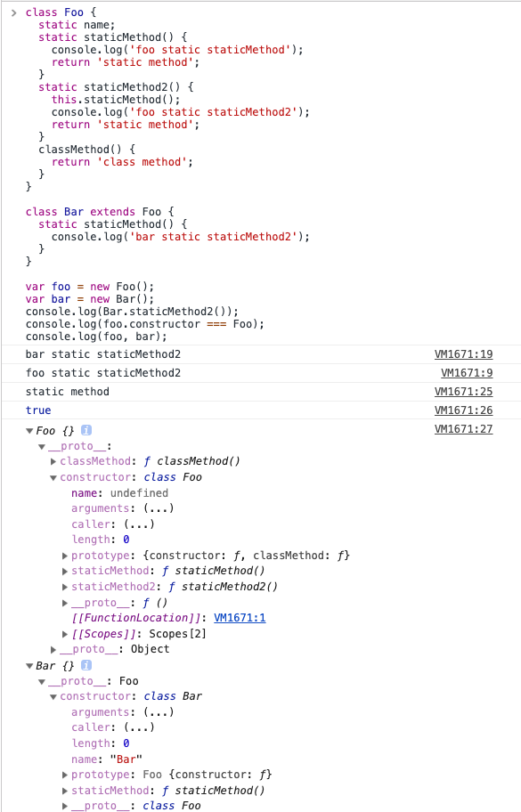

在`JavaScript` 中，生成实例对象的传统方法是通过构造函数， 对熟悉`OOP`的开发者而言，这很让人困惑。

不过，在`ES6`中新增了`class`的定义方法以及静态方法，使得 JS 开发者终于告别了直接使用原型对象模仿面向对象中的类和类继承时代。`ES7`新增了定义静态属性。

#### 静态方法

> 类相当于实例的原型，所有在类中定义的方法，都会被实例继承。如果在一个方法前，加上`static`关键字，就表示该方法不会被实例继承，而是直接通过类来调用，这就称为“静态方法”。

👇我们来看一下`ES6`写法下的`class`和`static`属性、方法在[Babel 转换](https://babeljs.io/repl)为`ES5`的代码。

`ES6 Class`

```javascript
class Foo {
  static name;
  static staticMethod() {
    return 'static method';
  }
  classMethod() {
    return 'class method';
  }
}

class Bar extends Foo {}
```

`babel -> presets: es2015 & stage-2 `

```javascript
"use strict";

function _typeof(obj) {
    if (typeof Symbol === "function" && typeof Symbol.iterator === "symbol") {
        _typeof = function _typeof(obj) {
            return typeof obj;
        };
    } else {
        _typeof = function _typeof(obj) {
            return obj && typeof Symbol === "function" && obj.constructor === Symbol && obj !== Symbol.prototype ?
                "symbol" : typeof obj;
        };
    }
    return _typeof(obj);
}

function _possibleConstructorReturn(self, call) {
    if (call && (_typeof(call) === "object" || typeof call === "function")) {
        return call;
    }
    return _assertThisInitialized(self);
}

function _assertThisInitialized(self) {
    if (self === void 0) {
        throw new ReferenceError("this hasn't been initialised - super() hasn't been called");
    }
    return self;
}

function _getPrototypeOf(o) {
    _getPrototypeOf = Object.setPrototypeOf ? Object.getPrototypeOf : function _getPrototypeOf(o) {
        return o.__proto__ || Object.getPrototypeOf(o);
    };
    return _getPrototypeOf(o);
}

function _inherits(subClass, superClass) {
    if (typeof superClass !== "function" && superClass !== null) {
        throw new TypeError("Super expression must either be null or a function");
    }
    subClass.prototype = Object.create(superClass && superClass.prototype, {
        constructor: {
            value: subClass,
            writable: true,
            configurable: true
        }
    });
    if (superClass) _setPrototypeOf(subClass, superClass);
}

function _setPrototypeOf(o, p) {
    _setPrototypeOf = Object.setPrototypeOf || function _setPrototypeOf(o, p) {
        o.__proto__ = p;
        return o;
    };
    return _setPrototypeOf(o, p);
}

function _instanceof(left, right) {
    if (right != null && typeof Symbol !== "undefined" && right[Symbol.hasInstance]) {
        return right[Symbol.hasInstance](left);
    } else {
        return left instanceof right;
    }
}

function _classCallCheck(instance, Constructor) {
    if (!_instanceof(instance, Constructor)) {
        throw new TypeError("Cannot call a class as a function");
    }
}

function _defineProperties(target, props) {
    for (var i = 0; i < props.length; i++) {
        var descriptor = props[i];
        descriptor.enumerable = descriptor.enumerable || false;
        descriptor.configurable = true;
        if ("value" in descriptor) descriptor.writable = true;
        Object.defineProperty(target, descriptor.key, descriptor);
    }
}

function _createClass(Constructor, protoProps, staticProps) {
    if (protoProps) _defineProperties(Constructor.prototype, protoProps);
    if (staticProps) _defineProperties(Constructor, staticProps);
    return Constructor;
}

function _defineProperty(obj, key, value) {
    if (key in obj) {
        Object.defineProperty(obj, key, {
            value: value,
            enumerable: true,
            configurable: true,
            writable: true
        });
    } else {
        obj[key] = value;
    }
    return obj;
}

var Foo =
    /*#__PURE__*/
    function () {
        function Foo() {
            _classCallCheck(this, Foo);
        }

        _createClass(Foo, [{
            key: "classMethod",
            value: function classMethod() {
                return 'class method';
            }
  }], [{
            key: "staticMethod",
            value: function staticMethod() {
                return 'static method';
            }
  }]);

        return Foo;
    }();

_defineProperty(Foo, "name", void 0);

var Bar =
    /*#__PURE__*/
    function (_Foo) {
        _inherits(Bar, _Foo);

        function Bar() {
            _classCallCheck(this, Bar);

            return _possibleConstructorReturn(this, _getPrototypeOf(Bar).apply(this, arguments));
        }

        return Bar;
    }(Foo);
```

我们发现`static`属性是通过[`Object.defineProperty`](https://developer.mozilla.org/zh-CN/docs/Web/JavaScript/Reference/Global_Objects/Object/defineProperty)在一个对象上定义一个新属性，或者修改一个对象的现有属性， 并返回这个对象。

**Notes**: 这个属性值除了`enumerable`为`false`，其他属性都可以，也就是静态属性可以赋值、修改、删除。

`ES6` 和`ES7`定义静态属性的差异

```javascript
class Foo {
  static name; // es 7
  static get gender() { // es 6
    return gender;
  }
}
```

`babel`

```javascript
"use strict";

function _instanceof(left, right) {
    if (right != null && typeof Symbol !== "undefined" && right[Symbol.hasInstance]) {
        return right[Symbol.hasInstance](left);
    } else {
        return left instanceof right;
    }
}

function _classCallCheck(instance, Constructor) {
    if (!_instanceof(instance, Constructor)) {
        throw new TypeError("Cannot call a class as a function");
    }
}

function _defineProperties(target, props) {
    for (var i = 0; i < props.length; i++) {
        var descriptor = props[i];
        descriptor.enumerable = descriptor.enumerable || false;
        descriptor.configurable = true;
        if ("value" in descriptor) descriptor.writable = true;
        Object.defineProperty(target, descriptor.key, descriptor);
    }
}

function _createClass(Constructor, protoProps, staticProps) {
    if (protoProps) _defineProperties(Constructor.prototype, protoProps);
    if (staticProps) _defineProperties(Constructor, staticProps);
    return Constructor;
}

function _defineProperty(obj, key, value) {
    if (key in obj) {
        Object.defineProperty(obj, key, {
            value: value,
            enumerable: true,
            configurable: true,
            writable: true
        });
    } else {
        obj[key] = value;
    }
    return obj;
}

var Foo =
    /*#__PURE__*/
    function () {
        function Foo() {
            _classCallCheck(this, Foo);
        }

        _createClass(Foo, null, [{
            key: "gender",
            get: function get() {
                return gender;
            }
  }]);

        return Foo;
    }();

_defineProperty(Foo, "name", void 0);
```

`ES6`会判断当前`props`是原型链上的还是静态属性，通过不同判断条件来将当前属性值定义到本身对象还是对象的`constructor`上。

说完了静态属性，我们接着了解一下静态方法吧，emm, 这是不是有点不好理解呀，OK，那我们换一种方式来看吧

`ES6 Class`

```javascript
class Foo {
  // static name;
  static staticMethod() {
    return 'static method';
  }
  static staticMethod2() {
    this.staticMethod();
    return 'static method';
  }
  classMethod() {
    return 'class method';
  }
}
```

`babel -> presets: es2015-loose`

```javascript
"use strict";

var Foo =
/*#__PURE__*/
function () {
  function Foo() {}

  // static name;
  Foo.staticMethod = function staticMethod() {
    return 'static method';
  };

  Foo.staticMethod2 = function staticMethod2() {
    this.staticMethod();
    return 'static method';
  };

  var _proto = Foo.prototype;

  _proto.classMethod = function classMethod() {
    return 'class method';
  };

  return Foo;
}();
```

从上述代码我们发现，静态方法是直接注册在当前类上的，所以静态方法将不在实例化对象的方法中，因此不能在静态方法中通过`this`来调用静态方法和属性。

**Note**: 如果静态方法包含`this`关键字，这个`this`指的是当前调用的**类(注意`this`的指向)**，而不是**实例**。

说了这么多，那静态方法和属性的作用是什么呢？

作用:

> 静态方法、属性将被共享，避免全局变量污染，减少所用内存。

使用场景:

> 1. 全局方法、变量
> 2. 当前属性和方法与其实例无关

```javascript
class Foo {
  static name;
  static staticMethod() {
    return 'static method';
  }
  static staticMethod2() {
    this.staticMethod();
    console.log('foo static staticMethod2');
    return 'static method';
  }
  classMethod() {
    return 'class method';
  }
}

class Bar extends Foo {
  static staticMethod() {
    console.log('bar static staticMethod2');
  }
}

var foo = new Foo();
var bar = new Bar();
console.log(foo, bar);
console.log(foo.constructor === Foo);
console.log(Bar.staticMethod2()););
```



如上图示，`name`、`staticMethod`、`staticMethod2`都是在`Foo`这个类上，不在`prototype`上，只有`classMethod`在`prototype`上。这就说明访问静态变量和属性只能通过类来访问，不能通过实例来访问。

#### 参考资料

[阮一峰: class#静态方法](http://es6.ruanyifeng.com/#docs/class#静态方法)

[MDN - Static](https://developer.mozilla.org/zh-CN/docs/Web/JavaScript/Reference/Classes/static)

[ES6 class 静态属性和私有方法](https://www.tangshuang.net/3237.html)

[原型链问题](https://zhuanlan.zhihu.com/p/34640855)

