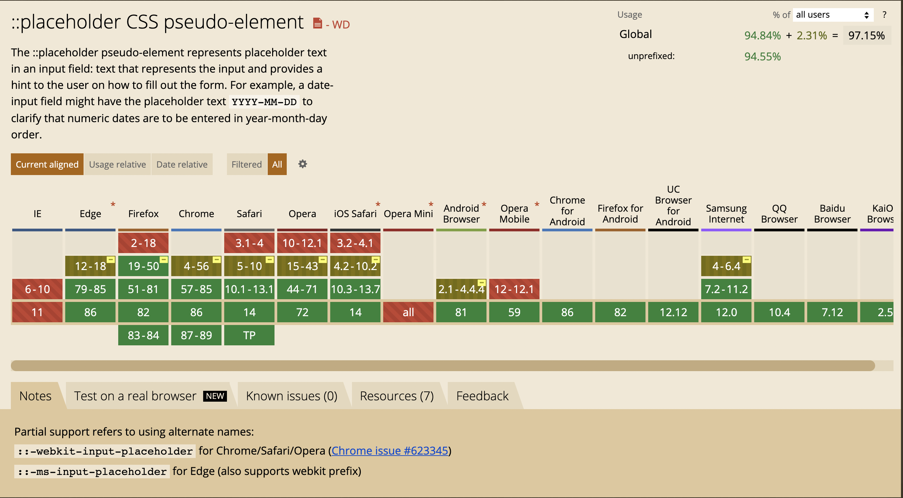

#### 代码

```html
<!DOCTYPE html>
<html>
  <head>
  <meta charset="utf-8">
  <title>input textarea placehodler</title>
  <style>
    /* do not group these rules */
    *::-webkit-input-placeholder {
      color: red;
    }
    *:-moz-placeholder {
      /* FF 4-18 */
      color: red;
      opacity: 1;
    }
    *::-moz-placeholder {
      /* FF 19+ */
      color: red;
      opacity: 1;
    }
    *:-ms-input-placeholder {
      /* IE 10+ */
      color: red;
    }
    *::-ms-input-placeholder {
      /* Microsoft Edge */
      color: red;
    }
    *::placeholder {
      /* modern browser */
      color: red;
    }
  </style>
  </head>
  <body>
    <input placeholder="input placeholder"></input>
    <br />
    <br />
    <textarea placeholder="textarea placeholder"></textarea>
  </body>
</html>
```

#### Demo

<!DOCTYPE html>
<html>
  <head>
  <meta charset="utf-8">
  <title>input textarea placehodler</title>
  <style>
    /* do not group these rules */
    *::-webkit-input-placeholder {
      color: red;
    }
    *:-moz-placeholder {
      /* FF 4-18 */
      color: red;
      opacity: 1;
    }
    *::-moz-placeholder {
      /* FF 19+ */
      color: red;
      opacity: 1;
    }
    *:-ms-input-placeholder {
      /* IE 10+ */
      color: red;
    }
    *::-ms-input-placeholder {
      /* Microsoft Edge */
      color: red;
    }
    *::placeholder {
      /* modern browser */
      color: red;
    }
  </style>
  </head>
  <body>
    <input placeholder="input placeholder"></input>
    <br />
    <br />
    <textarea placeholder="textarea placeholder"></textarea>
  </body>
</html>

#### 兼容性



[can i use](https://caniuse.com/?search=%3A%3Aplaceholder)

#### 参考内容

[Change an HTML5 input's placeholder color with CSS](https://stackoverflow.com/questions/2610497/change-an-html5-inputs-placeholder-color-with-css)

[MDN ::placeholder](https://developer.mozilla.org/zh-CN/docs/Web/CSS/::placeholder)

[CSS Tricks: placeholder](https://css-tricks.com/almanac/selectors/p/placeholder/)

