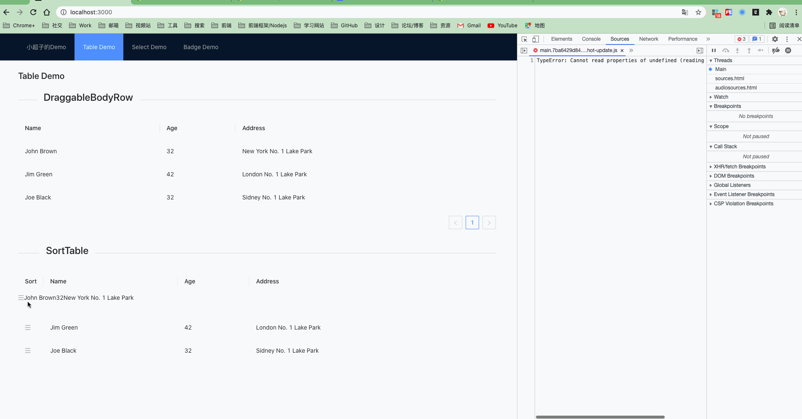
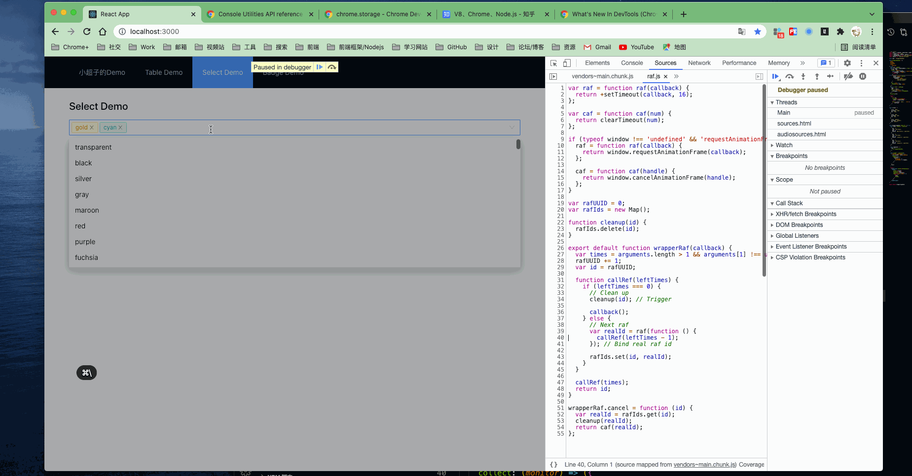
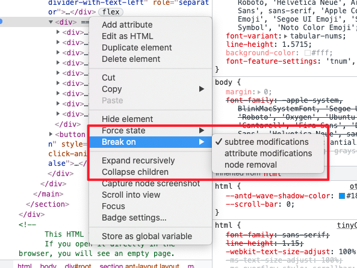
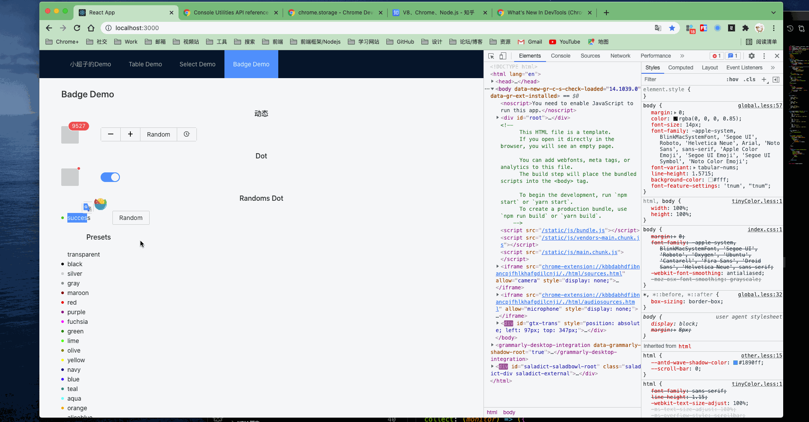
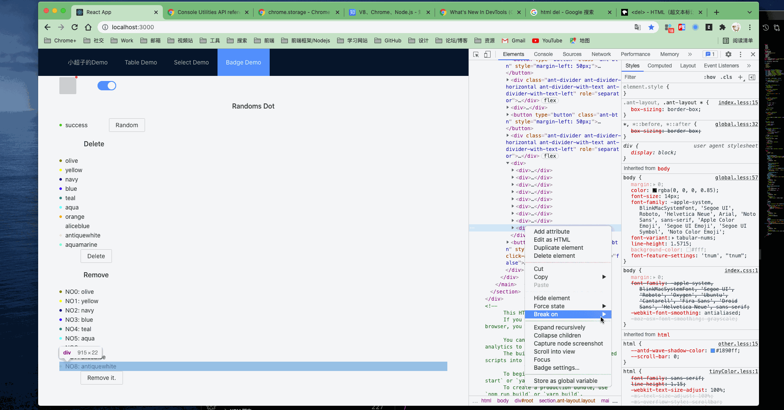
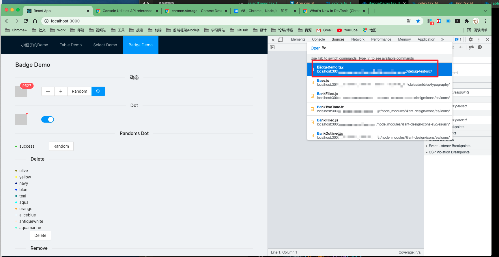
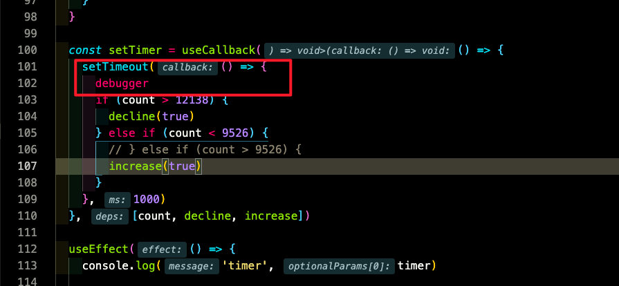
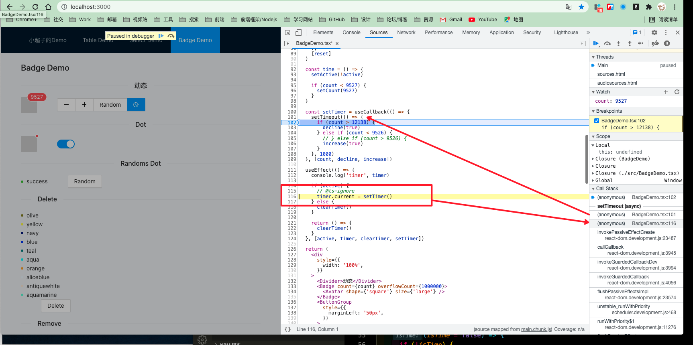
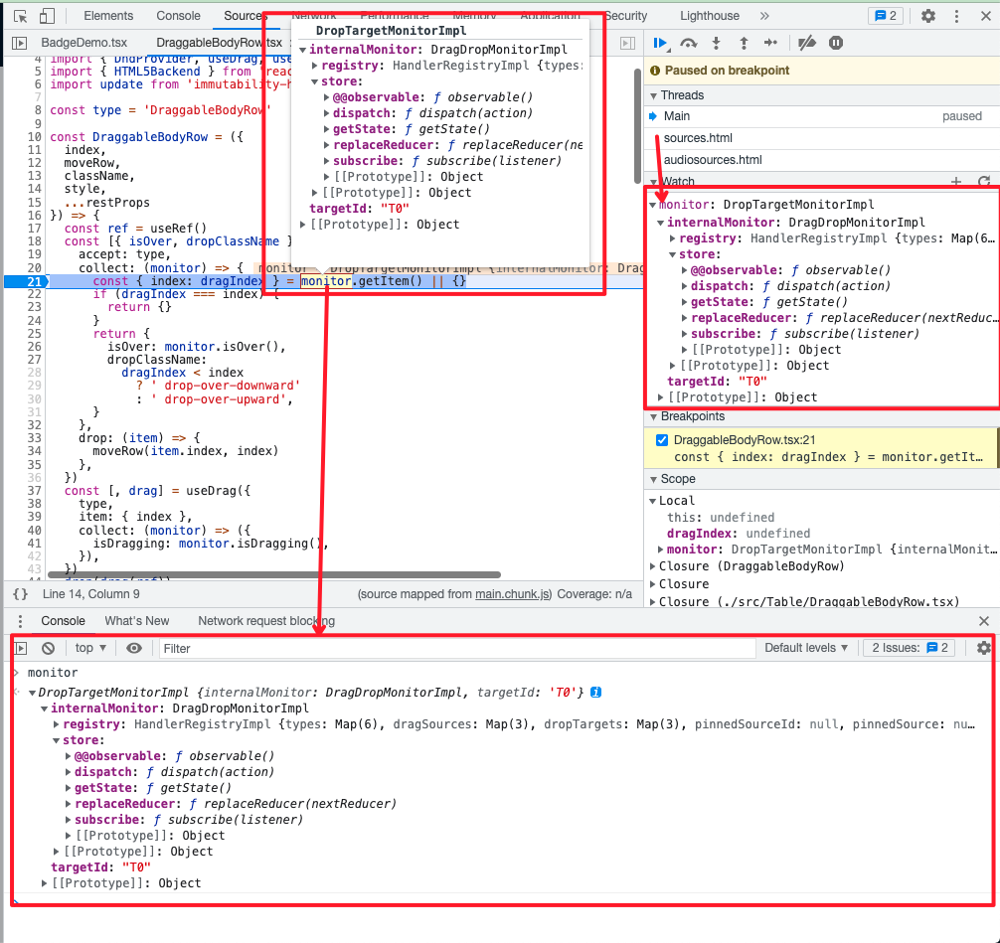
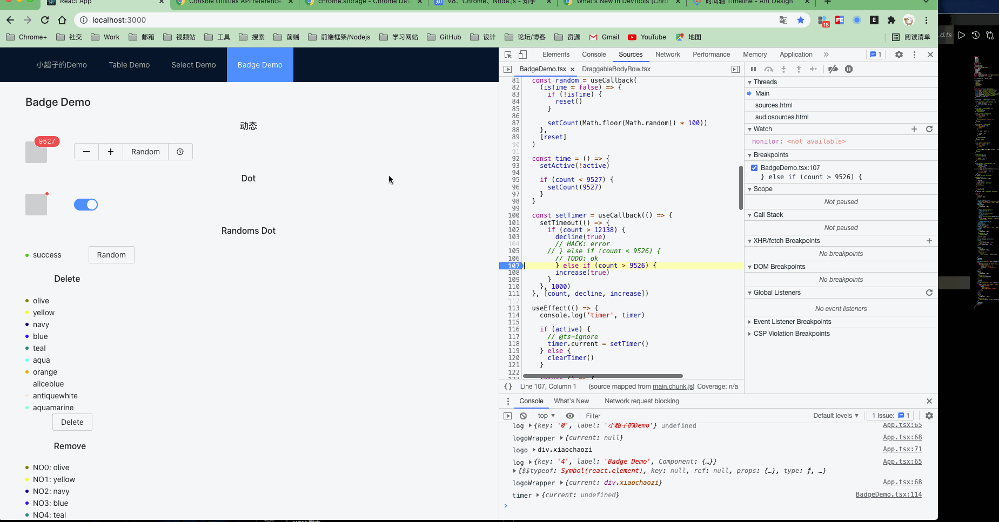

## HTML

### 浮窗类的调试方式

当你遇到 **拖拽DOM**， **Popover**，**Select** 等类似组件时，你是如何debugger?

#### 拖拽类

#### Select Options

### Debugger

#### Dom

##### Attribute Modifications

##### Subtree Modifications

##### Noed Removal

#### Javascript

##### Code Debug

- IDE Debug

  

- Devtools Debug

  

关于watch data 的相关操作

关于 devtools breakpoint

##### Find the errors position by the throw from the console

#### 更多调试相关的资源

[How I got better at debugging](http://jvns.ca/blog/2015/11/22/how-i-got-better-at-debugging/)

[使用开发者工具进行性能检查的高级技巧](https://docs.google.com/document/d/1K-mKOqiUiSjgZTEscBLjtjd6E67oiK8H2ztOiq5tigk/pub)

