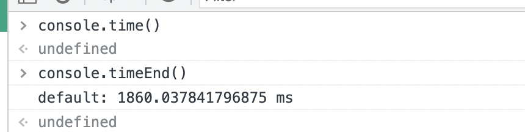
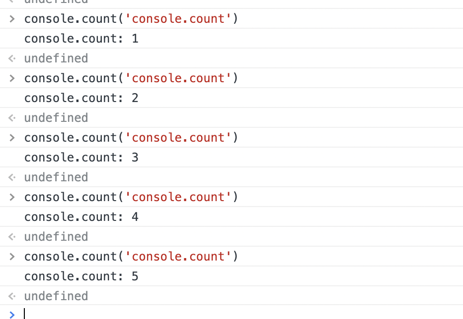
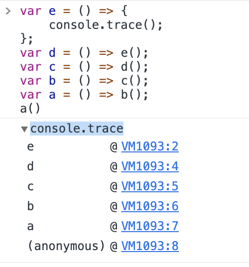
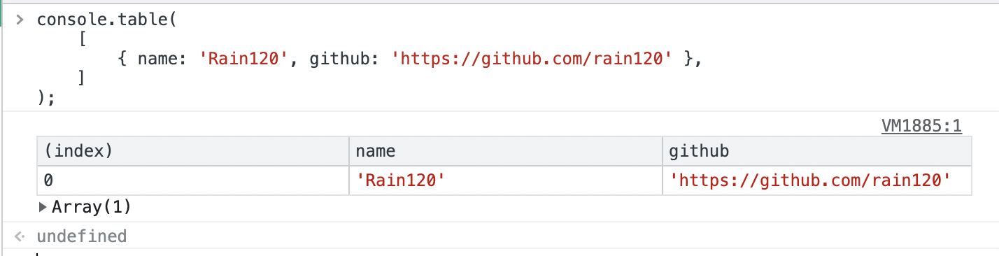

### console

#### console.time() && console.timeEnd()

分析函数的性能

#### console.count

记录一个函数或则一段代码重复执行了多少次

#### console.trace

打印的数据的 `stacktrace`。

#### console.table

将对象以表格的形式打印出来

### 参考资料

[console全家桶](notes/javascript/console/console-related-note.md)
