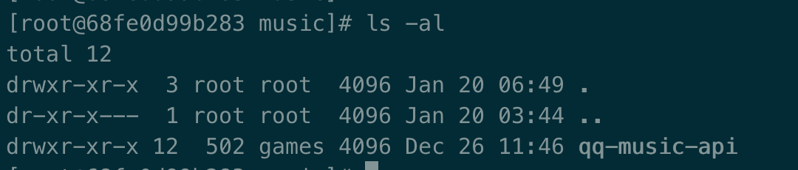

#### `cp` 命令

##### 语法

```sh
docker cp [Options] Container:source_path dest_path/-

docker cp [Options] source_path- Container:dest_path
```

`Options` 说明：

- **-L :**保持源目标中的链接

##### 实例

将主机 `/path`目录拷贝到容器 `68fe0d99b283` 的 `/path`目录下。

```
docker cp /path 68fe0d99b283:/path/
```

将主机 `/path`目录拷贝到容器 `68fe0d99b283`中，目录重命名为`/rename`。

```
docker cp /www/runoob 68fe0d99b283:/rename`
```

将容器 `68fe0d99b283` 的 `/path` 目录拷贝到主机的 `/tmp`目录中。

```
docker cp  68fe0d99b283:/www /tmp/
```




#### 参考资料

[Docker 文档](https://docs.docker.com/get-started/)