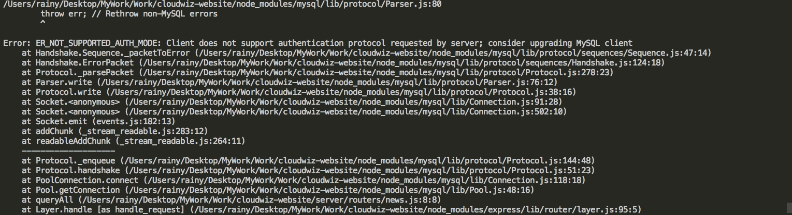
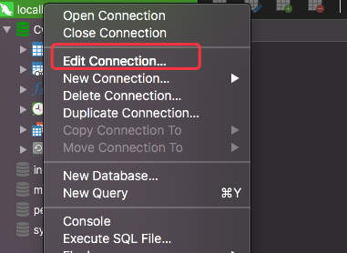
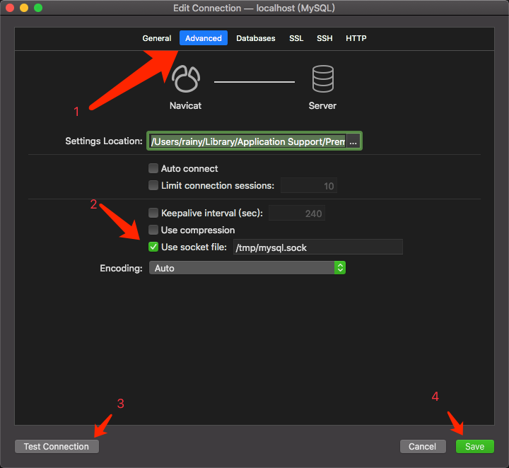
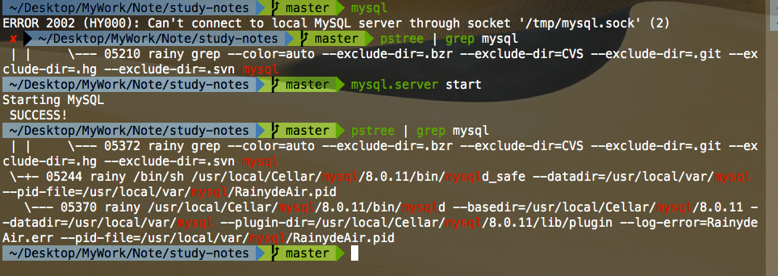
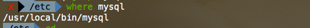
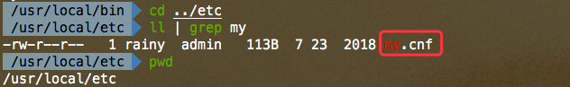

[目录 -> 学习笔记](notes/guide.md)

[目录 -> 上一级](notes/error-qa/guide.md)

##### 1. MySQL + Node报错



**Q:** Error: ER_NOT_SUPPORTED_AUTH_MODE: Client does not support authentication protocol requested by server; consider upgrading MySQL client

**A:**

在MySQL命令行中执行，将password替换成你需要修改的密码

```mysql
ALTER USER 'root'@'localhost' IDENTIFIED WITH mysql_native_password BY 'password'
```

参考：

https://stackoverflow.com/questions/50093144/mysql-8-0-client-does-not-support-authentication-protocol-requested-by-server/50961428


##### 2. MySQL

**Q:** 2002 - Can't connect to local MySQL server through socket '/tmp/mysql.sock' (2 "No such file or directory")


**A:** [Stackoverflow - mysql - 2002](https://stackoverflow.com/questions/11657829/error-2002-hy000-cant-connect-to-local-mysql-server-through-socket-var-run)







```mysql
mysql.server start
```

**Q:** 2003 (HY000): Can't connect to MySQL server on '127.0.0.1' (111)


**A:** [Stackoverflow - mysql -2003](https://stackoverflow.com/questions/1673530/error-2003-hy000-cant-connect-to-mysql-server-on-127-0-0-1-111)





```mysql
mysql.server start
```


**Q:** 2013. Lost connection to MySQL server during query


**A:** [Stackoverflow - mysql -2013](https://stackoverflow.com/questions/10563619/error-code-2013-lost-connection-to-mysql-server-during-query)


