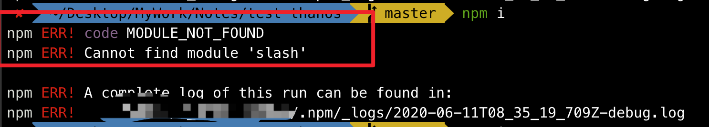

#### 1. mac下npm命令升级

```
 sudo chown -R $(whoami) $(npm config get prefix)/{lib/node_modules,bin,share}
```

```js
sudo chown -R $(whoami) ~/.npm
```

[npm throws errors without sudo](https://stackoverflow.com/questions/16151018/npm-throws-error-without-sudo)

#### 2. npm Cannot find module 'slash'

```sh
npm ERR! code MODULE_NOT_FOUND
npm ERR! Cannot find module 'slash'
```



解决办法:

```sh
rm -rf /usr/local/lib/node_modules/npm


# 安装任意一个node版本(node-version)即可
sudo npx n 10.10.0 
```


