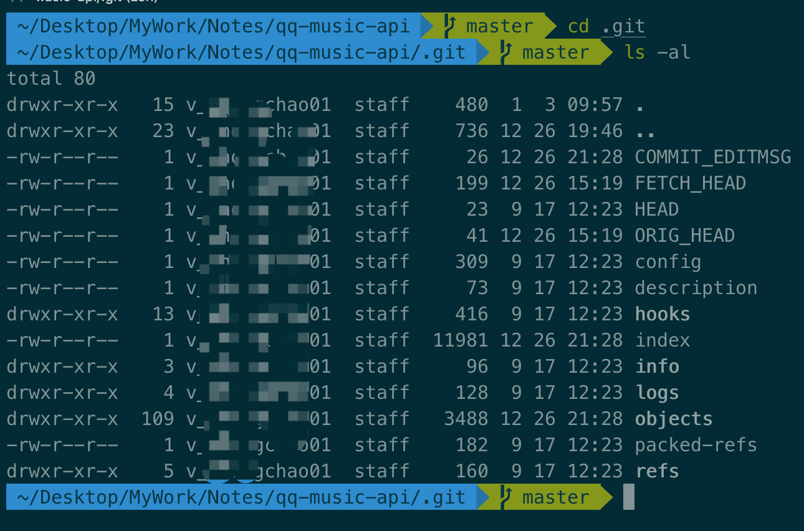
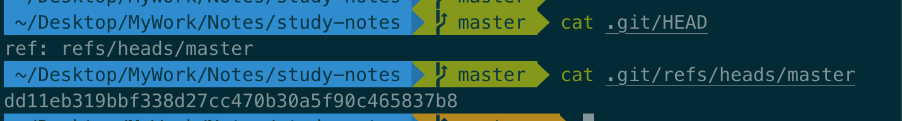
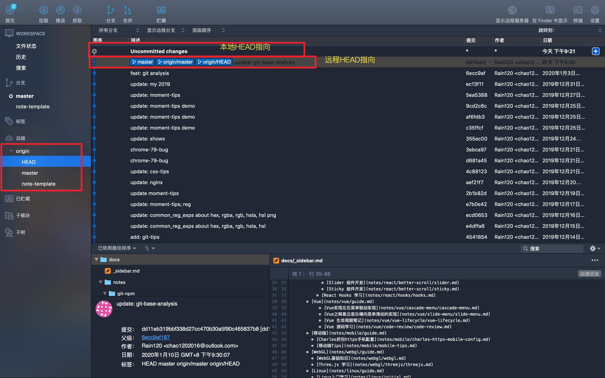
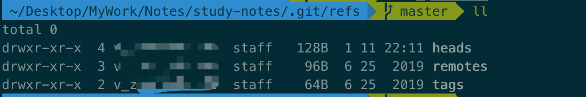
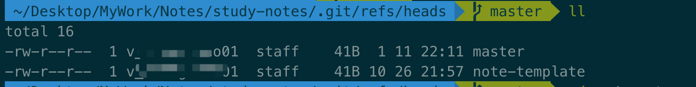
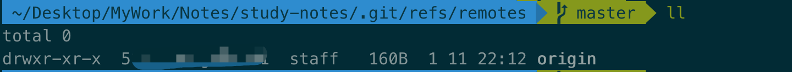
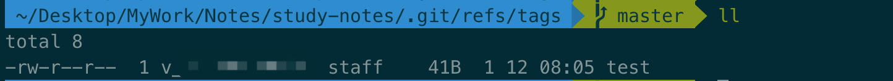
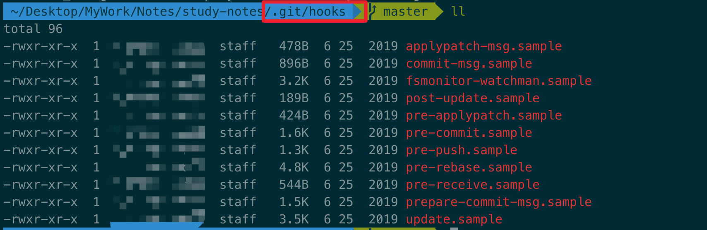

#### 前言

为什么要写这个呢？因为一直以来就想学习更多`Git`的相关知识，然后也因为某次演讲和公司大佬的分享，所以我想把我学习到的和理解的分享给大家。如果你也想一起学习`Git`，那就来和我一起学习吧!! `Let's Go` 😁

**Note**: 这个不太适合初学者，如果你想学习基础知识，请移步 [Git 官网](https://git-scm.com/) 以及[你必须知道的`Git`命令](notes/git-npm/you-must-know-git-commands.md)

#### 前置知识

- 三个关键词: 本地仓库 `(local)`, 暂存区 `(index or stage)`, 远程 `(remote)`

要了解`Git`底层工作机制，就要先了解它是什么？它有什么？我们先来了解一下`.git`目录都有什么吧。

#### `.git`目录

```sh
cd .git
ls -al
```



- `info`: 目录包含一个全局性排除 `(global exclude)` 文件，用以放置那些不希望被记录在 `.gitignore` 文件中的忽略模式 `(ignored patterns)`
- `description`: 文件仅供 `GitWeb` 程序使用，我们无需关心
- `index`: `stage`又称暂存区, 是一个索引
- `config`：存放各种设置文档, 包含项目特有的配置选项。

```sh
cat .git/config
```

包括默认`remote`,  `branch`, 个人账户等信息

```sh
[core]
	repositoryformatversion = 0
	filemode = true
	bare = false
	logallrefupdates = true
	ignorecase = true
	precomposeunicode = true
[remote "origin"]
	url = git@github.com:Rain120/study-notes.git
	fetch = +refs/heads/*:refs/remotes/origin/*
[branch "master"]
	remote = origin
	merge = refs/heads/master
[branch "note-template"]
	remote = origin
	merge = refs/heads/note-template
```

可以通过一下命令来查看 `or` 配置你的 `git`信息

```sh
# 系统配置
git config --system --list

# 全部配置
git config --global --list

# 当前仓库
git config --local --list

# 打开编辑器来修改指定的配置文件; --system, --global or repository (默认)
git config -e / --edit
```

详见

```sh
git config --help
```


- `HEAD`：指向当前所在分支`(current branch)`的指针文件路径`(Hash)`，一般指向`refs`下的某文件





- `refs`：存储指向各个分支的指针`(SHA-1标识)`文件, 包括分支和标签的引用

  

  

  `heads`

  

  `remotes`

  

  `tags`

  

  

  

- `hooks`：包含客户端或服务端的钩子脚本 `(hooks scripts)`

`Git Hooks` 是定制化的脚本程序, 它能在特定事件发生**之前**或**之后**执行特定脚本代码功能。它分为客户端`hooks` `(Client-Side Hooks)` 和服务端`hooks` `(Server-Side Hooks)`。

- `Client-Side Hooks`
  - **`pre-commit`** : 执行`git commit`命令时触发，常用于代码格式化
  - `prepare-commit-msg`: `commit message`编辑器启动前`default commit message`创建后触发，常用于生成默认的[标准化的提交说明](https://conventionalcommits.org/)
  - **`commit-msg`** :  在`git commit -m message`后触发，常用于校验`commit message`是否标准
  - `post-commit` : 整个`git commit`完成后触发，常用于邮件通知、提醒
  - `applypatch-msg` : 执行`git am`命令时触发，常用于检查命令提取出来的提交信息是否符合特定格式
  - `pre-applypatch `: `git am`提取出补丁并应用于当前分支后，准备提交前触发，常用于执行测试用例或检查缓冲区代码
  - `post-applypatch`: `git -am`提交后触发，常用于通知、或补丁邮件回复（此钩子不能停止`git am`过程）
  - `pre-rebase`: 执行`git rebase`命令时触发
  - `post-rewrite`: 执行会替换`commit`的命令时触发，比如`git rebase`或`git commit --amend`
  - `post-checkout`: 执行`git checkout`命令成功后触发，可用于生成特定文档，处理大二进制文件等
  - `post-merge`: 成功完成一次 `merge`行为后触发
  - `pre-push`: 执行`git push`命令时触发，可用于执行测试用例
  - `pre-auto-gc`: 执行垃圾回收前触发
- `Server-Side Hooks`
  - `pre-receive`: 当服务端收到一个 `push`操作请求时触发，可用于检测`push`的内容
  - `update`: 与pre-receive相似，但当一次`push`想更新多个分支时，`pre-receive`只执行一次，而此钩子会为每一分支都执行一次
  - `post-receive`: 当整个`push`操作完成时触发，常用于服务侧同步、通知



>  `.sample` 拓展名是为了防止它们默认被执行，安装一个钩子只需要去掉 `.sample`拓展名即可。

相关使用，`husky` `commitlint`

###### 参考

[自定义你的工作流](https://github.com/geeeeeeeeek/git-recipes/wiki/5.4-Git-钩子：自定义你的工作流)

[Git-钩子](https://git-scm.com/book/zh/v2/自定义-Git-Git-钩子#r_git_hooks)

- `logs`：存储日志的文件夹

## 

- `objects`：存放`git`对象


#### 参考资料

[Git 内部原理 - 底层命令和高层命令]([https://git-scm.com/book/zh/v2/Git-%E5%86%85%E9%83%A8%E5%8E%9F%E7%90%86-%E5%BA%95%E5%B1%82%E5%91%BD%E4%BB%A4%E5%92%8C%E9%AB%98%E5%B1%82%E5%91%BD%E4%BB%A4](https://git-scm.com/book/zh/v2/Git-内部原理-底层命令和高层命令))

[这才是真正的GIT——GIT内部原理](https://www.lzane.com/tech/git-internal/)

[这才是真正的GIT——GIT内部原理 - 视频](https://www.bilibili.com/video/av77252063?t=2070)

[Git - Wiki](https://en.wikipedia.org/wiki/Git)

[Git 官网](https://git-scm.com/)

[A Visual Git Reference](https://marklodato.github.io/visual-git-guide/index-en.html)

[Git 资料学习](https://github.com/Rain120/Free-Source#Git)