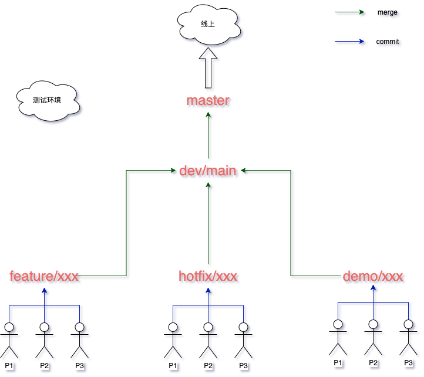
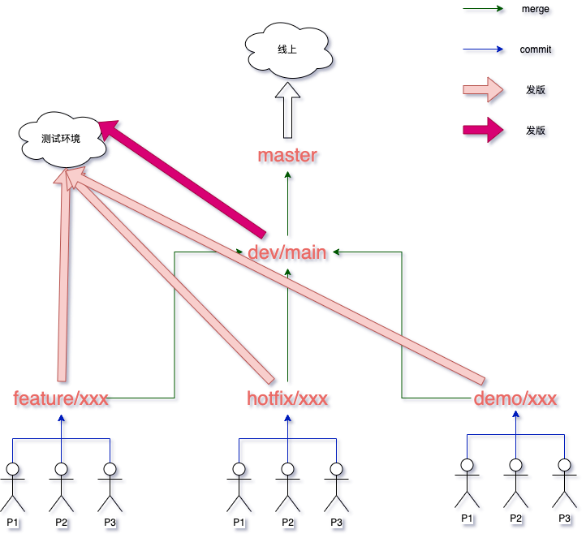

#### 前言

**起因**: 因为某次项目中的分支特别混乱, 在开发和发版上都给人带很多的重复操作和困惑, 总结有如下问题:

- 分支设置问题
    分支名很不合理, 以人命名区分不出来这个分支是干嘛的? 做过什么? 发版也会出现一些疑惑。

- 重复操作
    - 每次发版前都得合入其他人的分支, 我只想发个版而已, 没事`merge`好玩🐎🐎🐎? 浪费时间, **摊手.png**
    - 通用的的`utils` & `components` & `config` 不及时同步容易造成任务重叠, **你做了? 这么巧, 我也是.png**

- 发版问题
    - 浪费时间去合你那个, 我这个分支。

以上是目前为止, 我发现的问题。如果你说, 诶, 我就喜欢这么玩, 你拿我怎么着, `emmmm`, 那你玩好了, **就当爸爸什么也没说.png**

为什么消除这些问题, 故有了这些想法。

#### 分支的诞生

#### 分支的生命周期

#### 分支的设置规则

我认为的分支名的设置有几个重点:

- 准确定义, 见名知意

    - `feat/xxx` or `feature/xxx`: 新功能
    - `hotfix/xxx` or `fix/xxx`: 紧急`bug`
    - `demo/xxx`: `demo` or 客户 `UAT`
    - `docs/xxx`: 文档
    ...etc 可以参考[commitlint](https://github.com/conventional-changelog/commitlint#what-is-commitlint)的提交规则

- 好吧, 我想不出来, 欢迎补充呀👋👋👋

#### 分支的交际

#### 分支的发布

关于发布, 我也有几点想法, 也是目前为止团队较多的一个规则,

- 多人开发的功能是否具有相关性
    - 相同分支
        - 上线时间是否一致
            - 是
            `push`解决冲突
            - 否
            分支单独发 or 不同环境
    - 不同分支
        - 上线时间是否一致
            - 是
            推荐在`push`之前(谁后发版谁合并, 因为有关联, 建议与之前的开发者沟通下**冲突的内容**)合并分支发版测试 🤝🤝🤝
            - 否
            测试单发分支, 最后合并

#### 分支的未来

