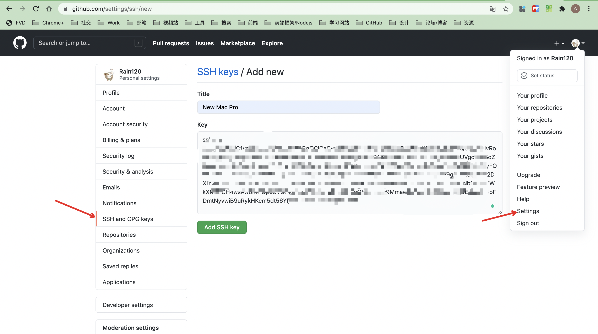
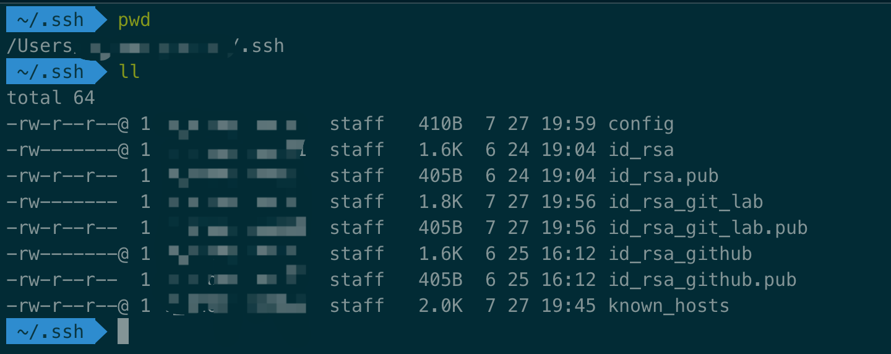

#### Resolve

```sh
# 在Linux或Mac OS终端或Windows Git Bash, 执行ssh-keygen命令生成SSH公钥和私钥
ssh-keygen -t rsa

# 查看并复制SSH公钥
cat ~/.ssh/id_rsa.pub
```

生成复制到 `GitHub` 等其他平台，然后在你的 `clone` 完项目之后

```sh
git clone xxxx
git config --local user.name Rain120
git config --local user.name xxx@xxx.com

# 查看配置中的 user
git config -e
```

或者一句命令执行

```sh
git clone xxxx/repo-name baidu/erp/fe-okr \
&& git config -f repo-name/.git/config user.name Rain120 \
&& git config -f repo-name/.git/config user.email xxxx@xxx.com
```

---

### 为什么需要配置多个`SSH Key`？

公司项目仓库可能存放在其他环境上而且私有，存在安全红线问题，个人学习相关的代码，需要提交到其他仓库

### 如何生成`SSH Key`?

```bash
# 默认方式: 存放位置 ~/.ssh 名字: id_rsa, id_rsa.pub

ssh-keygen -t rsa -C "youremail@email.com”

# 设置创建路径和名字

ssh-keygen -t rsa -C "youremail@email.com” -f ~/.ssh/id_rsa
```

创建时，会创建公钥和私钥，分别是`id_rsa_xxx.pub`, `id_rsa_xxx`, 你只需要根据自己需求使用对应的`SSH Key`即可。

### 添加GitHub SSH




### 创建`config`

```bash
cd ~/.ssh
touch config
```

```shell
# gitlab
Host gitlab.com  # 主机名字
HostName gitlab.com  # 主机名，有域名的写域名，没域名的写ip，如果写ip下面可以加一条Port 22这种端口信息。
PreferredAuthentications publickey
IdentityFile ~/.ssh/id_rsa  # 公钥文件

# github
Host github.com
HostName github.com
PreferredAuthentications publickey
IdentityFile ~/.ssh/id_rsa_github

...
```



**Note**: `ll` -> `ls -al`

### 测试时候连通？(Eg: github)

```bash
ssh -T git@github.com
```


