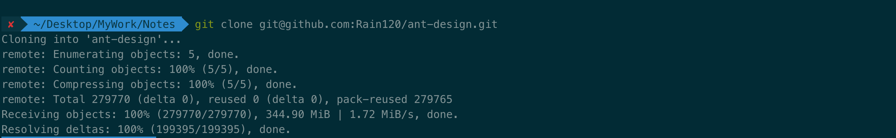
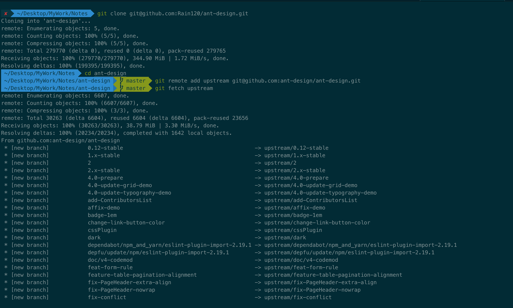

#### Git 如何同步Fork 项目的最新代码

```sh
git clone git@github.com:ant-design/ant-design.git

git remote add upstream git@github.com:ant-design/ant-design.git

git fetch upstream
```

以`Ant Desingn`为例






