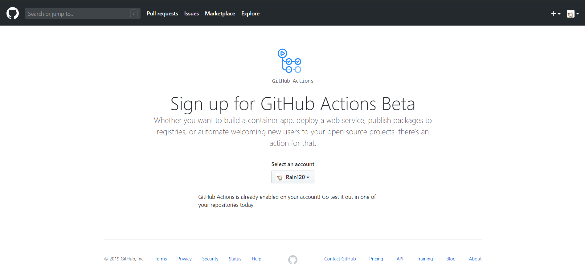
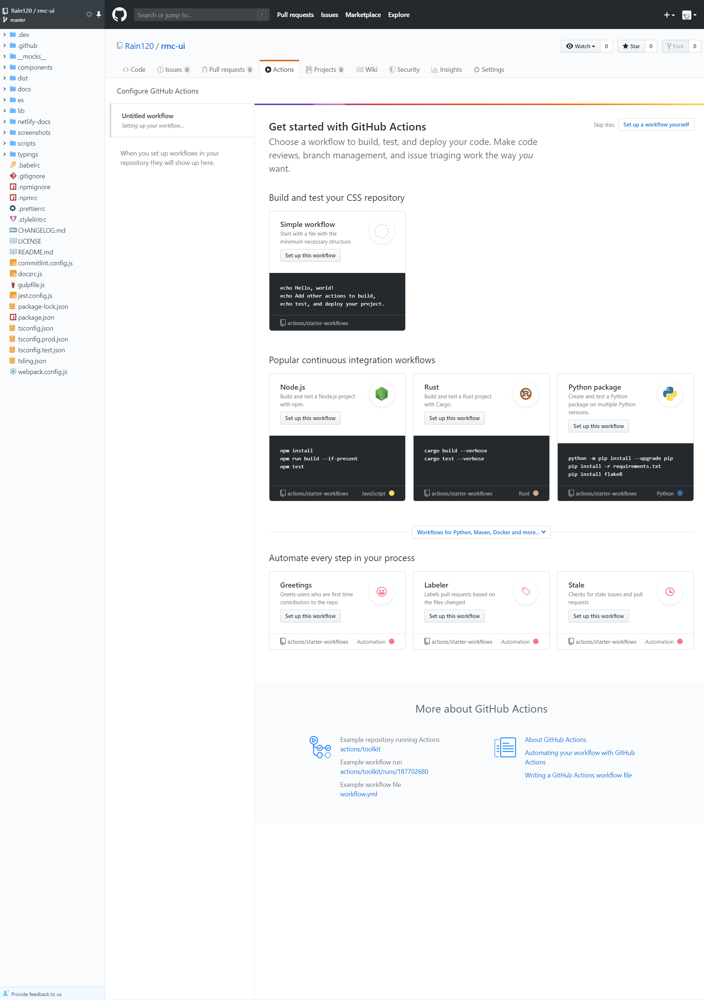

### [GitHub Actions](https://github.com/features/actions)

> `GitHub Actions`是现今非常优秀的`CI / CD`工具，它使你可以轻松实现所有软件工作流程的自动化。你可以直接从`GitHub`中构建，测试和部署代码。按照你所希望的方式进行代码检查、分支管理和问题筛选工作。

### 申请权限`Github Actions bete`

#### 如何使用`Github Actions`

