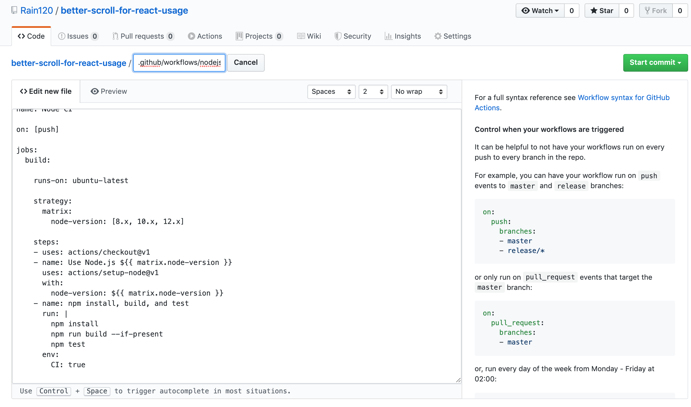
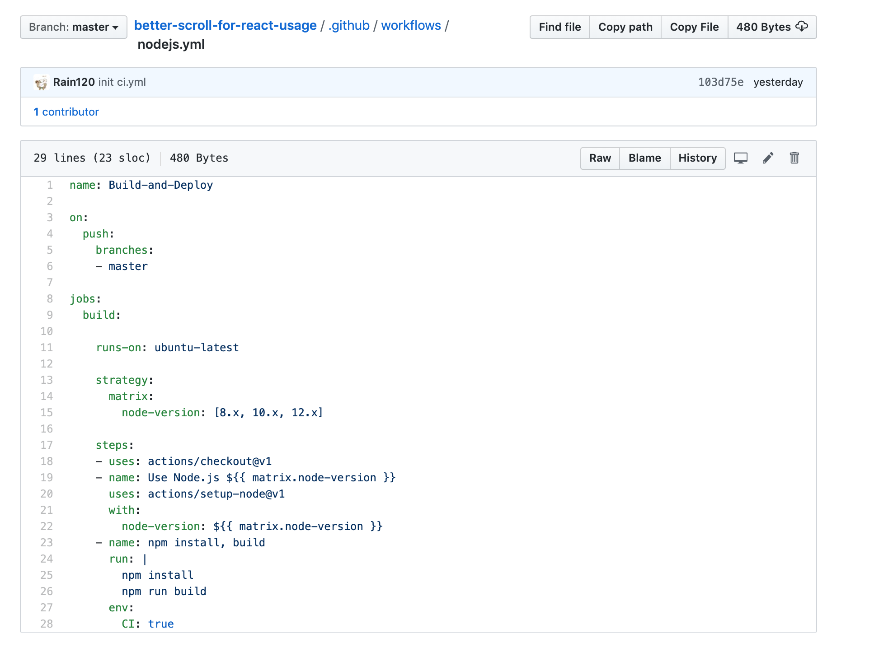
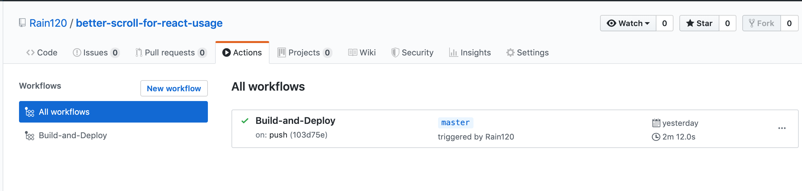
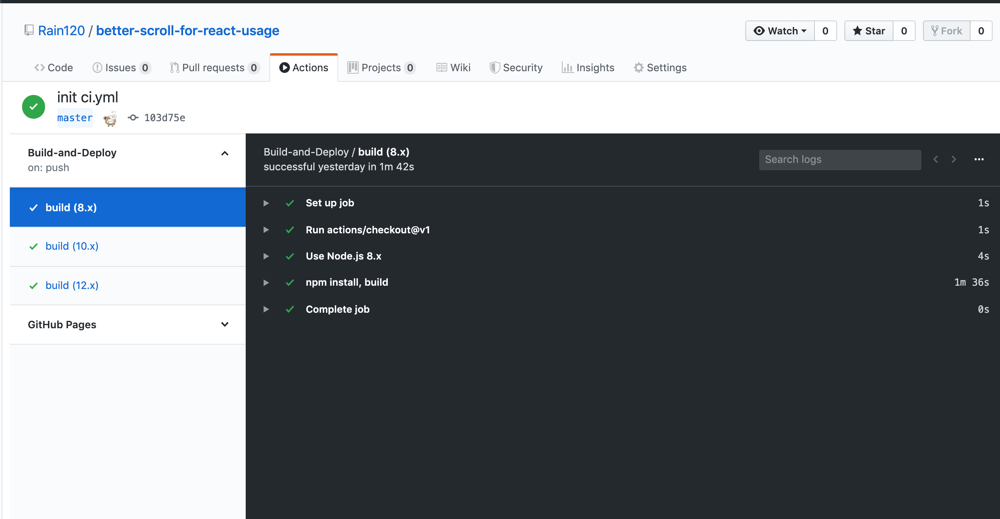

### [GitHub Actions](https://github.com/features/actions)

> `GitHub Actions`是现今非常优秀的`CI / CD`工具，它使你可以轻松实现所有软件工作流程的自动化。你可以直接从`GitHub`中构建，测试和部署代码。按照你所希望的方式进行代码检查、分支管理和问题筛选工作。

### 申请权限`Github Actions bete`


#### 如何使用`Github Actions`


我们来做一个最简单的`CI`，就是在线`Build and Deploy`，我们使用的[Demo](https://github.com/Rain120/better-scroll-for-react-usage)只需要在用户`push`之后,进行`npm run build`即可。

首先我们选择`Node.js`



我们发现这个`workflow`会帮我们`check node`的版本以及提供一些简单的流程。

我们目前只要让他执行

```shell
npm install
npm run build
```

所以我们的配置如下



设置完了之后，我们点击进入



👉有个执行按钮



### 参考资料

[GitHub Actions 入门教程](http://www.ruanyifeng.com/blog/2019/09/getting-started-with-github-actions.html)

