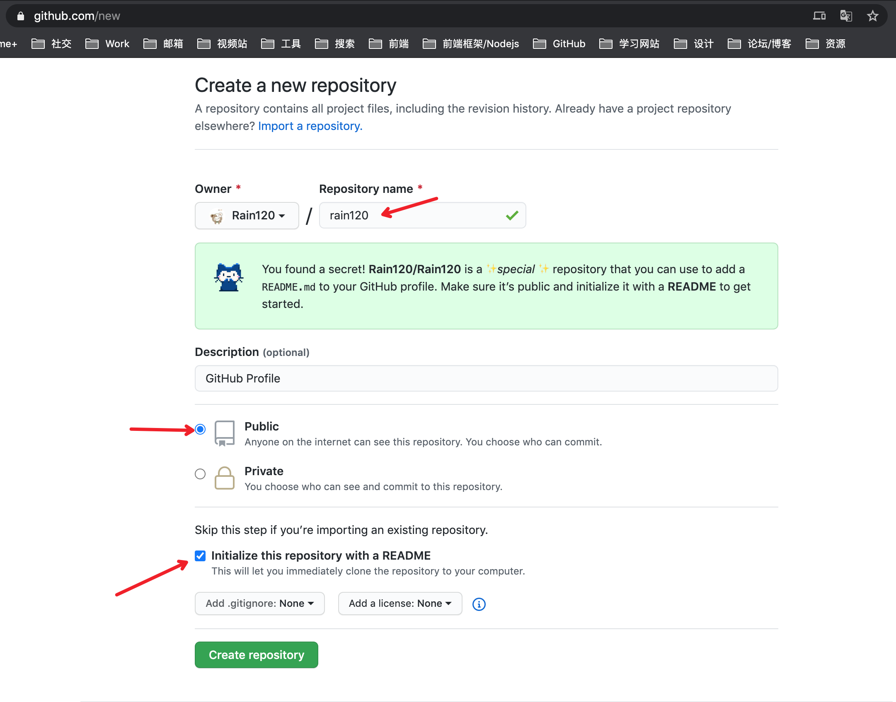

#### 创建一个同名的仓库

[Create a new repository](https://github.com/new)



#### README.md

```md
### Hi there, I'm Rain120! 👋

<a href="https://rain120.github.io/study-notes/">
  
</a>
<a href="https://codesandbox.io/u/rain120">
  
</a>
<a href="https://www.zhihu.com/people/yan-yang-nian-hua-120">
  
</a>
<a href="https://juejin.im/user/57c616496be3ff00584f54db">
  
</a>
<a href="http://weibo.com/5304058050/profile">
  
</a>

<br />
<br />

Hi, I'm Rain120, 一名已经 **北漂** 两年的菜鸡前端, 技术栈是 `React` + `Mobx`, 正在积极学习 `Typescript`, 生活组成就是出门练习练习摄影, 试图捡起篮球以及 **折腾并学习那些不会的前端知识** (PS: 学不动了要😭😭) , 并且会将学习心得和笔记记录下 [study-notes](https://rain120.github.io/study-notes/)上, 除此之外, 还会实践一些个人感兴趣的小东西, 虽然流产率比较高, 但还是比较喜欢折腾这些。

<!-- - 🔭 -->

- 🌱 目前正在学习并书写 `Typescript` 指导书, 为了方便小白入门以及自己日后温习 [Here](https://github.com/Rain120/typescript-guide)

- 👯 真正寻求大佬的 `PR` [Here](https://github.com/Rain120/typescript-guide)

- 💬 欢迎各位向我提问 [Here](https://github.com/Rain120/rain120/issues)

**Languages and Tools:**

<code></code>

<code></code>

<code></code>

<code></code>

[](https://github.com/Rain120/)

**我热度最高的Repositories:**

<a href="https://github.com/Rain120/typescript-guide" style="display: inline-flex;">
  
</a>

<a href="https://github.com/Rain120/study-notes" style="display: inline-flex;">
  
</a>

<a href="https://github.com/Rain120/awesome-javascript-code-implementation" style="display: inline-flex;">
  
</a>

**更多仓库 [Here](https://github.com/Rain120?tab=repositories)**

**当前热度最高的Repositories, 请向下👇👇👇滚动**

```


#### 参考

[github-readme-stats](https://github.com/anuraghazra/github-readme-stats)

[GitHub 隐藏功能 - 个人首页](https://zhuanlan.zhihu.com/p/161029860)

