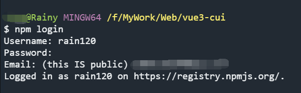
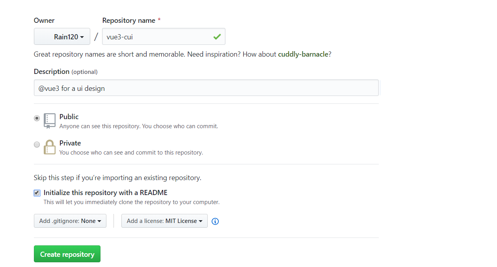
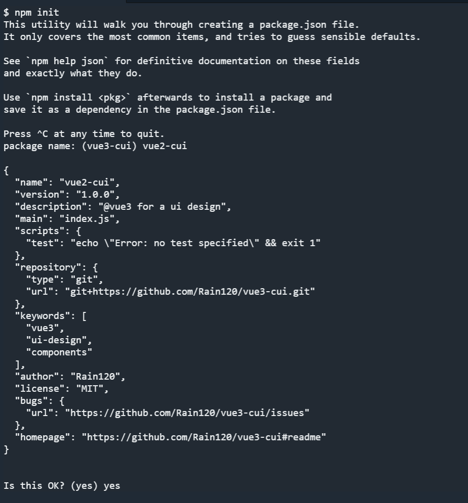
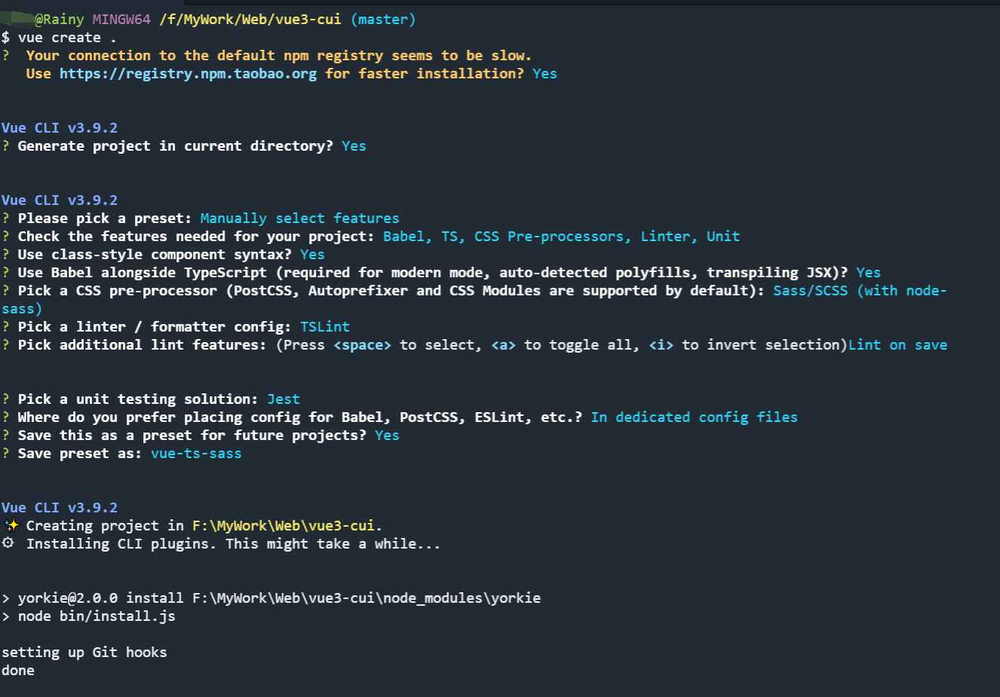
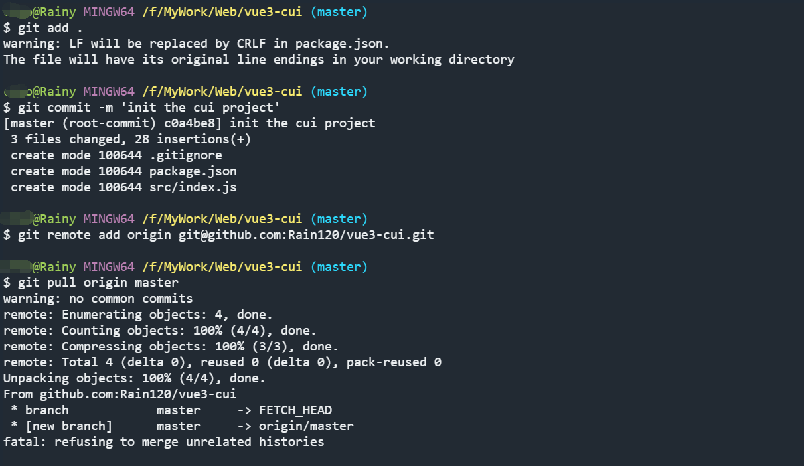
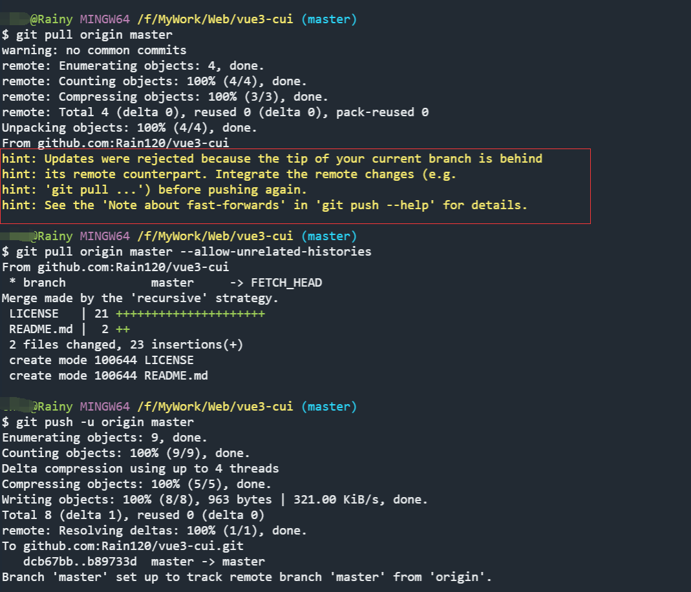
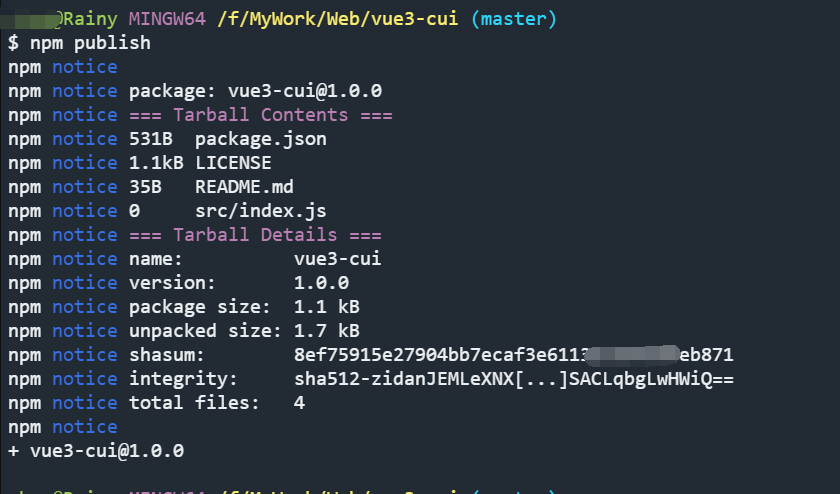

#### 1. 注册`npm`账号

[npm注册地址](https://www.npmjs.com/)

```shell
npm login
```




新建一个`repository`



`npm init`



`vue-create`



`remote github`



`push error`



查看你的包名是否已存在


`npm publish`



#### 2. 使用`vue3.x`进行组件库开发

问题:

1. `vue 3.x`学习
2. 组件库开发
3. 持续集成学习

待学习ing


