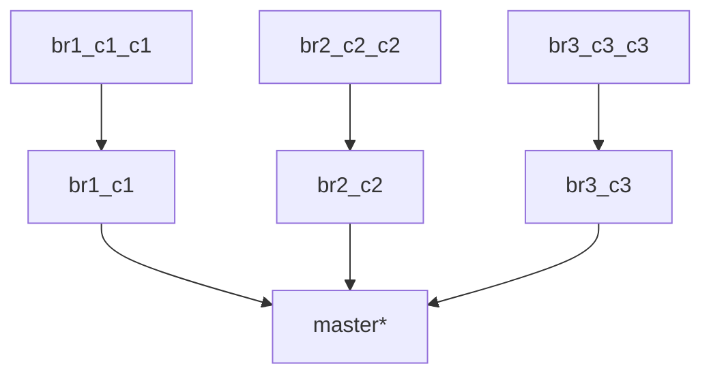
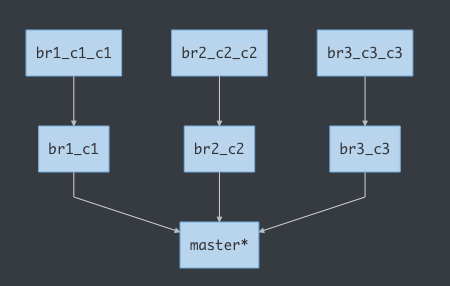
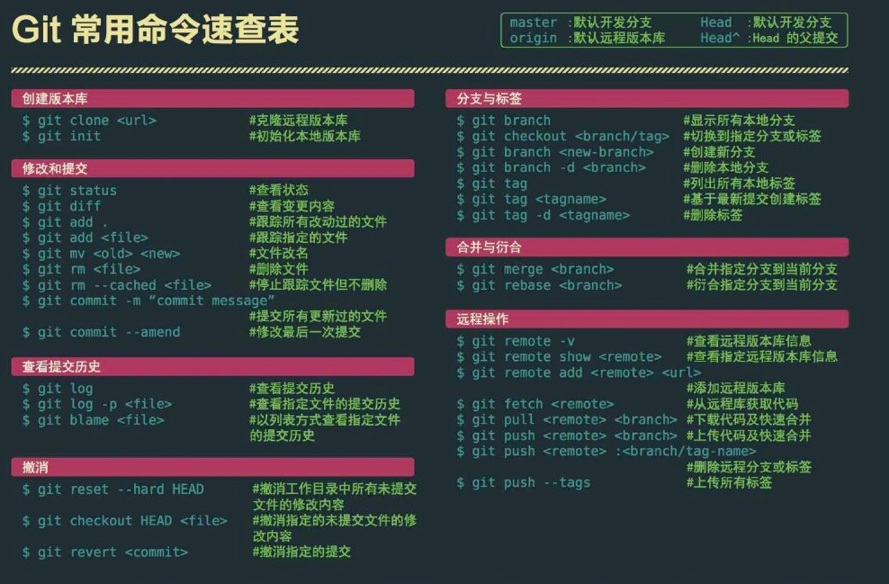

>  [Git](https://git-scm.com/) 是一个分布式版本控制软件, 最初目的是为更好地管理`Linux`内核开发而设计。
>
>  来源：[维基百科  - Git](https://zh.wikipedia.org/wiki/Git)

`Git`是一个软件，它允许你通过提交对一个系统（或一组）文件的历史进行注释。这些提交便是在给定时间点对系统做出的差异“快照”。

[官网下载速度慢，可使用这个链接下载](https://github.com/Rain120/Free-Source/releases/tag/0.0.1) 或者[`Github`下载地址](https://github.com/Rain120/Free-Source/blob/master/Git%20Bash/README.md), 需要其他版本请提`issue`联系我。

#### 1. `Git` 配置

```shell
--system #系统级别
--global #用户全局
--local #单独一个项目

git config --global user.name "xxxx" #用户名
git config --global user.email "xxxx@xxx.com" #邮箱

git config --list # 列举所有配置
```

[连接远程仓库`github`](https://git-scm.com/book/zh/v1/服务器上的-Git-生成-SSH-公钥)

1. 创建`SSH Key`

   ```shell
   ssh-keygen -t rsa -C <youremail@example.com>
   ```

   

2. 登陆`GitHub`，打开`Account settings` -> `SSH Keys` -> `Add SSH Key`，填上任意`Title`，在`Key`文本框里粘贴`id_rsa.pub`文件的内容

3. 测试是否连接

   ```shell
   ssh git@github.com
   ```

   

几个概念：

工作区`(Working Directory)`: 你在电脑里能看到的目录。

暂存区`(stage / index)`: 保存了下次将提交的文件列表信息, 一般存放在 `.git`目录下 下的`index`文件`(.git/index)`中，所以我们把暂存区有时也叫作索引`(index)`。

版本库`(Repository)`:  工作区有一个隐藏目录`.git`，这个不算工作区，而是`Git`的版本库。

远程仓库`(Remote)`


<center>阮一峰老师对Git工作区、暂存区、版本库、远程仓库的解释</center>


<center>Runoob对Git工作区、暂存区、版本库、远程仓库的解释</center>

忽略文件配置：添加`.gitignore`文件

文件 `.gitignore` 的格式规范如下：

- 所有空行或者以 `＃` 开头的行都会被 Git 忽略。
- 可以使用标准的 glob 模式匹配。
- 匹配模式可以以（`/`）开头防止递归。
- 匹配模式可以以（`/`）结尾指定目录。
- 要忽略指定模式以外的文件或目录，可以在模式前加上惊叹号（`!`）取反。

#### 2. 创建版本库

版本库又名仓库，英文名`repository`，你可以简单理解成一个目录，这个目录里面的所有文件都可以被`Git`管理起来，每个文件的修改、删除，`Git`都能跟踪，以便任何时刻都可以追踪历史，或者在将来某个时刻可以“还原”。

```shell
git clone url # clone远程仓库
git init # 初始化本地版本库
```

#### 3. `Git` 分支

`master`: 默认开发分支

`HEAD`: 当前开发分支

`HEAD^([n])`: `HEAD`的第`n`次父提交提交, `^`相当于`^1`

`HEAD~([n])`: `HEAD`的第`n`个祖先提交

`origin`: 默认远程版本库





`master`: `master`分支

`*`: `HEAD`，当前活跃(开发)分支

`br1_c1`: `br1`分支的提交第一次提交

`br1_c1_c1`: `br1_c1`的第一次提交

<details>
  <summary>如何区分`^`和`~`？</summary>
  <br />
  据上图示知，当前开发分支是`master`，即`HEAD`指向`master`, `c1`, `c2`, `c3`是`master`的三次父提交
  <br />
  `HEAD^ -> c1`，`HEAD^2 -> c2`，`HEAD^3 -> c3`, `HEAD~ -> c1`，`HEAD~2 -> c1_c1`
</details>


```shell
git branch # 查看分支

git branch -r #查看远程分支

# 此命令将显示包含特定提交的所有分支。
git branch --contains <commit>

git branch <name> # 创建分支

git checkout <name> # 切换分支

git checkout -b <name> # 创建 + 切换分支

# 重命名本地分支
git branch -m <old-name> <new-name>

# 重命名刚切换的新分支
git branch -m <new-name>

# 重命名远程分支： 一旦在本地重命名了分支，您需要先远程删除该分支，然后再次推送重命名的分支。
git push origin :<old-name>
git push origin <new-name>

git merge <name> # 合并某分支到当前分支

git branch -d <name> # 删除分支

git branch -D <name> # 强制删除分支

# 删除远程分支(先在本地删除该分支)，原理是把一个空分支push到server上，相当于删除该分支。
git push origin :<name>
```

`Note`: `checkout`只会移动`HEAD`指针，`reset`会改变`HEAD`的引用值

#### 4. 查看

```shell
git status # 查看状态

git diff <filename> # 查看修改内容

git diff <first_branch>..<second_branch> # 显示两次提交之间的差异

git diff --shortstat "@{n day ago}" # 显示n天的代码数量

git diff --cached(--staged) # 查看已经暂存起来的变化

git show <commit>:<filename> # 显示某次提交时，某个文件的内容

git show <commit> # 显示某次提交的元数据和内容变化

git show --name-only <commit> # 显示某次提交发生变化的文件

git reflog # 显示当前分支的最近几次提交

git blame <filename> # 显示指定文件修改信息
```

#### 5. 修改

```shell
git add <filename>|<div> # 添加指定文件, 指定目录(包括子目录)到暂存区

git add . # 添加当前目录的所有文件到暂存区

# -p（或-patch）允许交互选择要提交的每个跟踪文件的各个部分。 这样每个提交只包含相关的更改。
git add -p

git mv <old-name> <new-name> # 文件改名

git rm --cached <file> # 停止追踪指定文件，但该文件会保留在工作区

git rm -f <filename> # 强制删除选项 -f
```

#### 6. 提交

```shell
git commit -m 'message' # 提交版本库

git commit -a -m 'message' # 添加所有修改文件到暂存区，并提交版本库(不包括新增文件)

git commit --amend -m # 修改最后一次提交，如果代码没有任何新变化，则用来改写上一次commit的提交信息
```

[`Git Commit`](https://git-scm.com/docs/git-commit)

#### 7. [撤销、版本回滚](https://git-scm.com/book/zh/v2/Git-基础-撤消操作)

```shell
git reset --hard HEAD # 撤销工作目录中暂存的所有未提交文件的修改内容

git reset --keep [commit] # 重置当前HEAD为指定commit，但保持暂存区和工作区不变

git reset [file] # 重置暂存区的指定文件，与上一次commit保持一致，但工作区不变

git commit --amend # 将暂存区中的文件提交

git checkout [file] # 恢复暂存区的指定文件到工作区

# --patch还可用于选择性地丢弃每个被跟踪文件的部分。
git checkout -p

# 此命令允许您快速切换到先前检出的分支。 一般说来 - 是前一个分支的别名。 它也可以与其他命令一起使用。
git checkout -

# 还原所有本地更改，如果您确定可以丢弃所有本地更改，则可以使用。
git checkout .

git checkout HEAD <filename> # 取消指定未提交文件的修改内容

git checkout --patch <filename> # 撤消对文件的修改

git revert <commit_id> # 撤销指定提交
```

#### 8. 提交历史

[常见参数选项](https://git-scm.com/book/zh/v2/Git-基础-查看提交历史#rlog_options):

`-p`: 显示每次提交的内容差异。

`—stat`: 显示每次更新的文件修改统计信息。

`—shortstat`: 只显示 `—stat` 中最后的行数修改添加移除统计。

`--name-only`  仅在提交信息后显示已修改的文件清单。

`--name-status`  显示新增、修改、删除的文件清单。

`--abbrev-commit`:  仅显示 `SHA-1` 的前几个字符，而非所有的 40 个字符。

`--relative-date`:  使用较短的相对时间显示（比如，`2 weeks ago`）。

`--graph`:  显示 `ASCII` 图形表示的分支合并历史。

`—pretty=(oneline,short,medium(默认值),full,fuller,email,raw,format)`： 这个选项可以指定使用不同于默认格式的方式展示提交历史。 这个选项有一些内建的子选项供你使用。

	- `oneline`: 将每个提交放在一行显示，查看的提交数很大时非常有用。
	- [`format`](https://git-scm.com/book/zh/v2/Git-基础-查看提交历史#rpretty_format): 列出了常用的格式占位符写法及其代表的意义。

`—oneline`: `--pretty=oneline --abbrev-commit` 的简化用法。

`--date= (relative|local|default|iso|rfc|short|raw)`：定制出现日期格式。

[常见输出参数](https://git-scm.com/book/zh/v2/Git-基础-查看提交历史#rlimit_options):

`-n`: 仅显示最近的 n 条提交

`—since`, `—after`: 仅显示指定时间之后的提交

`--until`, `—before`: 仅显示指定作者相关的提交。

`—author`: 仅显示指定提交者相关的提交。

`—grep`: 仅显示含指定关键字的提交

`-S`: 仅显示添加或移除了某个关键字的提交

默认不用任何参数的话，`git log` 会按提交时间列出所有的更新，最近的更新排在最上面。

```shell
git log # 查看所有提交历史

git log -p -n # 查看最近提交的n条历史

git log -p -n <filename> # 查看指定文件最近提交的n条历史
```

`git log alias`配置

```shell
git log --pretty=format:'%s %C(bold blue)(%an)%Creset' --abbrev-commit

git log --graph --pretty=format:'%Cred%h%Creset -%C(yellow)%d%Creset %s %Cgreen(%cr) %C(bold blue)<%an>%Creset' --abbrev-commit

# 设置git alias
git config --global alias.slg "log --color --graph --pretty=format:'%Cred%h%Creset -%C(yellow)%d%Creset %s %Cgreen(%cr) %C(bold blue)<%an>%Creset' --abbrev-commit"
```


```shell
# 显示每个提交在过去两周内引入的差异日志。
git whatchanged —-since='2 weeks ago'
```


#### 9. 标签

`Git` 可以给历史中的某一个提交打上标签，以示重要。

`Git `使用两种主要类型的标签：轻量标签`(lightweight)`与附注标签`(annotated)`。

轻量标签: 很像一个不会改变的分支 - 它只是一个特定提交的引用。它本质上是将提交校验和存储到一个文件中 - 没有保存任何其他信息。

附注标签是存储在 `Git` 数据库中的一个完整对象。 它们是可以被校验的；其中包含打标签者的名字、电子邮件地址、日期时间；还有一个标签信息；并且可以使用 `GNU Privacy Guard(GPG)`签名与验证。 通常建议创建附注标签，这样你可以拥有以上所有信息；但是如果你只是想用一个临时的标签，或者因为某些原因不想要保存那些信息，轻量标签也是可用的。

`-a`:  创建附注标签

`-m` 选项指定了一条将会存储在标签中的信息。 如果没有为附注标签指定一条信息，`Git` 会运行编辑器要求你输入信息。

```shell
git tag # 列出已有的标签

git tag <tagname> # 创建标签，-a 创建附注标签

git tag -d <tagname> # 删除掉你本地仓库上的标签

git show <tagname> # 查看标签信息与对应的提交信息

git push origin <tagname> # 推送标签到远程仓库服务器上

git push origin --tags # 一次性推送所有不在远程仓库服务器上的标签
```

#### 10. 变基

`merge`:  用来合并一个或者多个分支到你已经检出的分支中， 然后它将当前分支指针移动到合并结果上，现有分支不会被修改。

`rebase`: 通常称之为“衍合”，它通过修改提交历史来对比双方的`commit`，然后找出不同的去缓存，然后在去`push`，修改你的`commit`历史。

`cherry-pick`: 用于将在其他分支上的 commit 修改，移植到当前的分支(HEAD), `-x` 参数，表示保留原提交的作者信息进行提交。

```shell
git merge <branch> # 合并指定分支到当前分支

git rebase <branch> # 衍合指定分支到当前分支

# 用于将在其他分支上的 commit 修改，移植到当前的分支(HEAD), <start-commit-id>…<end-commit-id>左开右闭，<start-commit-id>^…<end-commit-id>全闭
git cherry-pick <start-commit-id>…<end-commit-id>
```

#### 11. 储藏与清理

当你在项目的一部分上已经工作一段时间后，所有东西都进入了混乱的状态，而这时你想要切换到另一个分支做一点别的事情。 问题是，你不想仅仅因为过会儿回到这一点而为做了一半的工作创建一次提交。

储藏会处理工作目录的脏的状态 - 即，修改的跟踪文件与暂存改动 - 然后将未完成的修改保存到一个栈上，而你可以在任何时候重新应用这些改动。

```shell
git add . && git stash # 将新的储藏推送到栈上

git stash save 'message' # 储藏修改，并留下stash信息

# -p（或-patch）允许交互选择要提交的每个跟踪文件的各个部分。 这样每个提交只包含相关的更改。
git stash -p

# 默认情况下，当存储时，不包括未跟踪的文件。 为了更改该行为并包含这些文件，您需要使用-u参数。 还有-a（-all）可以完全存储未跟踪和忽略的文件，这可能是您通常不需要的东西。
git stash -u

git stash list # 查看栈中所有暂存

git stash apply <stash_id> # 恢复复对应编号暂存到工作区，如果不指定编号为栈顶的，注意：这些暂存还在栈中

git stash pop <stash_id> #将栈顶的暂存，恢复到工作区，并从栈中弹出，注意：这些暂存不在栈中

git stash drop <stash_id> # 移除的储藏在栈中的东西

git stash clear #清空暂存栈

git stash branch <branch_name> # 从储藏创建一个分支
```

#### 12. 远程操作

远程仓库是指托管在因特网或其他网络中的你的项目的版本库。

```shell
git remote # 查看已配置的远程仓库服务器

git remote -v # 指定选项 -v，会显示需要读写远程仓库使用的 Git 保存的简写与其对应的 URL。

git remote show <remote-name> # 查看制定远程仓库的更多信息

git remote add <shortname> <url> # 添加一个新的远程 Git 仓库

git remote rm <name> # 移除远程仓库

git remote rename <oldname> <newname># 重命名远程仓库

git fetch <remote-name> # 从远程仓库中拉取数据

# 下载代码及快速合并, 当你想拉取origin服务器上的当前分支名的代码时，可简写git pull
git pull <remote-name> <branch-name>

# 第一次推送到远程仓库，--set-upstream可简写为-u
git push --set-upstream <remote-name> <branch-name>

# 推送到远程仓库, 当你想将当前开发分支名推送到 origin 服务器，可简写为git push
git push <remote> <branch-name>

git push [remote] --force # 强行推送当前分支到远程仓库，即使有冲突

git push [remote] --all # 推送所有分支到远程仓库

git push <remote> :<branch-name/tag-name> # 删除远程分支或标签

git push --tag # 上传所有标签
```

#### 13. 冲突

```shell
# 一次打开所有冲突的文件,重新绑定可能会导致冲突，以下命令将打开需要您帮助解决这些冲突的所有文件。
git diff --name-only --diff-filter=U | uniq  | xargs $EDITOR
```

#### 从本地初始化到上传到`GitHub`远程仓库的一般步骤

```shell
git init
git add .
git commit -m 'hint message'
git remote add origin 'your project repositories href on github'
git pull origin master
git push -u origin master
```

首次`push`远程仓库提交错误 -> [错误截图解决详见](https://zhuanlan.zhihu.com/p/34125089)

```error
error: failed to push some refs to 'https://github.com/xxx.git'
```

```shell
# --allow-unrelated-histories 合并了两个不相关的项目的历史记录。
git pull origin master --allow-unrelated-histories

git push -u origin master
```



参考资料

[Git Document](https://git-scm.com/docs)  [中文文档](https://git-scm.com/book/zh/v2)

[15-git-commands-you-may-not-know](https://zaiste.net/15-git-commands-you-may-not-know/)

[阮一峰常用`Git `命令清单](http://www.ruanyifeng.com/blog/2015/12/git-cheat-sheet.html)

[廖雪峰 `Git`教程](https://www.liaoxuefeng.com/wiki/896043488029600)

[Runoob `Git`教程](https://www.runoob.com/git/git-tutorial.html)

[`Git`入门](https://backlog.com/git-tutorial/cn/)

