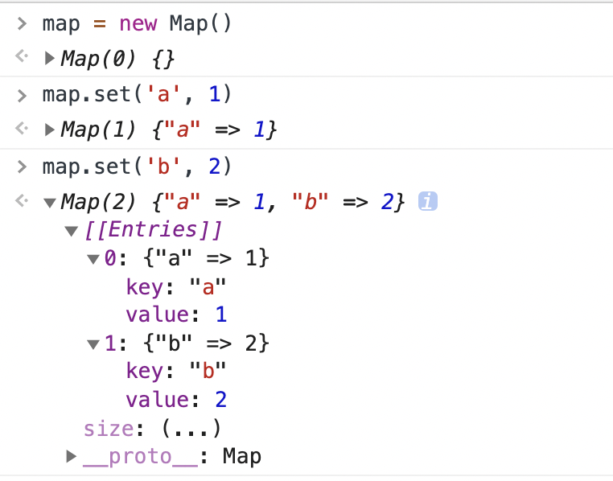
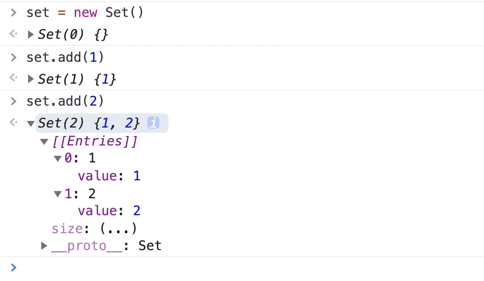

#### 前置概念

##### 强引用

在 `JavaScript` 中，一般我们创建一个对象，都是建立一个强引用：

```js
let rain120 = { name: "rain120" };
```

只有当我们手动设置 `rain120 = null` 的时候，才有可能回收 `rain120` 所引用的对象。

##### 弱引用

> 在[计算机程序设计](https://zh.wikipedia.org/wiki/计算机程序设计)中，**弱引用**与[强引用](https://zh.wikipedia.org/w/index.php?title=强引用&action=edit&redlink=1)相对，是指不能确保其引用的[对象](https://zh.wikipedia.org/wiki/对象_(计算机科学))不会被[垃圾回收器](https://zh.wikipedia.org/wiki/垃圾回收器)回收的引用。一个对象若只被弱引用所引用，则被认为是[不可访问](https://zh.wikipedia.org/wiki/不可访问内存)（或弱可访问）的，并因此可能在任何时刻被回收。   --- [Wiki](https://zh.wikipedia.org/zh-cn/%E5%BC%B1%E5%BC%95%E7%94%A8)

#### Map

**`Map`** 对象保存键值对，并且能够记住键的原始插入顺序。任何值(对象或者[原始值](https://developer.mozilla.org/zh-CN/docs/Glossary/Primitive)) 都可以作为一个键或一个值。

#### WeakMap

**`WeakMap`** 对象是一组键/值对的集合，其中的键是**弱引用**的。其键**必须是对象**，而值可以是任意的。

`WeakMap` 中，每个键对自己所引用对象的引用都是弱引用，在没有其他引用和该键引用同一对象，这个对象将会被垃圾回收(相应的`key`则变成无效的)，所以，`WeakMap` 的 `key` 是不可枚举的。

#### Map Vs WeakMap

##### Map



- 本质上是键值对的集合，类似集合，以 `[{ key: addKey, value: addValue }]` 的形式储存元素
- **可以遍历**

##### WeakMap

- **只接受对象作为键名**(`null`除外)，不接受其他类型的值作为键名。
- 键名所指向的对象，不计入垃圾回收机制。
- **不能遍历**，即没有`keys()`、`values()`和`entries()`方法，也没有`size`属性。
- `WeakMap` 只有以下的方法：
  - `weakMap.get(key)`
  - `weakMap.set(key, value)`
  - `weakMap.delete(key)`
  - `weakMap.has(key)`

#### Set

**`Set`** 对象允许你存储任何类型的唯一值，无论是[原始值](https://developer.mozilla.org/zh-CN/docs/Glossary/Primitive)或者是对象引用。

#### WeakSet

**`WeakSet`** 对象允许你将 **弱引用** 存储在一个集合中。

#### Set Vs WeakSet

##### Set



- 成员不能重复，以 `[{ value: addValue }]` 的形式储存元素。
- 只有键值，没有键名。
- **可以遍历**。

##### WeakSet

- 成员都是对象。
- **不能遍历**，成员都是弱引用，随时可以消失。
- 可以用来保存DOM节点，不容易造成内存泄漏。
- `WeakSet` 只有以下的方法：
  - `weakSet.add(key, value)`
  - `weakSet.delete(key)`
  - `weakSet.has(key)`

#### 参考资料

[Javascript 垃圾回收](notes/javascript/key-concept/garbage-collection.md)

[ECMAScript 6 入门 - Set 和 Map 数据结构](https://es6.ruanyifeng.com/#docs/set-map)

[MDN Map](https://developer.mozilla.org/zh-CN/docs/Web/JavaScript/Reference/Global_Objects/Map)

[MDN WeakMap](https://developer.mozilla.org/zh-CN/docs/Web/JavaScript/Reference/Global_Objects/WeakMap)

[MDN Set](https://developer.mozilla.org/zh-CN/docs/Web/JavaScript/Reference/Global_Objects/Set)

[MDN WeakSet](https://developer.mozilla.org/zh-CN/docs/Web/JavaScript/Reference/Global_Objects/WeakSet)

