[目录 -> 学习笔记](notes/guide.md)

[目录 -> 上一级](notes/javascript/guide.md)

在`CSS`中，每一个元素都是一个盒子，都有着描述盒子大小和位置的相关属性。比如：`width`, `height`, `position: trbl(top, right, bottom, left)`。在实际开发中，我们可能需要通过`JavaScript`来获取它们的位置和尺寸关系，这篇笔记就是记录这个问题，不瞎`BB`了, 我们直接进入正题。

### 1. `DOM`

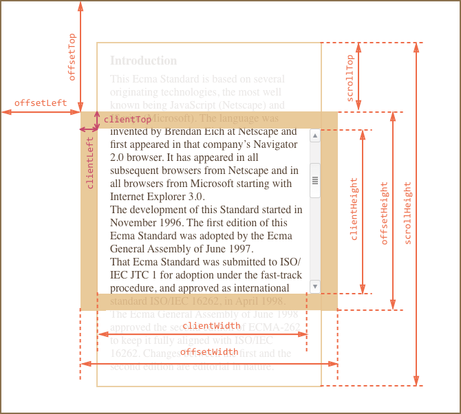

查看各浏览器版本是否兼容属性: [Can I Use](<https://caniuse.com/>)

#### **Scroll家族**


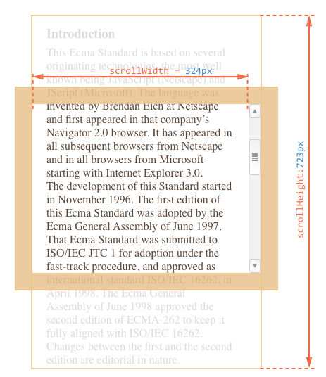

* `scroll`
  * `scrollHeight`: 只读
    * 返回`Number`表示元素的滚动视图高度, 包括由于溢出而无法展示在网页的不可见部分。
    * `scrollHeight` >= `clientHeight`
    * 无滚动条：`scrollHeight` = `clientHeight` = `height` + `padding-top`+ `padding-bottom`
    * 有水平滚动条：`scrollHeight` = `clientHeight` + `horizontal scroll bar` = `height` + `padding-top`+ `padding-bottom` + `horizontal scroll bar`
  * `scrollWidth`: 只读
    * 返回`Number`表示元素的滚动视图宽度, 包括由于溢出而无法展示在网页的不可见部分。
    * `scrollWidth` >= `clientWidth`
    * 无滚动条：`scrollWidth` = `clientWidth` = `width` + `padding-left`+ `padding-right`
    * 有垂直滚动条：`scrollWidth` = `clientWidth` + `vertical scroll bar` = `width` + `padding-left`+ `padding-right` + `vertical scroll bar`
  * `scrollTop`: 可读可写
    * 返回`Number`表示该元素纵向滚动条距离
  * `scrollLeft` : 可读可写
    * 返回`Number`表示该元素横向滚动条距离最左的位移.

**getBoundingClientRect()**: 返回元素的大小及其相对于视口的位置。

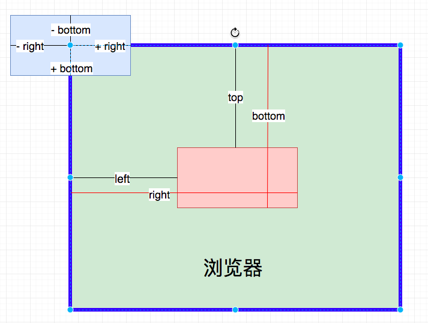

**判定元素是否滚动到底**

如果元素滚动到底，下面等式返回true，没有则返回false.

```
element.scrollHeight - element.scrollTop === element.clientHeight
```

当容器不滚动但有溢出的子容器时，这些检查可以确定容器能否滚动：

```html
window.getComputedStyle(element).overflowY === 'visible' window.getComputedStyle(element).overflowY !== 'hidden'
```

#### **Client家族**

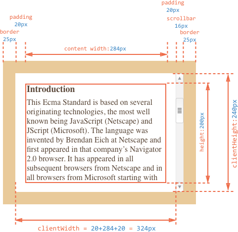

* `client`
  * `clientHeight`: 只读
    * 返回`Number`表示内部相对于外层元素的高度.
    * `clientHeight` = `height` + `padding-top` + `padding-bottom` - `horizontal scroll bar`(?)
  * `clientWidth`: 只读
    * 返回`Number`表示该元素它内部的宽度.
    * `clientWidth` = `width` + `padding-left` + `padding-right` - `vertical scroll bar`(?)
  * `clientTop`: 只读
    * 返回`Number`表示该元素距离它上边界的高度.
    * `clientTop` = `border-top` + 上边的滚动条大小
  * `clientLeft`: 只读
    * 返回`Number`表示该元素距离它左边界的宽度.
    * `clientLeft` = `border-left` + 左边 的滚动条大小

`Note`: (?) 是否存在

#### **Offset家族**


```css
#content {
  width: 300px;
  height: 200px;
  border: 25px;
  padding: 20px;
}
```

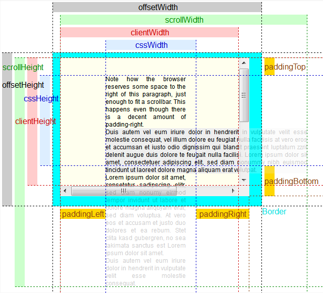

* `offset`
  * `offsetHeight`
    * 返回`double`, 高度包含该元素的垂直内边距(`padding-top`, `padding-bottom`)和边框(`border-top`, `border-bottom`)。
    * `offsetHeight` = `height` (含滚动条宽度)+ `border-top` + `border-bottom` + `padding-top` + `padding-bottom`.
  * `offsetWidth`
    * 返回`double`, 高度包含该元素的水平内边距(`padding-left`, `padding-right`)和边框(`border-left`, `border-right`)。
    * `offsetWidth` = `width` (含滚动条宽度)+ `border-left` + `border-right` + `padding-left` + `padding-right`.
  * `offsetTop`
    * 返回`double`,当前元素`border`顶部距离父元素顶部或者`body`元素`border`顶部的距离。
    * `offsetTop` = `marginTop?` + `paddingTop?` + `top`(先找到`offsetParent`)
  * `offsetLeft`
    * 返回`double`, 当前元素的`border`左边距离父元素`border`左边或者`body`元素`border`左边的距离。
    * `offsetLeft` = `marginLeft?` + `paddingLeft?` + `left`(先找到`offsetParent`)
  * `offsetParent`
    * 返回`HTMLElement`, 返回一个指向最近的(`closest`，指包含层级上的最近), 包含该元素的定位元素，如果没有就是`body`元素。当元素的 `style.display` 设置为 `none` 时，`offsetParent` 返回 `null`。(与当前元素最近的经过定位(`position`不等于`static`)的父级元素)

  定义`offsetParent`情况：

  - 1、`position: fixed` -> `offsetParent = null`

    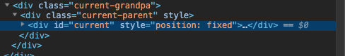

    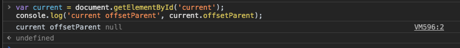

  - 2 父元素是根据其父元素定位后元素，当前元素无定位 -> `offsetParent = current parent dom`

    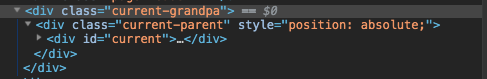

    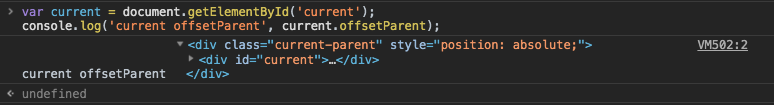

  - 3 父元素是无定位后元素，当前元素无定位  -> `offsetParent = <body></body>`

    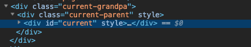

    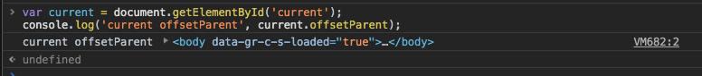

  - 4  `display: none` -> `offsetParent = null`

    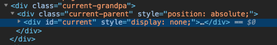

    

  - 5  `<body></body>`元素 -> `offsetParent = null`

    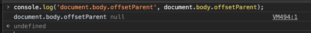

  **注意**：

  - 1、需要考虑盒模型，即`box-sizing`属性对元素的影响；
  - 2、需要考虑到`overflow`或者内容撑开出现的滚动条；
  - 3、有些高度是有内容自动撑开的，即设置`width`、`height`为`auto`。

**获取元素位置**

```javascript
function getPosition(el) {
  var _x = 0;
  var _y = 0;
 
  while (el) {
    if (el.tagName.toUpperCase() == "BODY") {
      // deal with browser quirks with body/window/document and page scroll
      var xScroll = el.scrollLeft || document.documentElement.scrollLeft;
      var yScroll = el.scrollTop || document.documentElement.scrollTop;
 
      _x += (el.offsetLeft - xScroll + el.clientLeft);
      _y += (el.offsetTop - yScroll + el.clientTop);
    } else {
      // for all other non-BODY elements
      _x += (el.offsetLeft - el.scrollLeft + el.clientLeft);
      _y += (el.offsetTop - el.scrollTop + el.clientTop);
    }
 
    el = el.offsetParent;
  }
  return {
    x: _x,
    y: _y
  };
}

/ deal with the page getting resized or scrolled
window.addEventListener("scroll", updatePosition, false);
window.addEventListener("resize", updatePosition, false);

function updatePosition() {
  // add your code to update the position when your browser
  // is resized or scrolled
  var position = getPosition(myElement);
}
```


参考：

[MDN - Element](<https://developer.mozilla.org/zh-CN/docs/Web/API/Element>)

[DOM系列：获取元素位置和尺寸](<https://www.w3cplus.com/javascript/get-element-position-and-size-using-javascript.html>)

[JavaScript学习笔记：视口宽高、位置与滚动高度](<https://www.w3cplus.com/javascript/offset-scroll-client.html>)

[Get an Element's Position Using JavaScript](<https://www.kirupa.com/html5/get_element_position_using_javascript.htm>)

