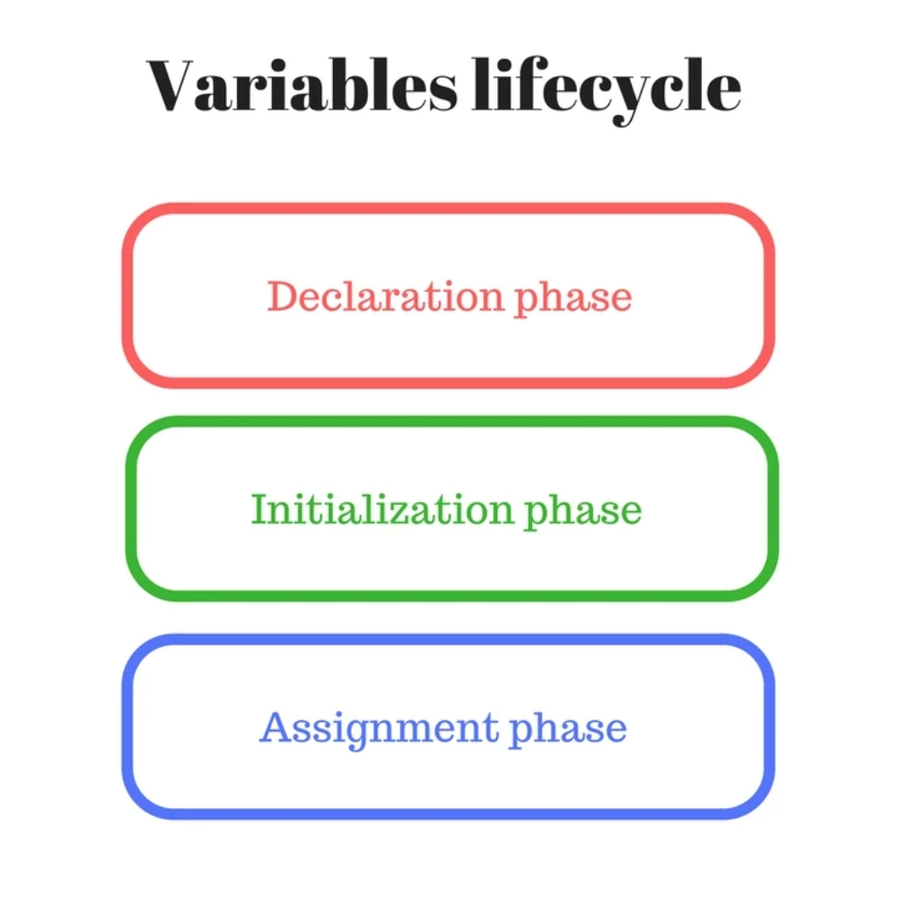
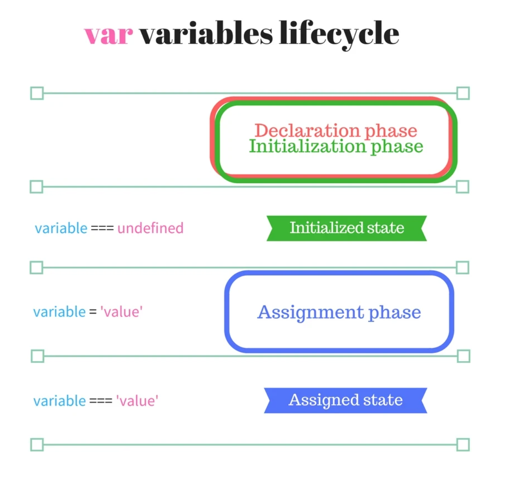
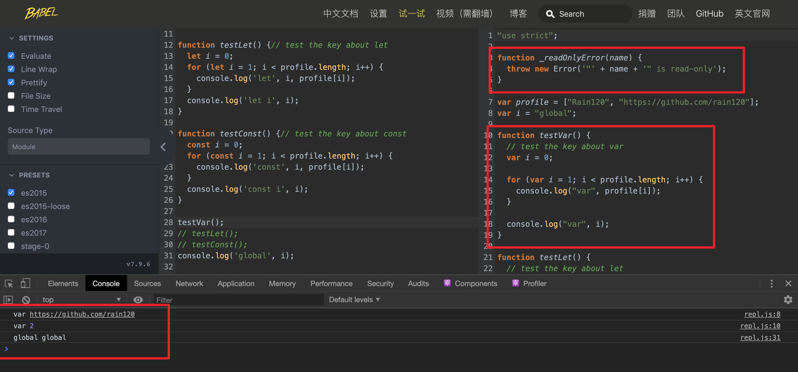
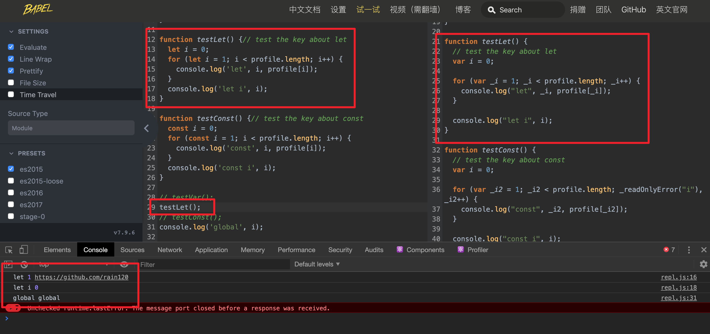
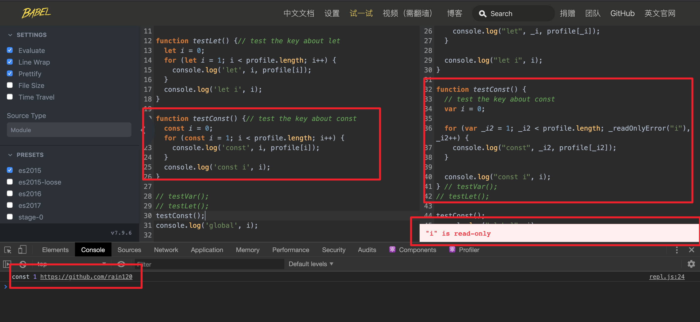

#### 什么是变量？

变量是存储数据值的容器。在 `JavaScript` 中，对象和函数也是变量。

##### 全局变量

函数之外声明的变量，会成为*全局变量*。

全局变量的作用域是*全局的*：网页的所有脚本和函数都能够访问它。

##### 局部变量

在 `JavaScript` 函数中声明的变量，会成为函数的*局部变量*。

局部变量的作用域是*局部的*：只能在函数内部访问它们。

**Note:** 

`JavaScript `变量的有效期始于其被创建时。

局部变量会在函数完成时被删除。

全局变量会在您关闭页面是被删除。

#### 什么是作用域?

变量和函数的**可访问范围**，即作用域控制着变量和函数的 **可见性** 和 **生命周期**。

`ES6`之前, `Javascript`只有 **全局作用域** 和 **局部作用域**, 之后新增了 **块级作用域**, 具体从[`let`](https://developer.mozilla.org/en-US/docs/Web/JavaScript/Reference/Statements/let) [`const`](https://developer.mozilla.org/en-US/docs/Web/JavaScript/Reference/Statements/const)中体现。

#### 全局作用域(Global Scope)

不在任何函数内定义的变量就具有全局作用域。

- `window` 是**浏览器**的全局对象，`global` 是 `Node`环境下的全局对象
- 不在任何一个函数内定义的变量拥有全局作用域

#### 局部作用域(Local Scope)

`JavaScript`的作用域是通过函数来定义的，所以每一个在函数内定义的变量只能拥有这个函数内的**局部作用域**  (除**闭包**外, 详见[Javascript 闭包](notes/javascript/key-concept/closure.md))。

#### 块级作用域(block Statement)

用于组合零个或多个语句，该块由一对大括号`{}`界定, 具体从[`let`](https://developer.mozilla.org/en-US/docs/Web/JavaScript/Reference/Statements/let) [`const`](https://developer.mozilla.org/en-US/docs/Web/JavaScript/Reference/Statements/const)中体现。

我们知道，当`Javascript`引擎使用变量时，它们的生命周期包括以下几个阶段：

1. **声明阶段**正在范围内注册变量。
2. **初始化阶段**是分配内存并为作用域中的变量创建绑定。在此步骤中，变量将使用进行自动初始化`undefined`。
3. **分配阶段**是为初始化变量分配一个值。

变量在通过声明阶段时已**处于统一**状态，但尚未达到**初始化**状态。



即: **声明阶段**，**初始化阶段**和**赋值阶段**。

##### var变量生命周期



在执行任何语句之前，变量在作用域的开头通过*声明阶段*并立即*初始化阶段*（步骤1）。 `var variable`语句在函数作用域中的位置不影响声明和初始化阶段。

在声明和初始化之后，但是在赋值阶段之前，该变量具有`undefined`值并且可以被使用。

在*赋值阶段* `variable = 'value'`，变量将接收其初始值（步骤2）。

严格*吊起*的思想是，在函数作用域*的开始处声明和初始化*变量。声明和初始化阶段之间没有差距。

##### 暂存性死区

在讲这两个关键字前，我们先讲一个概念 `TDZ(Temporal Dead Zone)`, 又称**暂存性死区**。

##### let

**let**允许你声明一个作用域被限制在 [`块`](https://developer.mozilla.org/zh-CN/docs/Web/JavaScript/Reference/statements/block)级中的变量、语句或者表达式。与 [`var`](https://developer.mozilla.org/zh-CN/docs/Web/JavaScript/Reference/statements/var) 关键字不同的是， [`var`](https://developer.mozilla.org/zh-CN/docs/Web/JavaScript/Reference/statements/var)声明的变量只能是全局或者整个函数块的。 [`var`](https://developer.mozilla.org/zh-CN/docs/Web/JavaScript/Reference/statements/var) 和 `let` 的不同之处在于后者是在编译时才初始化（[见下面](https://developer.mozilla.org/zh-CN/docs/Web/JavaScript/Reference/Statements/let#暂存死区)）。

##### const

下面我们将边通过`babel`对`var` `let` `const`关键字的解析来理解，块级作用域，反派总是死于话多，话不多说，我们直接上代码

```javascript
let profile = ['Rain120', 'https://github.com/rain120'];
var i = 'global';

function testVar() {
  // test the key about var
  var i = 0;
  for (var i = 1; i < profile.length; i++) {
   	console.log('var', profile[i]); 
  }
  console.log('var', i);
}

function testLet() {
  // test the key about let
  let i = 0;
  for (let i = 1; i < profile.length; i++) {
   	console.log('let', i, profile[i]); 
  }
  console.log('let i', i);
}

function testConst() {
  // test the key about const
  const i = 0;
  for (const i = 1; i < profile.length; i++) {
   	console.log('const', i, profile[i]); 
  }
  console.log('const i', i);
}

// testVar();
// testLet();
// testConst();
// console.log('global', i);
```

`babel`解析

```javascript
"use strict";

function _readOnlyError(name) {
  throw new Error('"' + name + '" is read-only');
}

var profile = ["Rain120", "https://github.com/rain120"];
var i = "global";

function testVar() {
  // test the key about var
  var i = 0;

  for (var i = 1; i < profile.length; i++) {
    console.log("var", profile[i]);
  }

  console.log("var", i);
}

function testLet() {
  // test the key about let
  var i = 0;

  for (var _i = 1; _i < profile.length; _i++) {
    console.log("let", _i, profile[_i]);
  }

  console.log("let i", i);
}

function testConst() {
  // test the key about const
  var i = 0;

  for (var _i2 = 1; _i2 < profile.length; _readOnlyError("i"), _i2++) {
    console.log("const", _i2, profile[_i2]);
  }

  console.log("const i", i);
} // testVar();
// testLet();
// testConst();
// console.log('global', i);

```

运行结果

- `testVar`

  

- `testLet`

  

- `testConst`

  

更多详情请移步 [babeljs playground](https://www.babeljs.cn/repl#?browsers=&build=&builtIns=false&spec=false&loose=false&code_lz=DYUwLgBADgTg9gMwJaggXggbQOQCUCGSAdgIwBMADNgDQTYAWYYUAzgFwD0HA5kmPQFcARgDoAxnAC2HGIVKVsAXQDcAKABu-GBCTo63YHCH5g2NaoQCiYsEjhEIYECzAA1LQAoAlBADeXR2dIfhAIAGsQAE8IfCE4AUhNGFUICCSdPQo1VIQ4bQ903QwSZQyAHmh4ZFARUCJuflKkAGpmn18U1IBICSIWOBrDbg9sJJpKxBQQTCRFL1LOgF9O3v7BuGHRrXGkedVliysbOwcnFwAZcG8_ALPg-lCI6Nj4yFAwTveMjCzO3PyvkUICVyhNqiBaiB6o0dK12p0ID17GsIUMRu8drRYJNQDM5gtUstUqsBqiNujwDodnsDpZrLZ7IEXABhZFga7-DhM-6PKIxOIJCCrD7EtnfCC_HJ5CAeYXikG6CrY8GQ6H0JpwvwIpF9Um1cnYYWYsFTPHzCBLFbIvVow1ipDUtQHW5BdwwbxqF0XK57L1gVl9dm-rkk9abAxGEyO1RAA&debug=false&forceAllTransforms=false&shippedProposals=false&circleciRepo=&evaluate=true&fileSize=false&timeTravel=false&sourceType=module&lineWrap=true&presets=es2015&prettier=true&targets=&version=7.9.6&externalPlugins=)

#### 什么是作用域链？

#### 参考资料

[what-is-lexical-scope](https://stackoverflow.com/questions/1047454/what-is-lexical-scope)

[作用域 - Wiki](https://zh.wikipedia.org/zh-cn/作用域)

[块级作用域](https://developer.mozilla.org/en-US/docs/Web/JavaScript/Reference/Statements/block)

[Execution context and the call stack — visually illustrated by a slice of tasty cake](https://medium.com/free-code-camp/execution-context-and-the-call-stack-visually-illustrated-by-a-slice-of-tasty-cake-14f9a64dc460)

[Scope](https://developer.mozilla.org/zh-CN/docs/Glossary/Scope)

[are-variables-declared-with-let-or-const-not-hoisted-in-es6](https://stackoverflow.com/questions/31219420/are-variables-declared-with-let-or-const-not-hoisted-in-es6)

[let hoisting](https://github.com/getify/You-Dont-Know-JS/issues/767)

[variables-lifecycle-and-why-let-is-not-hoisted](https://dmitripavlutin.com/variables-lifecycle-and-why-let-is-not-hoisted)

