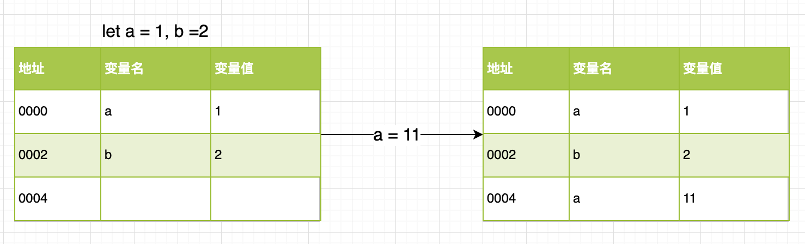
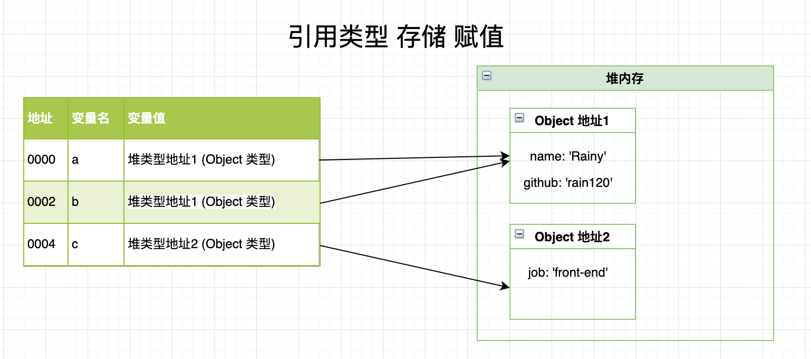
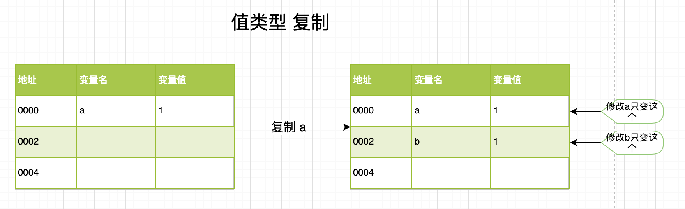

#### 值类型 & 引用类型

##### 区别

1. **可变性**

**值类型的数据是不可变(immutable)的。**指值本身，一旦创建，便不可更改。

值类型是存储在堆内存中。

```javascript
let a = 1, b = 2;
a = 11;
```




**常见类型**: `number`, `string`, `null`, `undefined`, `boolean`, `symbol`

**引用类型值是可以改变的。**

引用类型的值是将变量名称和引用地址存储 保存在**堆内存** `(Heap)` 中的对象 `(Object)`。

```javascript
let a = { name: 'Rainy' };
let b = a;
b.github = 'Rain120'
let c = { job: 'front-end' };
```



**常见类型**: 对象`object`, 函数 `function`, 数组`array`, 类型的包装函数`Object` `Array` `Number`  `String` `Boolean`,  `Math` `Date` `RegExp` 库函数等

**Note**: `JavaScript` 不能直接操作对象的内存空间 **(堆内存)**。

2. **复制**

**值类型复制是值本身复制**

```javascript
let a = 1;
let b = a;
```



**引用类型复制是值的引用复制**

```javascript
let a = { name: 'Rainy' }
let b = a;
b.github = 'Rain120'
```


**Note:**

- 函数传递的参数是**引用类型**时，函数的参数是传入的参数的引用，所以**函数内部操作参数**会对传入的参数造成副作用
- `==` 和 `===`对引用类型的值判断结果是一样的，不准确。

#### 对象引用

对象引用就是将一个**引用类型的值**复制给 **另一个变量**，实际上就是将 **引用类型的堆地址** 复制给新变量。

详细见上图

#### null 和 undefined 的区别

**null表示"没有对象"，即该处不应该有值。**典型用法是：

- 作为函数的参数，表示该函数的参数不是对象。

- 作为对象原型链的终点。

**undefined表示"缺少值"，就是此处应该有一个值，但是还没有定义。**典型用法是：

- 变量被声明了，但没有赋值时，就等于 `undefined`。
- 调用函数时，应该提供的参数没有提供，该参数等于`undefined`。
- 对象没有赋值的属性，该属性的值为`undefined`。
- 函数没有返回值时，默认返回`undefined`。


**void 运算符** 对给定的表达式进行求值，然后返回 [`undefined`](https://developer.mozilla.org/zh-CN/docs/Web/JavaScript/Reference/Global_Objects/undefined)。`void` 运算符通常只用于获取 `undefined`的原始值，一般使用`void(0)`（等同于`void 0`）。

##### 参考

[undefined与null的区别](https://www.ruanyifeng.com/blog/2014/03/undefined-vs-null.html)

[void](https://developer.mozilla.org/zh-CN/docs/Web/JavaScript/Reference/Operators/void)

#### 精度丢失

##### 小数

大家先思考下下面几个问题:

```javascript
0.1 + 0.2 = ? 0.3
0.07 * 100 = ? 7
1 - 0.9 = ? 0.1
```

`JavaScript` 的数字在存储时并不区分`number`和`float`类型，而是采用 [IEEE 754](https://zh.wikipedia.org/zh-cn/IEEE_754) **标准的 64 位双精度浮点数**来存储的。那么 **IEEE 754** 定义的**双精度浮点数**的格式是什么呢？

1. 了解 IEEE 754 格式

- 1 位符号位 `(sign)`
- 11 位指数位 `(exponent)`
- 52 位尾数位 `(fraction)`


2. 小数进制转换

我们知道**十进制**转换 其他 **进制** 分为 **整数转换**， **小数转换**

**整数**: 转换数值 **除以** 进制数 **取余**，放**后面**

**小数**: 转换数值 **乘以** 进制数 **取整数位**， 放**前面**

```javascript
# 0.1  十进制 -> 二进制
0.1 * 2 = 0.2  取0
0.2 * 2 = 0.4  取0
0.4 * 2 = 0.8  取0
0.8 * 2 = 1.6  取1
0.6 * 2 = 1.2  取1
0.2 * 2 = 0.4  取0
0.4 * 2 = 0.8  取0
0.8 * 2 = 1.6  取1
0.6 * 2 = 1.2  取1
.... n

# 0.1 = 0.0001 1001 1...
```

##### 整数

```javascript
Number.MAX_SAFE_INTEGER = 9007199254740991 = Math.pow(2, 53) - 1

Number.MIN_SAFE_INTEGER = -9007199254740991 = -(Math.pow(2, 53) - 1)
```

整数在**安全值域内**`[-9007199254740991, 9007199254740991]`亦会如此

##### 参考资料

[Wiki IEEE 754](https://zh.wikipedia.org/zh-cn/IEEE_754)

