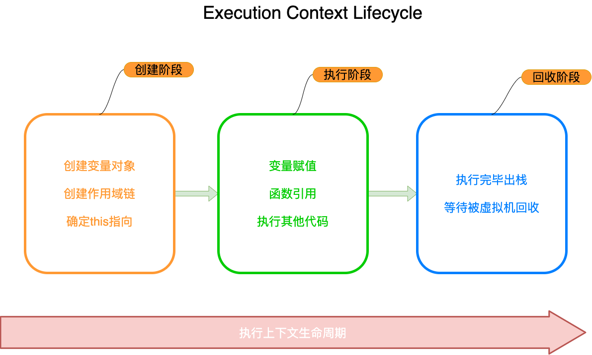

#### 前言

想要了解 `EC`，需要先了解一下几个概念

- [作用域链`(Scope chain)`](notes/javascript/key-concept/scope-chain.md)
- 执行上下文`(Execution Context or EC)`
- 执行环境栈 `(Execution Context Stack or ECS)`
- 变量对象`(Variable object，VO)`
- 活动对象`(Activation object，AO)`

#### 作用域链 (Scope chain)

[详见](notes/javascript/key-concept/scope-chain.md)

#### 执行上下文 (Execution Context or EC)

执行上下文`(EC)`是评估和执行 `JavaScript` 代码的环境的抽象概念。每当 `Javascript` 代码在运行的时候，它都是在执行上下文中运行。

##### 生命周期

执行上下文的生命周期包括三个阶段：**创建阶段👉执行阶段👉回收阶段**。

**创建阶段**

- 创建变量对象
- 建立作用域链
- 确定`this`指向

**执行阶段**

- 变量赋值
- 函数引用
- 执行其他代码

**回收阶段**

执行完毕出栈，等待被虚拟机回收

##### 执行上下文类型

`JavaScript` 中有三种执行上下文类型。

- **全局执行上下文** `(global)`

  默认任何不在函数内部的代码都在全局上下文中。它会执行两件事：创建一个全局的 `window` 对象（浏览器的情况下），并且设置 `this`的值等于这个全局对象。一个程序中只会有一个全局执行上下文。

- **函数执行上下文** `(function)`

  每当一个函数被调用时, 都会为该函数创建一个新的上下文。每个函数都有它自己的执行上下文，不过是在函数被调用时创建的。函数上下文可以有任意多个。每当一个新的执行上下文被创建，它会按定义的顺序执行一系列步骤。

- **Eval 函数执行上下文** `(Eval)`

  执行在 `eval`函数内部的代码也会有它属于自己的执行上下文。

#### 执行上下文栈 (Execution Context Stack or ECS)

也称**调用栈**, 是一种拥有 `LIFO(后进先出)`数据结构的栈，被用来存储代码运行时创建的所有**执行上下文**。

#### 变量对象 (Variable object，VO)

> Every execution context has associated with it a variable object. Variables and functions declared in the source text are added as properties of the variable object. For function code, parameters are added as properties of the variable object.
>
> --- [Standard ECMA-262 3r d Edition - December 1999 - 10.1.3 Variable Instantiation](http://www.ecma-international.org/publications/files/ECMA-ST-ARCH/ECMA-262, 3rd edition, December 1999.pdf)

创建执行上下文时与之关联的会有一个变量对象，它保存着当前上下文所有变量。

- 变量`(Variable Declaration)`
- 函数生命`(Function Declaration)`
- 函数形参 `(function arguments)`

#### 活动对象 (Activation object，AO)

> When control enters an execution context for function code, an object called the activation object is created and associated with the execution context. The activation object is initialised with a property with name arguments and attributes { DontDelete }. The initial value of this property is the arguments object described below.
>
> The activation object is then used as the variable object for the purposes of variable instantiation.
>
> --- [Standard ECMA-262 3r d Edition - December 1999 - 10.1.6 Activation Object](http://www.ecma-international.org/publications/files/ECMA-ST-ARCH/ECMA-262, 3rd edition, December 1999.pdf)

当控制进入函数代码的执行上下文时，创建一个活动对象并将它与该执行上下文相关联， 并使用一个名为 `arguments`、特征为 `{ DontDelete }` 的属性初始化该对象。该属性的初始值是稍后将要描述的一个参数对象`Arguments Object(简称ArgO)`。 活动对象纯粹是一种规范性机制，在 `ECMAScript` 访问它是不可能的。只能访问其成员而非该活动对象本身。对一个基于对象为活动对象的引用值应用调用运算符时，这次调用的 `this` 值为` null`。

**当函数被激活，那么一个活动对象(activation object)就会被创建并且分配给执行上下文。活动对象由特殊对象 arguments 初始化而成。随后，它被当做变量对象(variable object)用于变量初始化。**

#### 参考资料

[Understanding Execution Context and Execution Stack in Javascript](https://blog.bitsrc.io/understanding-execution-context-and-execution-stack-in-javascript-1c9ea8642dd0)

[execution contexts](https://tc39.es/ecma262/#sec-execution-contexts)

[execution context stack](https://tc39.es/ecma262/#execution-context-stack)

[ecmascript variable object](http://dmitrysoshnikov.com/ecmascript/chapter-2-variable-object/)

[javascriptthe core](http://dmitrysoshnikov.com/ecmascript/javascript-the-core/)

[调用栈](https://developer.mozilla.org/zh-CN/docs/Glossary/Call_stack)

