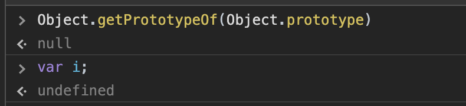

**null表示"没有对象"，即该处不应该有值。**典型用法是：

- 作为函数的参数，表示该函数的参数不是对象。

- 作为对象原型链的终点。

**undefined表示"缺少值"，就是此处应该有一个值，但是还没有定义。**典型用法是：

- 变量被声明了，但没有赋值时，就等于 `undefined`。
- 调用函数时，应该提供的参数没有提供，该参数等于`undefined`。
- 对象没有赋值的属性，该属性的值为`undefined`。
- 函数没有返回值时，默认返回`undefined`。

**void 运算符** 对给定的表达式进行求值，然后返回 [`undefined`](https://developer.mozilla.org/zh-CN/docs/Web/JavaScript/Reference/Global_Objects/undefined)。`void` 运算符通常只用于获取 `undefined`的原始值，一般使用`void(0)`（等同于`void 0`）。

#### 参考

[undefined与null的区别](https://www.ruanyifeng.com/blog/2014/03/undefined-vs-null.html)

[void](https://developer.mozilla.org/zh-CN/docs/Web/JavaScript/Reference/Operators/void)
