## 缘由
小白正则表达式入门学习：[正则表达式30分钟入门教程](http://www.runoob.com/w3cnote/regular-expression-30-minutes-tutorial.html#alternative)

正则表达式Regular Expression是一种文本模式。它描述了一种字符串匹配的模式pattern，可以用来检查一个串是否含有某种子串、将匹配的子串替换或者从某个串中取出符合某个条件的子串等。
我们将正则表达式分为几个部分记下笔记，便于理解与使用。
## 1. 元字符

我们在 [MDN-Regular_Expression](https://developer.mozilla.org/en-US/docs/Web/JavaScript/Guide/Regular_Expressions) 上得知，正则表达式会有一些特殊字符，也叫作元字符。如下表示：

|                          字符                          | 含义                                                         |                   英语记忆或者个人记忆方法                   |
| :----------------------------------------------------: | ------------------------------------------------------------ | :----------------------------------------------------------: |
|                        匹配字符                        |                                                              |                                                              |
|                           \b                           | 匹配一个单词边界，也就是指单词和空格间的位置。一个匹配的词的边界的内容的长度是0。（不要和[\b]混淆了） |                            blank                             |
|                           \B                           | 匹配非单词边界。一个字符串的开始和结尾都被认为不是“字”字符，或者空字符串 |                       Blank，b与B相反                        |
|                           \d                           | 匹配一个数字字符。等价于 [0-9]                               |                            digit                             |
|                           \D                           | 匹配一个非数字字符。等价于 [\^0-9]                           |                       Digit，d与D相反                        |
|                           \s                           | 匹配任何空白字符，包括空格、制表符、换页符等等。等价于 `[ \f\n\r\t\v]` |                            space                             |
|                           \S                           | 匹配任何非空白字符。等价于`[^ \f\n\r\t\v]`                   |                       Space, s与S相反                        |
|                           \w                           | 匹配字母、数字、下划线。等价于'\[A-Za-z0-9_]'                |                             word                             |
|                           \W                           | 匹配非字母、数字、下划线。等价于 '\[^A-Za-z0-9_]'            |                        Word，w与W相反                        |
|                      匹配特殊字符                      |                                                              |                                                              |
|                           \t                           | 匹配一个制表符 (\x09)。                                      |                            Table                             |
|                           \n                           | 匹配一个换行符 (\x09A)。                                     |                           New line                           |
| [\f](https://en.wikipedia.org/?title=%5Cf&redirect=no) | 匹配一个换页符 (\x09C)。                                     |                     Page break#Form feed                     |
|                           \v                           | 匹配一个垂直制表符。等价于 \x0b 和 \cK。                     |                        Vertical table                        |
|                           \r                           | 匹配一个回车符 (\x09D)。                                     |                            Return                            |
|                           \                            | 将下一个字符标记为一个特殊字符、或一个原义字符、或一个 向后引用、或一个八进制转义符。 | 反斜杠也可以将其后的特殊字符，转义为字面量,当需要使用`\`时也需要将其转义 |
|                         x \| y                         | 匹配 x 或 y                                                  |                            或运算                            |
|                           ^                            | 匹配输入字符串的开始位置。如果设置了 RegExp 对象的 Multiline 属性，^ 也匹配 '\n' 或 '\r' 之后的位置 |                             开始                             |
|                           $                            | 匹配输入字符串的结束位置。如果设置了RegExp 对象的 Multiline 属性，$ 也匹配 '\n' 或 '\r' 之前的位置 |                             结束                             |
|                      匹配内容次数                      |                                                              |                                                              |
|                           *                            | 匹配前面的子表达式零次或多次                                 |                           `{0, n}                            |
|                           +                            | 匹配前面的子表达式一次或多次                                 |                            {1, n}                            |
|                           ?                            | 匹配前面的子表达式零次或一次                                 |                            {0, 1}                            |
|                        匹配分组                        |                                                              |                                                              |
|                       (pattern)                        | 匹配 `pattern` 并获取这一匹配。所获取的匹配可以从产生的 `Matches` 集合得到，`JS`使用 `$0…$9` 属性获取匹配结果 |                 匹配括号内部的正则表达式结果                 |
|                          [xy]                          | 字符集合,匹配所包含的任意一个字符                            |                  匹配[]内部的内容,即`x` `y`                  |
|                         [^xy]                          | 字符集合,匹配所包含的任意一个字符                            |         匹配[]内部的内容,即不是`x` `y`的任意一个字符         |
|                         [a-z]                          | 字符集合,匹配所包含的任意一个字符                            |           匹配[]内部的内容,即`a-z`之间任意一个字符           |
|                         [^a-z]                         | 负值字符范围。匹配任何不在指定范围内的任意字符               |         匹配[]内部的内容,即不是`a-z`之间任意一个字符         |
|                          {n}                           | `n` 是一个非负整数。匹配确定的 `n` 次                        |                   匹配连续出现`n`次的字符                    |
|                          {n,}                          | `n` 是一个非负整数。至少匹配`n` 次                           |                   匹配至少出现`n`次的字符                    |
|                         {n,m}                          | `m` 和 `n` 均为非负整数，其中`n` <= `m`。最少匹配 `n` 次且最多匹配 `m` 次 |                   匹配出现 `[n, m]`次字符                    |

 - 优先级：正则表达式从左到右进行计算，并遵循优先级顺序

下面我们讲上述元字符一个一个的测试。

不过，在测试之前，我们先了解两个[正则表达式的方法](#func)，[test()](#test) 和 [exec()](#exec)。

元字符`\b`与`\B`

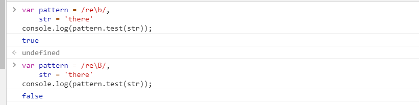

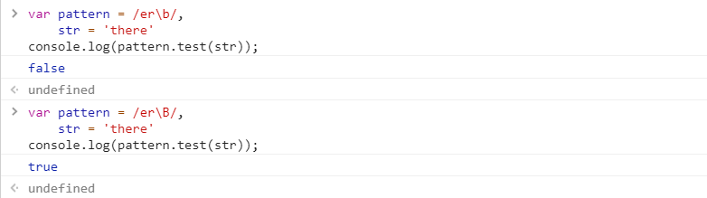

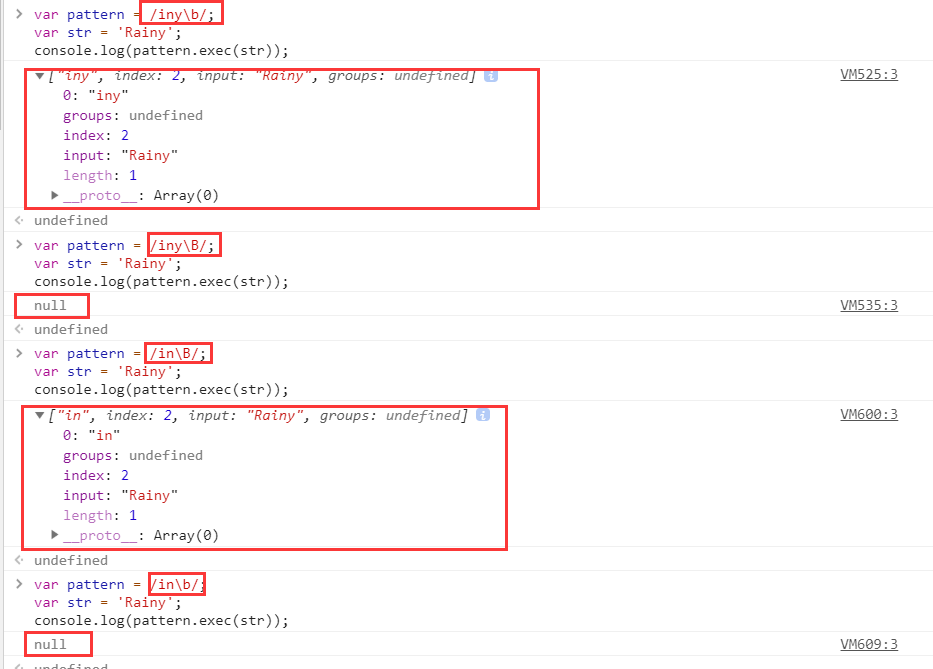
从上面结果得知，b匹配的是单词的边界，B匹配的是非单词的边界

元字符`\d`与`\D`
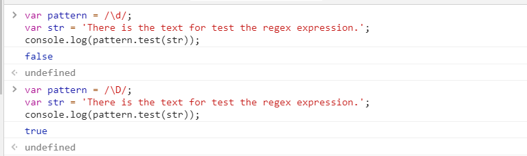

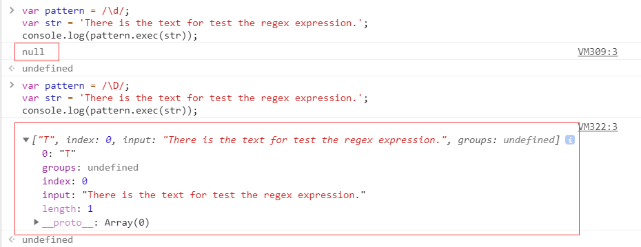

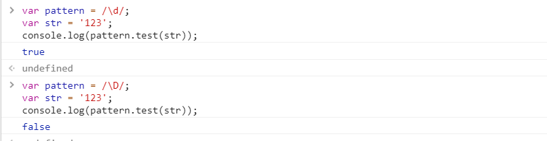

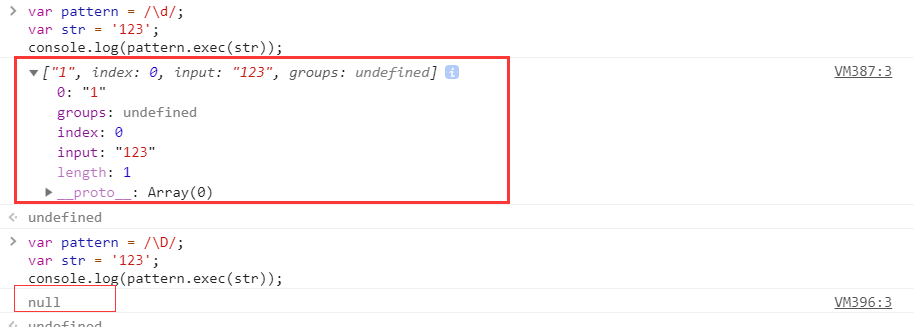
元字符`\s`与`\S`

元字符`\w`与`\W`
## 2. 参数

| 参数列表 | 含义                                                         | 英语记忆或者个人记忆方法 |
| :------: | ------------------------------------------------------------ | :----------------------: |
|    i     | 忽略大小写                                                   |        ignoreCase        |
|    g     | 全文查找出现的所有匹配字符                                   |          global          |
|    m     | 多行查找                                                     |        multiline         |
|    y     | 执行“粘性”搜索,匹配从目标字符串的当前位置开始，可以使用y标志 |          sticky          |

当然，上面这几种匹配规则可以结合使用，例如`/ig`或者`/gi`都是全文查找、忽略大小写

## 3. 方法

|                             方法                             | 含义                                                         |      匹配返回值      | 未匹配返回值 |
| :----------------------------------------------------------: | ------------------------------------------------------------ | :------------------: | :----------: |
|                       [test()](#test)                        | 测试是否匹配的RegExp方法                                     |         true         |    false     |
|                       [exec()](#exec)                        | 执行查找匹配的RegExp方法                                     |         数组         |     null     |
|                   [match(pattern)](#match)                   | 执行查找匹配的String方法                                     |         数组         |     null     |
|                  [search(pattern)](#search)                  | 测试匹配的String方法                                         | 返回匹配到的位置索引 |      -1      |
| [replace(pattern, obj &VerticalLine;&VerticalLine; callback)](#replace) | 执行查找匹配的String方法，并且使用替换字符串替换掉匹配到的子字符串 |    一个新的字符串    |     null     |
|                       [split](#split)                        | 一个使用正则表达式或者一个固定字符串分隔一个字符串，并将分隔后的子字符串存储到数组中的String方法 |     返回一个数组     |     null     |

下面我们讲上述方法一个一个的测试

#### 1. `test(str)`

##### param：`str`

##### result:

`匹配成功：` 如果正则表达式与指定的字符串匹配 ，返回true

`匹配失败：` false

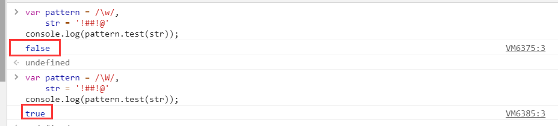

#### 2. `exec(str)`

##### param：`str`

##### result:

`匹配成功：`exec() 方法返回一个数组，并更新正则表达式对象的属性。返回的数组将完全匹配成功的文本作为第一项，将正则括号里匹配成功的作为数组填充到后面。

`匹配失败：` 如果匹配失败，exec() 方法返回 null。

|  对象  | 属性/索引 | 描述                 |
| :----: | :-------: | -------------------- |
| result |    [0]    | 匹配的全部字符串     |
|        |           | [1], ...[n ]         |
|        |           | index                |
|        |           | input                |
| regexp | lastIndex | 下一次匹配开始的位置 |
|        |           | ignoreCase           |
|        |           | global               |
|        |           | multiline            |
|        |           | source               |

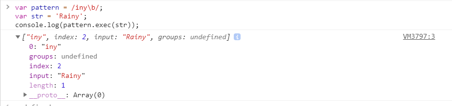

#### 3. `match(pattern)`

##### `param`: 传入一个正则表达式对象, 如果传入一个非正则表达式对象，则会隐式地使用 `new RegExp(obj)` 将其转换为一个 [`RegExp`](https://developer.mozilla.org/zh-CN/docs/Web/JavaScript/Reference/RegExp) 。如果你没有给出任何参数并直接使用match() 方法 ，你将会得到一 个包含空字符串的 [`Array`](https://developer.mozilla.org/zh-CN/docs/Web/JavaScript/Reference/Array) ：[""] 。

##### `return`:  

- 如果使用`g`标志，则将返回与完整正则表达式匹配的所有结果（`Array`），但不会返回捕获组，或者未匹配 `null`。
- 如果未使用`g`标志，则仅返回第一个完整匹配及其相关的捕获组（`Array`）。 在这种情况下，返回的项目将具有如下所述的其他属性，或者未匹配 `null`。
- **匹配成功**
  - `groups`: 一个捕获组数组 或 `undefined`（如果没有定义命名捕获组）。
  - `index`: 匹配的结果的开始位置
  - `input`: 搜索的字符串。

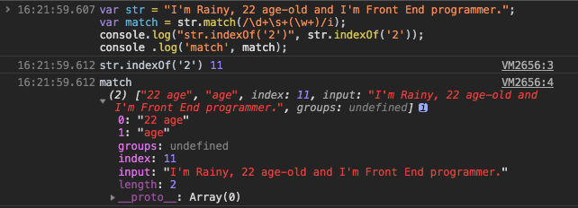

`match[0]`: 整条正则表达式匹配结果

`match[1]`: `(\w+)`匹配结果

#### 4. `search(pattern)`

##### `param`: 传入一个正则表达式对象， 如果传入一个非正则表达式对象，则会使用 `new RegExp(obj)` 隐式地将其转换为正则表达式对象。

##### `return`: 如果匹配成功，则 `search()` 返回正则表达式在字符串中首次匹配项的索引。否则，返回 `-1`。

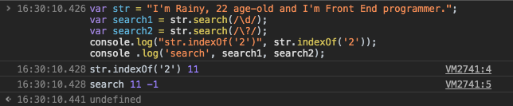

很类似`indexof`这个方法

#### 5. `replace(regexp|substr, newSubStr|function)`

##### `param`: 

- 正则表达式`or`字符
- 字符串或者函数

##### `return`: 一个部分或全部匹配由替代模式所取代的新的字符串。

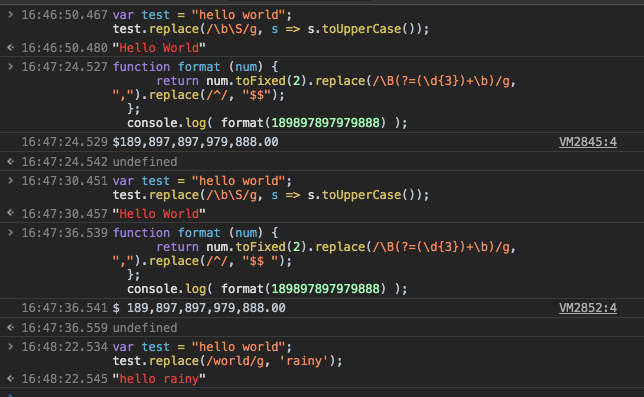

| 变量名 | 代表的值                                                     |
| ------ | ------------------------------------------------------------ |
| `$$`   | 插入一个 "$"。                                               |
| `$&`   | 插入匹配的子串。                                             |
| `$``   | 插入当前匹配的子串左边的内容。                               |
| `$'`   | 插入当前匹配的子串右边的内容。                               |
| `$n`   | 假如第一个参数是 [`RegExp`](https://developer.mozilla.org/zh-CN/docs/Web/JavaScript/Reference/RegExp)对象，并且 n 是个小于100的非负整数，那么插入第 n 个括号匹配的字符串。提示：索引是从1开始 |

#### 6. `split(pattern， limit？)`

##### `param`:

- `pattern`: 指定表示每个拆分应发生的点的字符串, 可以是一个正则表达式，也可以是字符串。
- `limit`: 一个整数，限定返回的分割片段数量。

##### `return`: 返回源字符串以分隔符出现位置分隔而成的一个`Array`

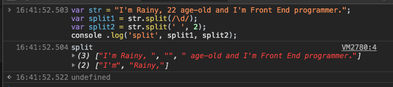

