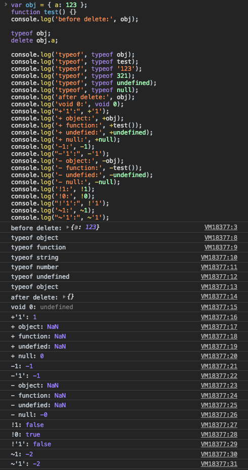
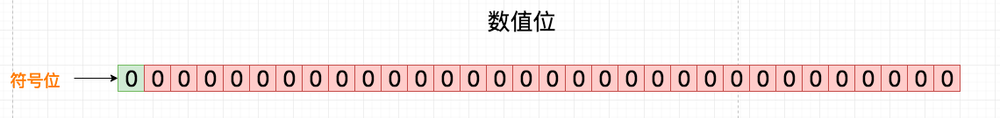
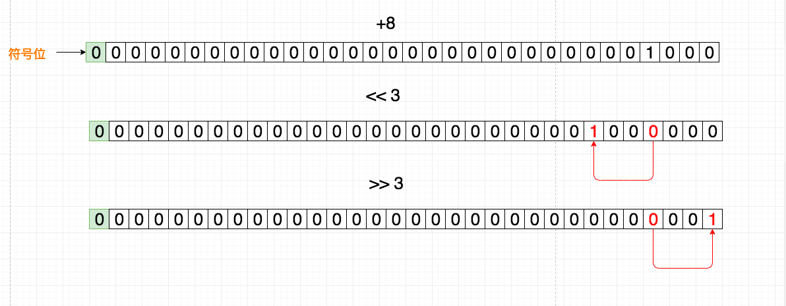
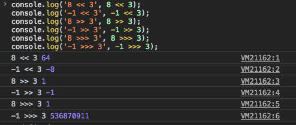

### [维基百科 --- 运算符](https://en.wikipedia.org/wiki/Operator_(computer_programming))

> [编程语言](https://en.wikipedia.org/wiki/Programming_languages)通常支持一组**运算符**：构造，其行为通常类似于函数，但在[语法](https://en.wikipedia.org/wiki/Syntax_(programming_languages)) 或[语义上](https://en.wikipedia.org/wiki/Semantics_(computer_science)) 与通常的函数不同。常见的简单示例包括算术（加法`+`），比较（加`>`）和逻辑运算（如`AND`或`&&`）。更多涉及的示例包括[赋值](https://en.wikipedia.org/wiki/Assignment_(computer_science)) （通常`=`或`:=`），记录或对象（通常）中的[字段](https://en.wikipedia.org/wiki/Field_(computer_science)) 访问`.`，以及[范围解析运算符](https://en.wikipedia.org/wiki/Scope_resolution_operator) （通常`::`）。语言通常定义一组内置运算符，在某些情况下允许用户定义的运算符。

#### 运算符的优先级

> 单目 > 算术 > 位移 > 关系 > 逻辑 > 三目 > 赋值

##### 1. 单目运算符

一元(单目)运算符只需要一个操作变量。

**`+`**: 一元加运算符将操作转换为Number类型.

**`-`**: 一元减运算符将操作转换为Number类型并取反.

**`!`**: 逻辑非运算符.

**`~`**: 按位非运算符.

**`delete`**: 运算符用来删除对象的属性.

**`void`**: 运算符表示表达式放弃返回值.

**`typeof`**:  运算符用来判断给定对象的类型.

```javascript
var obj = { a: 123 };
function test() {}
console.log('before delete:', obj);

typeof obj;
delete obj.a;

console.log('typeof', typeof obj);
console.log('typeof', typeof test);
console.log('typeof', typeof '123');
console.log('typeof', typeof 321);
console.log('typeof', typeof undefined);
console.log('typeof', typeof null);
console.log('after delete:', obj);
console.log('void 0:', void 0);
console.log("+'1':", +'1');
console.log('+ object:', +obj);
console.log('+ function:', +test());
console.log('+ undefied:', +undefined);
console.log('+ null:', +null);
console.log('-1:', -1);
console.log("-'1':", -'1');
console.log('- object:', -obj);
console.log('- function:', -test());
console.log('- undefied:', -undefined);
console.log('- null:', -null);
console.log('!1:', !1);
console.log('!0:', !0);
console.log("!'1':", !'1');
console.log('~1:', ~1);
console.log("~'1':", ~'1');
```



##### 2. 自增 `&` 自减运算符

`++a`: 先赋值后自增

`a++`: 先赋值后自增

`—-a`: 先自减后赋值

`a-—`: 先自减后赋值

```javas
var a = 0;
console.log('a++', a++);
console.log('a', a);
console.log('++a', ++a);

var b = 0;
console.log('b--', b--);
console.log('b', b);
console.log('--b', --b);
```


##### 3. 算术运算符

2个数值（字面量或变量）作为操作数，并返回单个数值.

主要有`+` `-` `*` `/` `%`.


##### 4. 位移运算符

在二进制的基础上对数字进行移动操作

`<<`: 按位左移运算符. 左移 当前值的二进制 `* `2 `^` (位数)

`>>`: 按位右移运算符. 左移 当前值的二进制  `/` 2 `^ `(位数)

`>>>`: 按位无符号右移运算符.

有符号整数使用 `31` 位表示整数的数值，用第` 32` 位表示整数的符号，``0 表示正数，``1` 表示负数。数值范围从 `-2147483648` 到 `2147483647`。

[二进制转换规则图绘制地址](https://www.draw.io/#W69167d0bde5dfb8f%2F69167D0BDE5DFB8F!744)

二进制表示规则



正数左右位移




```javascript
console.log('8 << 3', 8 << 3);
console.log('-1 << 3', -1 << 3);
console.log('8 >> 3', 8 >> 3);
console.log('-1 >> 3', -1 >> 3);
console.log('8 >>> 3', 8 >>> 3);
console.log('-1 >>> 3', -1 >>> 3);
```



##### 5. 关系运算符

比较运算符比较二个操作数并返回基于比较结果的`Boolean`值

`>` `>=` `<` `<=` `==` `===` `!=` `!==` `in` `instanceof`