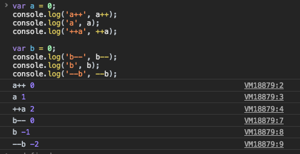
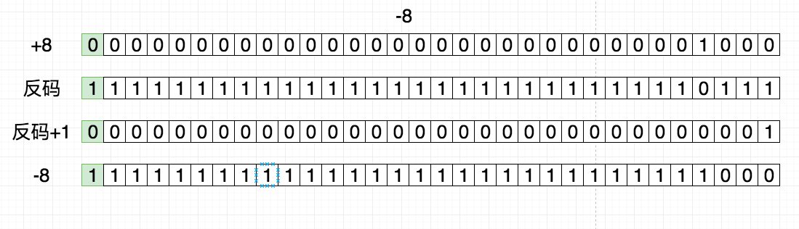
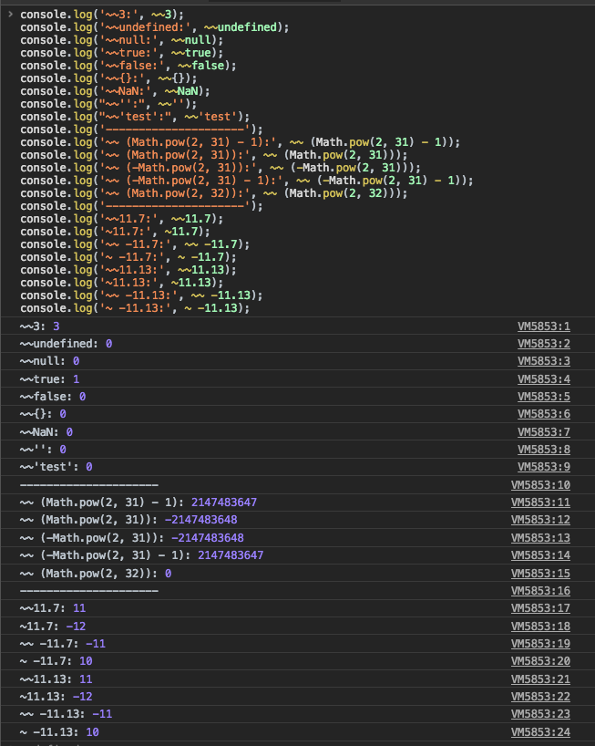
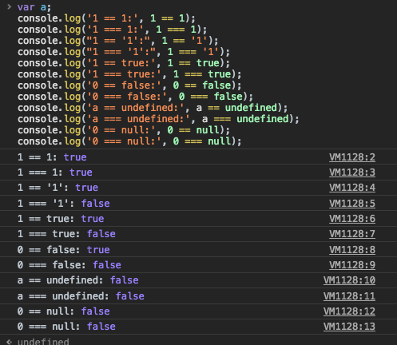
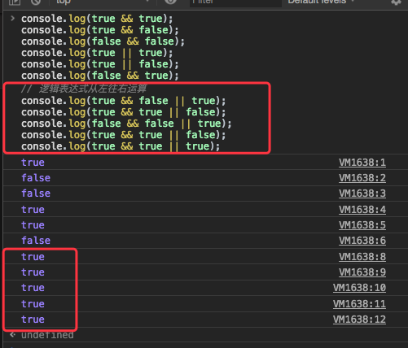
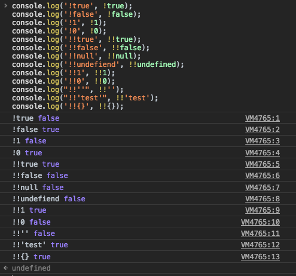
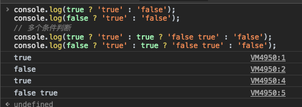

### [维基百科 --- 运算符](https://en.wikipedia.org/wiki/Operator_(computer_programming))

> [编程语言](https://en.wikipedia.org/wiki/Programming_languages)通常支持一组**运算符**：构造，其行为通常类似于函数，但在[语法](https://en.wikipedia.org/wiki/Syntax_(programming_languages)) 或[语义上](https://en.wikipedia.org/wiki/Semantics_(computer_science)) 与通常的函数不同。常见的简单示例包括算术（加法`+`），比较（加`>`）和逻辑运算（如`AND`或`&&`）。更多涉及的示例包括[赋值](https://en.wikipedia.org/wiki/Assignment_(computer_science)) （通常`=`或`:=`），记录或对象（通常）中的[字段](https://en.wikipedia.org/wiki/Field_(computer_science)) 访问`.`，以及[范围解析运算符](https://en.wikipedia.org/wiki/Scope_resolution_operator) （通常`::`）。语言通常定义一组内置运算符，在某些情况下允许用户定义的运算符。

#### [运算符的优先级](https://developer.mozilla.org/zh-CN/docs/Web/JavaScript/Reference/Operators/Operator_Precedence)

> 简单记忆法(需要具体问题具体分析)：单目 > 算术 > 位移 > 关系 > 逻辑 > 三目 > 赋值
>
> 下面的表将所有运算符按照优先级的不同从高到低排列。[`MDN`运算符优先级](https://developer.mozilla.org/zh-CN/docs/Web/JavaScript/Reference/Operators/Operator_Precedence)

| 优先级 | 运算类型                                                     | 关联性   | 运算符                 |
| ------ | ------------------------------------------------------------ | -------- | ---------------------- |
| 20     | [`圆括号`](https://github.com/zh-CN/docs/Web/JavaScript/Reference/Operators/Grouping) | n/a      | `(expr)`               |
| 19     | [`成员访问`](https://developer.mozilla.org/zh-CN/docs/Web/JavaScript/Reference/Operators/Property_Accessors#%E7%82%B9%E7%AC%A6%E5%8F%B7%E8%A1%A8%E7%A4%BA%E6%B3%95) | 从左到右 | `object.property`      |
|        | [`需计算的成员访问`](https://developer.mozilla.org/zh-CN/docs/Web/JavaScript/Reference/Operators/Property_Accessors#%E6%8B%AC%E5%8F%B7%E8%A1%A8%E7%A4%BA%E6%B3%95) | 从左到右 | `object[property]`     |
|        | [`new`](https://developer.mozilla.org/zh-CN/docs/Web/JavaScript/Reference/Operators/new) (带参数列表) | n/a      | `new Object(params)`   |
|        | [函数调用](https://developer.mozilla.org/zh-CN/docs/Web/JavaScript/Guide/Functions) | 从左到右 | `Function(params)`     |
| 18     | [new](https://developer.mozilla.org/zh-CN/docs/Web/JavaScript/Reference/Operators/new) (无参数列表) | 从右到左 | `new Object()`         |
| 17     | [后置递增](https://developer.mozilla.org/zh-CN/docs/Web/JavaScript/Reference/Operators/Arithmetic_Operators#Increment)(运算符在后) | n/a      | `expr++`               |
|        | [后置递减](https://developer.mozilla.org/zh-CN/docs/Web/JavaScript/Reference/Operators/Arithmetic_Operators#Decrement)(运算符在后) | n/a      | `expr—`                |
| 16     | [逻辑非](https://developer.mozilla.org/zh-CN/docs/Web/JavaScript/Reference/Operators/Logical_Operators#Logical_NOT) | 从右到左 | `!expr`                |
|        | [按位非](https://developer.mozilla.org/zh-CN/docs/Web/JavaScript/Reference/Operators/Bitwise_Operators#Bitwise_NOT) |          | `~expr`                |
|        | [一元加法](https://developer.mozilla.org/zh-CN/docs/Web/JavaScript/Reference/Operators/Arithmetic_Operators#Unary_plus) |          | `+expr`                |
|        | [一元减法](https://developer.mozilla.org/zh-CN/docs/Web/JavaScript/Reference/Operators/Arithmetic_Operators#Unary_negation) |          | `-expr`                |
|        | [前置递增](https://developer.mozilla.org/zh-CN/docs/Web/JavaScript/Reference/Operators/Arithmetic_Operators#Increment) |          | `++expr`               |
|        | [前置递减](https://developer.mozilla.org/zh-CN/docs/Web/JavaScript/Reference/Operators/Arithmetic_Operators#Decrement) |          | `—expr`                |
|        | `typeof`                                                     |          | `typeof expr`          |
|        | `void`                                                       |          | `void expr`            |
|        | `delete`                                                     |          | `delete expr`          |
|        | `await`                                                      |          | `await expr`           |
| 15     | [幂](https://developer.mozilla.org/zh-CN/docs/Web/JavaScript/Reference/Operators/Arithmetic_Operators#Exponentiation) |          | `expr**expr`           |
| 14     | [乘法](https://developer.mozilla.org/zh-CN/docs/Web/JavaScript/Reference/Operators/Arithmetic_Operators#Multiplication) | 从左到右 | `expr * expr`          |
|        | [除法](https://developer.mozilla.org/zh-CN/docs/Web/JavaScript/Reference/Operators/Arithmetic_Operators#Division) |          | `expr / expr`          |
|        | [取模](https://developer.mozilla.org/zh-CN/docs/Web/JavaScript/Reference/Operators/Arithmetic_Operators#Remainder) |          | `expr % expr`          |
| 13     | [加法](https://developer.mozilla.org/zh-CN/docs/Web/JavaScript/Reference/Operators/Arithmetic_Operators#Addition) | 从左到右 | `expr + expr`          |
|        | [减法](https://developer.mozilla.org/zh-CN/docs/Web/JavaScript/Reference/Operators/Arithmetic_Operators#Subtraction) |          | `expr - expr`          |
| 12     | [按位左移](https://developer.mozilla.org/zh-CN/docs/Web/JavaScript/Reference/Operators/Bitwise_Operators) | 从左到右 | `expr << expr`         |
|        | [按位右移](https://developer.mozilla.org/zh-CN/docs/Web/JavaScript/Reference/Operators/Bitwise_Operators) |          | `expr >> expr`         |
|        | [无符号右移](https://developer.mozilla.org/zh-CN/docs/Web/JavaScript/Reference/Operators/Bitwise_Operators) |          | `expr >>> expr`        |
| 11     | [小于](https://developer.mozilla.org/zh-CN/docs/Web/JavaScript/Reference/Operators/Comparison_Operators#Less_than_operator) | 从左到右 | `expr < expr`          |
|        | [小于等于](https://developer.mozilla.org/zh-CN/docs/Web/JavaScript/Reference/Operators/Comparison_Operators#Less_than__or_equal_operator) |          | `expr <= expr`         |
|        | [大于](https://developer.mozilla.org/en-US/docs/Web/JavaScript/Reference/Operators/Comparison_Operators#Greater_than_operator) |          | `expr > expr`          |
|        | [大于等于](https://developer.mozilla.org/zh-CN/docs/Web/JavaScript/Reference/Operators/Comparison_Operators#Greater_than_or_equal_operator) |          | `expr >= expr`         |
|        | [in](https://developer.mozilla.org/zh-CN/docs/Web/JavaScript/Reference/Operators/in) |          | `expr in expr`         |
|        | [instanceof](https://developer.mozilla.org/zh-CN/docs/Web/JavaScript/Reference/Operators/instanceof) |          | `expr instanceof expr` |
| 10     | [等号](https://developer.mozilla.org/zh-CN/docs/Web/JavaScript/Reference/Operators/Comparison_Operators#Equality) | 从左到右 | `expr = expr`          |
|        | [非等号](https://developer.mozilla.org/zh-CN/docs/Web/JavaScript/Reference/Operators/Comparison_Operators#Inequality) |          | `expr != expr`         |
|        | [全等号](https://developer.mozilla.org/zh-CN/docs/Web/JavaScript/Reference/Operators/Comparison_Operators#Identity) |          | `expr === expr`        |
|        | [全等号](https://developer.mozilla.org/zh-CN/docs/Web/JavaScript/Reference/Operators/Comparison_Operators#Identity) |          | `expr !== expr`        |
| 9      | [按位与](https://developer.mozilla.org/zh-CN/docs/Web/JavaScript/Reference/Operators/Bitwise_Operators#Bitwise_AND) | 从左到右 | `expr & expr`          |
| 8      | [按位异或](https://developer.mozilla.org/zh-CN/docs/Web/JavaScript/Reference/Operators/Bitwise_Operators#Bitwise_XOR) | 从左到右 | `expr ^ expr`          |
| 7      | [按位或](https://developer.mozilla.org/zh-CN/docs/Web/JavaScript/Reference/Operators/Bitwise_Operators#Bitwise_OR) | 从左到右 | `expr | expr`          |
| 6      | [逻辑与](https://developer.mozilla.org/zh-CN/docs/Web/JavaScript/Reference/Operators/Logical_Operators#Logical_AND) | 从左到右 | `expr && expr`         |
| 5      | [逻辑或](https://developer.mozilla.org/zh-CN/docs/Web/JavaScript/Reference/Operators/Logical_Operators#Logical_OR) | 从左到右 | `expr || expr`         |
| 4      | [条件运算符](https://developer.mozilla.org/zh-CN/docs/Web/JavaScript/Reference/Operators/Conditional_Operator) | 从右到左 | `expr ? expr : expr`   |
| 3      | [赋值](https://developer.mozilla.org/zh-CN/docs/Web/JavaScript/Reference/Operators/Assignment_Operators) | 从右到左 | `expr = expr `         |
|        |                                                              |          | `expr += expr `        |
|        |                                                              |          | `expr -= expr `        |
|        |                                                              |          | `expr *= expr `        |
|        |                                                              |          | `expr /= expr `        |
|        |                                                              |          | `expr %= expr `        |
|        |                                                              |          | `expr <<= expr `       |
|        |                                                              |          | `expr >>= expr `       |
|        |                                                              |          | `expr >>>= expr `      |
|        |                                                              |          | `expr &= expr `        |
|        |                                                              |          | `expr |= expr `        |
|        |                                                              |          | `expr ^= expr `        |
| 2      | [yield](https://developer.mozilla.org/zh-CN/docs/Web/JavaScript/Reference/Operators/yield) | 从右到左 | `yield expr`           |
|        | [yield*](https://developer.mozilla.org/zh-CN/docs/Web/JavaScript/Reference/Operators/yield*) | 从右到左 | `yield* expr           |
| 1      | [展开运算符](https://developer.mozilla.org/zh-CN/docs/Web/JavaScript/Reference/Operators/Spread_operator) | n/a      | `...expr`              |
| 0      | [逗号](https://developer.mozilla.org/zh-CN/docs/Web/JavaScript/Reference/Operators/Comma_Operator) | 从左到右 | `expr, expr`           |


##### 1. 单目运算符

一元(单目)运算符只需要一个操作变量。

**`+`**: 一元加运算符将操作转换为Number类型.

**`-`**: 一元减运算符将操作转换为Number类型并取反.

**`!`**: 逻辑非运算符.

**`~`**: 按位非运算符.

**`delete`**: 运算符用来删除对象的属性.

**`void`**: 运算符表示表达式放弃返回值.

**`typeof`**:  运算符用来判断给定对象的类型.

```javascript
var obj = { a: 123 };
function test() {}
console.log('before delete:', obj);

typeof obj;
delete obj.a;

console.log('typeof', typeof obj);
console.log('typeof', typeof test);
console.log('typeof', typeof '123');
console.log('typeof', typeof 321);
console.log('typeof', typeof undefined);
console.log('typeof', typeof null);
console.log('after delete:', obj);
console.log('void 0:', void 0);
console.log("+'1':", +'1');
console.log('+ object:', +obj);
console.log('+ function:', +test());
console.log('+ undefied:', +undefined);
console.log('+ null:', +null);
console.log('-1:', -1);
console.log("-'1':", -'1');
console.log('- object:', -obj);
console.log('- function:', -test());
console.log('- undefied:', -undefined);
console.log('- null:', -null);
console.log('!1:', !1);
console.log('!0:', !0);
console.log("!'1':", !'1');
console.log('~1:', ~1);
console.log("~'1':", ~'1');
```


##### 2. 自增 `&` 自减运算符

`++a`: 先赋值后自增

`a++`: 先赋值后自增

`—-a`: 先自减后赋值

`a-—`: 先自减后赋值

```javas
var a = 0;
console.log('a++', a++);
console.log('a', a);
console.log('++a', ++a);

var b = 0;
console.log('b--', b--);
console.log('b', b);
console.log('--b', --b);
```



##### 3. 算术运算符

2个数值（字面量或变量）作为操作数，并返回单个数值.

主要有`+` `-` `*` `/` `%`.


##### 4. 位移运算符

在二进制的基础上对数字进行移动操作

`<<`: 按位左移运算符. 左移 当前值的二进制 `* `2 `^` (位数)

`>>`: 按位右移运算符. 左移 当前值的二进制  `/` 2 `^ `(位数)

`>>>`: 按位无符号右移运算符.

有符号整数使用 `31` 位表示整数的数值，用第` 32` 位表示整数的符号，``0 表示正数，``1` 表示负数。数值范围从 `-2147483648` 到 `2147483647`。

[二进制转换规则图绘制地址](https://www.draw.io/#W69167d0bde5dfb8f%2F69167D0BDE5DFB8F!744)

二进制表示规则


正数左右位移




```javascript
console.log('8 << 3', 8 << 3);
console.log('-1 << 3', -1 << 3);
console.log('8 >> 3', 8 >> 3);
console.log('-1 >> 3', -1 >> 3);
console.log('8 >>> 3', 8 >>> 3);
console.log('-1 >>> 3', -1 >>> 3);
```


##### 5. [位运算符(**Bitwise operators**)](https://developer.mozilla.org/zh-CN/docs/Web/JavaScript/Reference/Operators/Bitwise_Operators)

​	将其操作数（operands）当作32位的比特序列（由0和1组成），而不是十进制、十六进制或八进制[数值](https://developer.mozilla.org/zh-CN/docs/Web/JavaScript/Reference/Global_Objects/Number)。

* `&`: 全`1`为`1`

* `|`: 见`1`为`1`
* `^`: 同为`1`, 异为`0`

* `~` : `1`变`0`，`0`变`1`

> *The production *UnaryExpression* **:** `**~**` *UnaryExpression* is evaluated as follows:
>
> 1. Let *expr* be the result of evaluating *UnaryExpression*.
> 2. Let *oldValue* be [ToInt32](http://es5.github.io/#x9.5)([GetValue](http://es5.github.io/#x8.7.1)(*expr*)).
> 3. Return the result of applying bitwise complement to *oldValue*. The result is a signed 32-bit integer.
>
> 中文：
>
> 产生式 `UnaryExpression : ~ UnaryExpression` 按照下面的过程执行：
>
> - 令 `expr` 为解析执行 `UnaryExpression` 的结果
> - 令 `oldValue` 为 ToInt32(GetValue(`expr`))
> - 返回 `oldValue` 按位取反的结果
>
> `ToInt32`过程：
>
> The abstract operation ToInt32 converts its argument to one of 232 integer values in the range −231 through 231−1, inclusive. This abstract operation functions as follows:
>
> 1. Let *number* be the result of calling [ToNumber](http://es5.github.io/#x9.3) on the input argument.
> 2. If *number* is **NaN**, **+0**, **−****0**, **+****∞**, or **−∞**, return **+0**.
> 3. Let *posInt* be [sign](http://es5.github.io/#sign)(*number*) * [floor](http://es5.github.io/#floor)([abs](http://es5.github.io/#abs)(*number*)).
> 4. Let *int32bit* be *posInt* [modulo](http://es5.github.io/#modulo) 232; that is, a finite integer value k of Number type with positive sign and less than 232 in magnitude such that the mathematical difference of *posInt* and k is mathematically an integer multiple of 232.
> 5. If *int32bit* is greater than or equal to 231, return *int32bit* − 232, otherwise return *int32bit*.
>
> 中文：
>
> - 令 `number` 为调用 ToNumber 将输入参数转化为数值类型的结果
> - 如果 `number` 是 NaN，+0，-0，+∞ 或者 -∞，返回 +0
> - 令 `posInt` 为 sign(`number`) * floor(abs(`number`))
> - 将 `posInt` 进行取模处理，转化为在 −2^31 到 2^31−1 之间的 32 位有符号整数并返回
> - 如果`int32bit` *大于或等于`2^31`，则返回* `int32bit ` -  `2^32`，否则返回`int32bit`。
>
> 从效果上看，ToInt32 依次做了这样几件事：
>
> - 类型转换，非数值类型的需要转化为数值类型
> - 特殊值处理，NaN 和 ∞ 都被转化为 0
> - 取整，如果是浮点数，会损失小数点后面的精度
> - 取模，将整数调整到 32 位有符号整数区间内，如果整数原本不在这个区间，会丧失精度
> - 边界处理

* `~~` ：将操作数转化为 32 位有符号整数

> *The production *UnaryExpression* **:** `**~**` *UnaryExpression* is evaluated as follows:
>
> 1. Let *expr* be the result of evaluating *UnaryExpression*.
> 2. Return [ToInt32](http://es5.github.io/#x9.5)([GetValue](http://es5.github.io/#x8.7.1)(*expr*)).
>
> 中文：
>
> 产生式 `UnaryExpression : ~~ UnaryExpression` 按照下面的过程执行：
>
> - 令 `expr` 为解析执行 `UnaryExpression` 的结果
> - 返回 ToInt32(GetValue(`expr`))

```javascript
console.log('2 & 3:', 2 & 3);
console.log('2 | 3:', 2 | 3);
console.log('~3:', ~3);
```


```javas
console.log('~~3:', ~~3);
console.log('~~undefined:', ~~undefined);
console.log('~~null:', ~~null);
console.log('~~true:', ~~true);
console.log('~~false:', ~~false);
console.log('~~{}:', ~~{});
console.log('~~NaN:', ~~NaN);
console.log("~~'':", ~~'');
console.log("~~'test':", ~~'test');
console.log('---------------------');
console.log('~~ (Math.pow(2, 31) - 1):', ~~ (Math.pow(2, 31) - 1));
console.log('~~ (Math.pow(2, 31)):', ~~ (Math.pow(2, 31)));
console.log('~~ (-Math.pow(2, 31)):', ~~ (-Math.pow(2, 31)));
console.log('~~ (-Math.pow(2, 31) - 1):', ~~ (-Math.pow(2, 31) - 1));
console.log('~~ (Math.pow(2, 32)):', ~~ (Math.pow(2, 32)));
console.log('---------------------');
console.log('~~11.7:', ~~11.7);
console.log('~11.7:', ~11.7);
console.log('~~ -11.7:', ~~ -11.7);
console.log('~ -11.7:', ~ -11.7);
console.log('~~11.13:', ~~11.13);
console.log('~11.13:', ~11.13);
console.log('~~ -11.13:', ~~ -11.13);
console.log('~ -11.13:', ~ -11.13);
```



##### 6. 关系运算符

比较运算符比较二个操作数并返回基于比较结果的`Boolean`值

`>` `>=` `<` `<=` `==` `===` `!=` `!==` `in` `instanceof`

* `==`, `!=` 与 `===`, `!==`

等于和全等，他们的区别是，前者会强制类型转换，再比较值。

```javascript
var a;
console.log('1 == 1:', 1 == 1);
console.log('1 === 1:', 1 === 1);
console.log("1 == '1':", 1 == '1');
console.log("1 === '1':", 1 === '1');
console.log('1 == true:', 1 == true);
console.log('1 === true:', 1 === true);
console.log('0 == false:', 0 == false);
console.log('0 === false:', 0 === false);
console.log('a == undefined:', a == undefined);
console.log('a === undefined:', a === undefined);
console.log('0 == null:', 0 == null);
console.log('0 === null:', 0 === null);
```



##### [7. 逻辑运算符](https://developer.mozilla.org/zh-CN/docs/Web/JavaScript/Reference/Operators/Logical_Operators)

逻辑运算符典型的用法是用于`boolean`(逻辑)值运算, 它们返回`boolean`值。

`&&`, `||`, `!`, `!!`(与，或，非, 双非),

如果一个值可以被转换为 `true`，那么这个值就是所谓的 [truthy](https://developer.mozilla.org/en-US/docs/Glossary/truthy)，如果可以被转换为 `false`，那么这个值就是所谓的 [falsy](https://developer.mozilla.org/en-US/docs/Glossary/falsy)。

`truthy`: 在 JavaScript中，**Truthy** (真值)指的是在 [布尔值](https://developer.mozilla.org/en-US/docs/Glossary/Boolean) 上下文中转换后的值为真的值。所有值都是真值，除非它们被定义为 [falsy](https://developer.mozilla.org/en-US/docs/Glossary/Falsy) (即除了 `false`，`0`，`""`，`null`，`undefined` 和 `NaN` 外).

`falsy`: `falsy`(虚值)是在 [Boolean](https://developer.mozilla.org/en-US/docs/Glossary/Boolean) 上下文中已认定可转换为‘假‘的值.

会被转换为 `false` 的表达式有：

- `null`；

- `NaN`；

- `0`；

- 空字符串（`""` or `''` or ````）；

- `undefined`。

  `!`: 逻辑非是将当前对象的`Boolean`取反，即取当前是`falsy`的值为`true`,当前是`true`的值为`false`。

  > *The production *UnaryExpression* **:** `**!**` *UnaryExpression* is evaluated as follows:
  >
  > 1. Let *expr* be the result of evaluating *UnaryExpression*.
  > 2. Let *oldValue* be [ToBoolean](http://es5.github.io/#x9.2)([GetValue](http://es5.github.io/#x8.7.1)(*expr*)).
  > 3. If *oldValue* is **true**, return **false**.
  > 4. Return **true**.
  >
  > 中文：
  >
  > 产生式 `UnaryExpression : ! UnaryExpression` 按照下面的过程执行：
  >
  > - 令 `expr` 为解析执行 `UnaryExpression` 的结果
  > - 令 `oldValue` 为 ToBoolean(GetValue(`expr`))
  > - 如果 `oldValue` 为 true, 返回 false
  > - 返回 true

  `!!`: 将操作数转化为布尔类型

  > *The production *UnaryExpression* **:** `**!!**` *UnaryExpression* is evaluated as follows:
  >
  > 1. Let *expr* be the result of evaluating *UnaryExpression*.
  > 2. Return* be [ToBoolean](http://es5.github.io/#x9.2)([GetValue](http://es5.github.io/#x8.7.1)(*expr*)).
  >
  > 中文：
  >
  > 产生式 `UnaryExpression : !! UnaryExpression` 按照下面的过程执行：
  >
  > - 令 `expr` 为解析执行 `UnaryExpression` 的结果
  > - 返回 ToBoolean(GetValue(`expr`))

由于逻辑表达式的运算的顺序是从左到右,也可以用以下规则进行"短路"计算，

```javascript
console.log(true && true);
console.log(true && false);
console.log(false && false);
console.log(true || true);
console.log(true || false);
console.log(false && true);
// 逻辑表达式从左往右运算
console.log(true && false || true);
console.log(true && true || false);
console.log(false && false || true);
console.log(true && true || false);
console.log(true && true || true);
```



```javascript
console.log('!true', !true);
console.log('!false', !false);
console.log('!1', !1);
console.log('!0', !0);
console.log('!!true', !!true);
console.log('!!false', !!false);
console.log('!!null', !!null);
console.log('!!undefiend', !!undefined);
console.log('!!1', !!1);
console.log('!!0', !!0);
console.log("!!''", !!'');
console.log("!!'test'", !!'test');
console.log('!!{}', !!{});
```




##### 8. 条件（三元）运算符

`?:`: 是 `JavaScript` 仅有的使用三个操作数的运算符。本运算符经常作为`if`语句的简短形式来使用。

```javascript
console.log(true ? 'true' : 'false');
console.log(false ? 'true' : 'false');
// 多个条件判断
console.log(true ? 'true' : true ? 'false true' : 'false');
console.log(false ? 'true' : true ? 'false true' : 'false');

```



##### [9. 赋值运算符](https://developer.mozilla.org/zh-CN/docs/Web/JavaScript/Reference/Operators/Assignment_Operators)

`=` `+=` `-=` `*=` `/=` `%=`  `**=`(平方) `<<=` `>>=` `>>>=` `&=` `|=` `^|`


**参考**

[`MDN`表达式和运算符](https://developer.mozilla.org/zh-CN/docs/Web/JavaScript/Guide/Expressions_and_Operators)

[`ECMAScript`](https://www.ecma-international.org/ecma-262/6.0/)

[按位操作符`Bitwise operators`)](https://developer.mozilla.org/zh-CN/docs/Web/JavaScript/Reference/Operators/Bitwise_Operators)

[Annotated ECMAScript 5.1 ](http://es5.github.io/#)

[js 中的 !! 与 ~~](https://shangchun.net/bitwise-not-and-logical-not.html)

