#### `console`函数列表

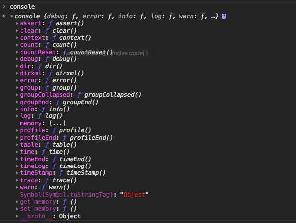

笔记来源：

1. `console`调试
2. 测试问题时候遇到一些看起来奇怪的东西

#### 问题引申

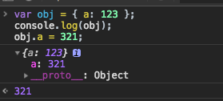


测试代码

```javascript
var obj = { a: 123 };
console.log(obj);
obj.a = 321;
```

为什么同样的一段代码的`console`的结果在**浏览器**和**`Node`**中的输出结果不一样呢？`console`的表现出来的这种异步行为让大家都很奇怪，甚至会以为它就是异步的，其实，它并不是异步的。

因为在浏览器中`console.log`只是一个指向当前对象引用，许多程序（不只是`JavaScript`）中，`I/O `是非常低速的阻塞部分。所以，（从`页面/UI` 的角度来说）浏览器在后台异步处理控制台`I/O` 能够提高性能，而在`Node`中，它是严格同步的，我们知道`Node`是非阻塞式`I/O`（[异步`I/O`](https://zh.wikipedia.org/wiki/%E5%BC%82%E6%AD%A5IO)），全局控制台对象的方法既不像它们类似的浏览器API一样同步，也不像所有其他Node.js流一样异步。

> 参考：《你不知道的`JavaScript`》（中卷）第二部分异步和性能 1.1 异步控制台部分

> [`Node Console官方解释`](https://nodejs.org/dist/latest-v10.x/docs/api/console.html#console_console)

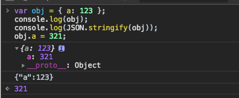

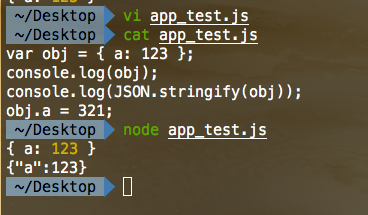

通过`JSON.stringify`输入可以得到我们期望的值。

#### `console`常见用法

详细了解可以看看[`Node Console`](https://nodejs.org/dist/latest-v10.x/docs/api/console.html#console_console)

##### 1. `console.log`

在`console`家族中，我们最熟悉的就是`console.log`了，所以，我们先熟悉一下`console.log`的一些用法吧。

```javascript
// console.log([data][, ...args])
var intNum = 117;
var floatNum = 11.7;
var str = 'Hello JS';
var obj = { name: 'Rainy' };
var json = { "name": "Rain120" }
console.log('intNum: %d', intNum);
console.log('floatNum: %f', floatNum);
console.log('str: %s', str);
console.log('obj: %o', obj);
console.log('json: %j', json);
console.log('intNum:', intNum);
console.log('floatNum:', floatNum);
console.log('str:', str);
console.log('obj:', obj);
console.log('json:', json);
console.log('%d %f%% %s %o %j', intNum, floatNum, str, obj, json);
```

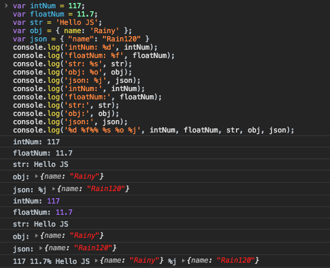

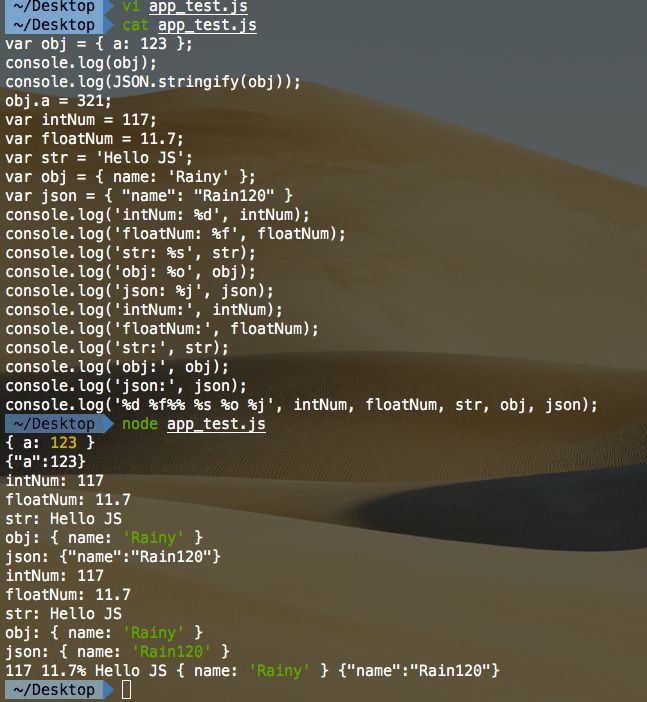

`console.log`输出其实很简单，使用空格隔开即可。当然我们可以使用一些占位符来输出我们需要的一些特定的格式。

```javascript
%d Int
%f Float
%s String
%o Object
%j JSON (Node)
%% % (不占参数位)
```

[util.format](https://nodejs.org/dist/latest-v10.x/docs/api/util.html#util_util_format_format_args)

##### 2.  `console.info` `console.warn` `console.error` `console.debug`

在调试的时候，我们比较关注的是`Info`,`Warn`,`Error`和`Debug`，所以我们先来探究一些这几个`console`的方法。

其实`info`和`debug`只是`log`的别名而已，所以这两个没什么区别。

```javascript
// console.log([data][, ...args])
console.log('Hello JS');
// console.info([data][, ...args])
console.info('Hello JS');
// console.warn([data][, ...args])
console.warn('Hello JS');
// console.error([data][, ...args])
console.error('Hello JS');
// console.debug([data][, ...args])
console.debug('Hello JS');
```

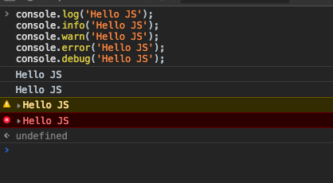

##### 3. `console.group`, `console.groupEnd`, `console.groupCollapsed`

`console.group()` 方法用于设置分组信息的起始位置，该位置之后的所有信息将写入分组。

使用 `console.groupEnd()`方法来结束当前的分组。

使用 `console.groupCollapsed()`方法来隐藏分组信息。

```javascript
console.group("I'm first Group");
console.log("First NO.1");
console.log("First NO.2");
console.log("First NO.3, and I.m the last in the group");
console.groupEnd();

console.group("I'm second Group");
console.log("Second NO.1");
console.log("Second NO.2");
console.log("Second NO.3, and I.m the last in the group");
console.groupEnd();

console.group("I'm third Group");
console.groupCollapsed('Third groupCollapsed');
console.log("Third NO.1");
console.log("Third NO.2");
console.log("Third NO.3, and I.m the last in the group");
console.groupEnd();
```

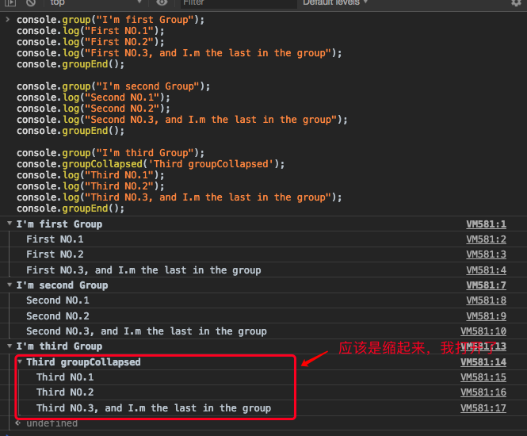

##### 4. `console.time`, `console.timeEnd`, `console.timeLog()`

`console.time()` 方法是作为计算器的起始方法。

该方法一般用于测试程序执行的时长。

`console.timeEnd()`方法为计算器的结束方法，并将执行时长显示在控制台。

如果一个页面有多个地方需要使用到计算器，可以添加标签参数来设置。

`console.timeLog()`方法输出时间日志，将先前通过调用`console.time()`启动的计时器的当前值记录到控制台。

```javascript
console.time('100-operates');
for (let i = 0; i < 100; i++) {}
console.timeEnd('100-operates');
```

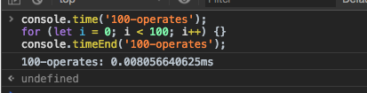

```javascript
console.time('process');
var value = () => 10;
console.timeLog('process', value);
(function (value) {
	return value * 10 / Math.random() * 50;
})();
console.timeEnd('process');
```

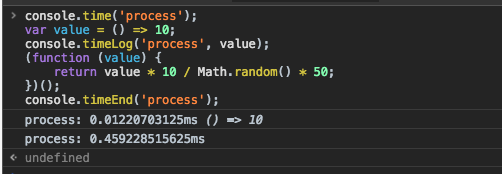

##### `console.table`

`console.table() `方法用于在控制台输出表格信息。

第一个参数是必需的，且对象类型需要是对象或数组，对应的数据会填充到表格中。

| 参数         | 类型            | 描述                               |
| ------------ | --------------- | ---------------------------------- |
| tabledata    | Array 或 Object | 必需，填充到表格中的数据。         |
| tablecolumns | Array           | 可选，一个数组，表格标题栏的名称。 |

```javascript
var profile = { name: 'Rain120', github: 'https://github.com/Rain120' };
console.table(profile)
```

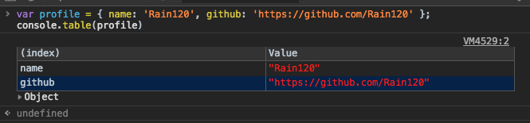

```javascript
var profile = { name: 'Rain120', github: 'https://github.com/Rain120' };
console.table([profile])
```

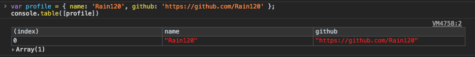

```javascript
var profile = { name: 'Rain120', github: 'https://github.com/Rain120' };
console.table([profile], ['github'])
```

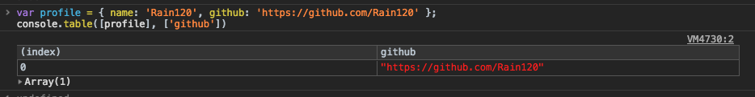


