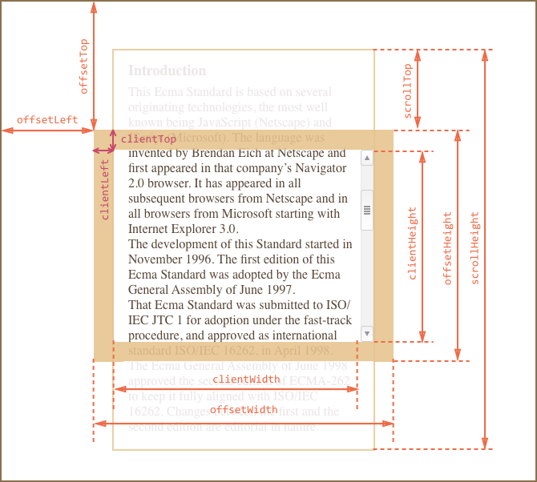
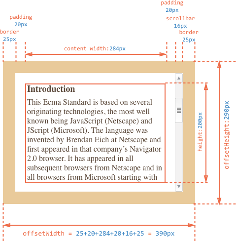

在`CSS`中，每一个元素都是一个盒子，都有着描述盒子大小和位置的相关属性。比如：`width`, `height`, `position: trbl(top, right, bottom, left)`。在实际开发中，我们可能需要通过`JavaScript`来获取它们的位置和尺寸关系，这篇笔记就是记录这个问题，不瞎`BB`了, 我们直接进入正题。

##### 1. `DOM`



查看各浏览器版本是否兼容属性: [Can I Use](<https://caniuse.com/>)

* `scroll`
  * `scrollHeight`: 只读
    * 返回`Number`表示元素的滚动视图高度。
  * `scrollWidth`: 只读
    * 返回`Number`表示元素的滚动视图宽度。
  * `scrollTop`: 可读可写
    * 返回`Number`表示该元素纵向滚动条距离
  * `scrollLeft` : 可读可写
    * 返回`Number`表示该元素横向滚动条距离最左的位移.

**判定元素是否滚动到底**

如果元素滚动到底，下面等式返回true，没有则返回false.

```
element.scrollHeight - element.scrollTop === element.clientHeight
```

当容器不滚动但有溢出的子容器时，这些检查可以确定容器能否滚动：

```html
window.getComputedStyle(element).overflowY === 'visible' window.getComputedStyle(element).overflowY !== 'hidden'
```

* `client`
  * `clientHeight`: 只读
    * 返回`Number`表示内部相对于外层元素的高度.
    * `clientHeight` = `height` + `padding-top` + `padding-bottom` - `horizontal scroll bar`(?)
  * `clientWidth`: 只读
    * 返回`Number`表示该元素它内部的宽度.
    * `clientWidth` = `width` + `padding-left` + `padding-right` - `vertical scroll bar`(?)
  * `clientTop`: 只读
    * 返回`Number`表示该元素距离它上边界的高度.
  * `clientLeft`: 只读
    * 返回`Number`表示该元素距离它左边界的宽度.

`Note`: (?) 是否存在



```css
#content {
  width: 300px;
  height: 200px;
  border: 25px;
  padding: 20px;
}
```


* `offset`
  * `offsetHeight`
    * 返回`double`, 高度包含该元素的垂直内边距(`padding-top`, `padding-bottom`)和边框(`border-top`, `border-bottom`)。
    * `offsetHeight` = `height` (含滚动条宽度)+ `border-top` + `border-bottom` + `padding-top` + `padding-bottom`.
  * `offsetWidth`
    * 返回`double`, 高度包含该元素的水平内边距(`padding-left`, `padding-right`)和边框(`border-left`, `border-right`)。
    * `offsetWidth` = `width` (含滚动条宽度)+ `border-left` + `border-right` + `padding-left` + `padding-right`.
  * `offsetTop`
    * 返回`double`,当前元素`border`顶部距离父元素顶部或者`body`元素`border`顶部的距离。
  * `offsetLeft`
    * 返回`double`, 当前元素的`border`左边距离父元素`border`左边或者`body`元素`border`左边的距离。
  * `offsetParent`
    * 返回`HTMLElement`, 返回一个指向最近的(`closest`，指包含层级上的最近), 包含该元素的定位元素，如果没有就是`body`元素。当元素的 `style.display` 设置为 `none` 时，`offsetParent` 返回 `null`。


参考：

[MDN - Element](<https://developer.mozilla.org/zh-CN/docs/Web/API/Element>)

[DOM系列：获取元素位置和尺寸](<https://www.w3cplus.com/javascript/get-element-position-and-size-using-javascript.html>)

[JavaScript学习笔记：视口宽高、位置与滚动高度](<https://www.w3cplus.com/javascript/offset-scroll-client.html>)

