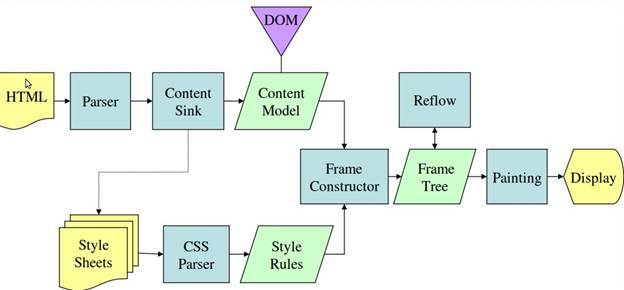

### <span id="top">快速导航</span>

[HTML](#html) | [CSS](#css) | [JavaScript](#js) | [浏览器相关](#browser) | [Node.js](#node) | [框架学习](#frame)

**<span id="html">1. HTML</span>**

[Back Top](#top)

**<span id="css">2. CSS</span>**

[Back Top](#top)

**<span id="js">3. JavaScript</span>**

  1. **`JavaScript`的基本数据类型?**

     ```javascript
     值类型(基本类型):
     字符串（String）、数字(Number)、布尔(Boolean)、对空（Null）、未定义（Undefined）、Symbol。
     
     引用数据类型：
     对象(Object)、数组(Array)、函数(Function)。
     Object 是 JavaScript 中所有对象的父对象
     ```
  2. **栈和堆的区别？**

     ```javascript
     栈（stack）：由编译器自动分配释放，存放函数的参数值，局部变量等；
     堆（heap）：一般由程序员分配释放，若程序员不释放，程序结束时可能由操作系统释放。
     ```

3. **`JS`延迟加载的方式有哪些?**

   ```javascript
   JS的延迟加载有助与提高页面的加载速度。
   defer和async、动态创建DOM方式（用得最多）、按需异步载入JS
   defer：延迟脚本。立即下载，但延迟执行（延迟到整个页面都解析完毕后再运行），按照脚本出现的先后顺序执行。
   async：异步脚本。下载完立即执行，但不保证按照脚本出现的先后顺序执行。
   ```

4. **同步和异步的区别?**

   ```javascript
   同步的概念在操作系统中：不同进程协同完成某项工作而先后次序调整（通过阻塞、唤醒等方式），同步强调的是顺序性，谁先谁后。异步不存在顺序性。
   同步：浏览器访问服务器，用户看到页面刷新，重新发请求，等请求完，页面刷新，新内容出现，用户看到新内容之后进行下一步操作。
   异步：浏览器访问服务器请求，用户正常操作，浏览器在后端进行请求。等请求完，页面不刷新，新内容也会出现，用户看到新内容。
   ```

5. **回流与重绘**

   请先浏览并理解 [浏览器相关问题1](#browser)

   ```javascript
   回流：
   	当Render Tree中部分或全部元素的尺寸、结构、或某些属性发生改变时，浏览器重新渲染部分或全部文档的过程称为回流。
   重绘：
   	当页面中元素样式的改变并不影响它在文档流中的位置时（例如：color、background-color、visibility等），浏览器会将新样式赋予给元素并重新绘制它，
   
   回流必将引起重绘，重绘不一定会引起回流。
   ```

   文章：[回流与重绘：CSS性能让JavaScript变慢？]([https://www.zhangxinxu.com/wordpress/2010/01/%E5%9B%9E%E6%B5%81%E4%B8%8E%E9%87%8D%E7%BB%98%EF%BC%9Acss%E6%80%A7%E8%83%BD%E8%AE%A9javascript%E5%8F%98%E6%85%A2%EF%BC%9F/](https://www.zhangxinxu.com/wordpress/2010/01/回流与重绘：css性能让javascript变慢？/))

6. **请描述一下 `cookies`，`sessionStorage` 和` localStorage` 的区别？**

   ```javascript
   cookie是网站为了标示用户身份而储存在用户本地终端（Client Side）上的数据（通常经过加密）。
   cookie数据始终在同源的http请求中携带（即使不需要），记会在浏览器和服务器间来回传递。
   sessionStorage和localStorage不会自动把数据发给服务器，仅在本地保存。
   
   存储大小：
       cookie数据大小不能超过4k。
       sessionStorage和localStorage 虽然也有存储大小的限制，但比cookie大得多，
       可以达到5M或更大。
   
   有期时间：
       localStorage    存储持久数据，浏览器关闭后数据不丢失除非主动删除数据；
       sessionStorage  数据在当前浏览器窗口关闭后自动删除。
       cookie          设置的cookie过期时间之前一直有效，即使窗口或浏览器关闭
   ```

7. **`.call()` 和` .apply()` 的区别？**

   ```javascript
   功能基本相同，都是实现继承和转换对象指针
   区别：
       call的参数列表与apply不同
      .call(obj[par1, par2,...])
      .apply(obj, pareArray)
   ```

8. **`DOM`操作——怎样添加、移除、移动、复制、创建和查找节点?**

   ```javascript
   （1）创建新节点
     createDocumentFragment()    //创建一个DOM片段
     createElement()   //创建一个具体的元素
     createTextNode()   //创建一个文本节点
   （2）添加、移除、替换、插入
     appendChild()
     removeChild()
     replaceChild()
     insertBefore() //在已有的子节点前插入一个新的子节点
   （3）查找
     getElementsByTagName()    //通过标签名称
     getElementsByName()    //通过元素的Name属性的值(IE容错能力较强，会得到一个数组，其中包括id等于name值的)
     getElementById()    //通过元素Id，唯一性
   ```

   

9. 1

[Back Top](#top)

**<span id="browser">4. 浏览器相关</span>**

 1. **浏览器的工作原理**

    

    <center>  浏览器结构</center>

    **用户界面(User Interface)** - 包括地址栏、前进/后退按钮、书签菜单等。除了浏览器主窗口显示的您请求的页面外，其他显示的各个部分都属于用户界面。

    **浏览器引擎(Browser engine)** - 在用户界面和呈现引擎之间传送指令。

    **呈现引擎(Rendering engine)** - 负责显示请求的内容。如果请求的内容是 `HTML`，它就负责解析 `HTML` 和 `CSS` 内容，并将解析后的内容显示在屏幕上。

    **网络(Networking)** - 用于网络调用，比如 `HTTP` 请求。其接口与平台无关，并为所有平台提供底层实现。

    **用户界面后端** - 用于绘制基本的窗口小部件，比如组合框和窗口。其公开了与平台无关的通用接口，而在底层使用操作系统的用户界面方法。

    **JavaScript 解释器(Javascript Interpreter)** -用于解析和执行 JavaScript 代码。

    **数据存储(Data Persistence)** - 这是持久层。浏览器需要在硬盘上保存各种数据，例如 `Cookie`。新的 `HTML` 规范 `(HTML5)` 定义了“网络数据库”，这是一个完整（但是轻便）的浏览器内数据库。

    

    <center>Webkit Dom Render过程</center>

    

    <center>Gecko Dom Render过程</center>

    ```javascript
    1. HTML通过Parser编译解析为DOM Tree
    2. CSS通过Parser编译解析为CSSOM Tree
    3. DOM和CSSOM合并就产生了Render Tree
    4. 然后绘制Render Tree
    5. 页面展示
    ```

    [浏览器的工作原理：新式网络浏览器幕后揭秘](https://www.html5rocks.com/zh/tutorials/internals/howbrowserswork/)

 2. 1

[Back Top](#top)

**<span id="node">5. Node.js</span>**

[Back Top](#top)

**<span id="frame">6. 框架学习</span>**

[Back Top](#top)

[How I Started in Web Development](https://codeburst.io/how-i-started-in-web-development-8f61da839e92)

