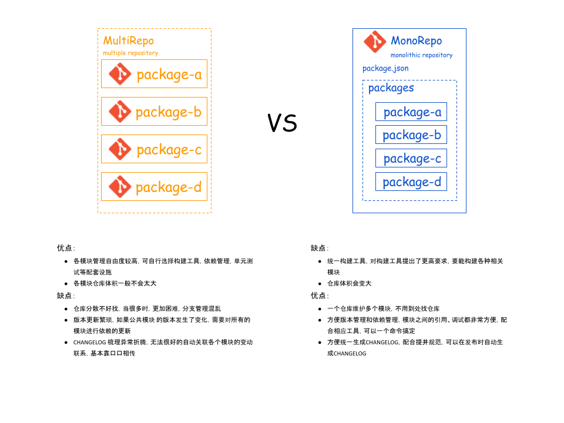

#### 多包管理方案

- `multirepo`
  - 又称`multiple repository`, 多代码仓库
  - 优势
    - 允许多元化发展，各个`module`有各自的构建等方式
  - 痛点
    - `issue`管理混乱
    - `changelog`难以整合，需要人工梳理所有变动的仓库，并做整合
    - `core repo`版本更新麻烦，需要同步所有`module`更新其依赖的`core repo`版本
- `monorepo`
  - 又称 `monolithic repository`, 单代码仓库
  - 优势
    - 集中管理，减少不同仓库配置的差异带来的沟通成本
  - 痛点
    - `repo`体积较大
    - 统一构建工具，对构建工具提出了更高要求，要能构建各种相关`module`



#### lerna 是什么？

`Lerna`是一种工具，用于优化使用`git`和`npm`管理多包存储库的工作流程。

#### 为什么要使用 lerna?

将大型代码库分成单独的独立版本化的软件包对于代码共享非常有用。 但是，跨许多存储库进行更改很麻烦且难以跟踪，并且跨存储库的测试变得非常复杂。

为了解决这些（以及许多其他）问题，某些项目会将其代码库组织到多包存储库中。 众多项目以及许多其他项目都在一个存储库中开发了所有软件包。

`lerna`可以让你在主项目下管理多个子项目，从而解决了多个包互相依赖，且发布时需要手动维护多个包的问题。

#### 安装 lerna

```sh
npm install -g lerna

# yarn

yarn global add lerna
```

#### 创建 lerna 仓库

```sh
git init lerna-repo && cd lerna-repo
```

#### Lerna 常用命令

##### lerna init

创建一个新的`lerna`仓库或将现有的仓库升级到`Lerna`的当前版本。

```sh
lerna init
```

生成的目录结构如下

```sh
lerna-repo/
  packages/
  package.json
  lerna.json
```

参数列表

`--independent`/`-i`：

- `independent`: 使用独立的版本控制模式, 它将会忽略`lerna.json`中定义的`version`
- `Fixed/Locked``(default)`: `Fixed`模式下，项目通过单一的版本进行控制。版本号放在项目根目录下的`lerna.json`文件的`version`这个字段。当你执行` lerna publish`，如果有文件更新，它将发布新的版本。


##### lerna create [name]

创建一个包


##### lerna add [package][@version?] [--dev]

用于为`packages`文件夹下的`package`安装依赖。

##### lerna bootstrap

在当前的`Lerna`存储库中引导软件包。安装它们的所有依赖性并链接任何交叉依赖性。

**此命令至关重要，因为它使您可以使用软件包名称，require()就好像软件包已经存在并在您的node_modules文件夹中可用一样。**

##### lerna import

将本地路径`<pathToRepo>`中的包导入具有提交历史记录的`package / <directory-name>`中。

##### lerna publish

创建一个新版本的已更新的软件包。提示新版本并更新`git`和`npm`上的所有软件包。

参数列表

`--npm-tag [tagname]`: 使用给定的`npm dist-tag`发布到`npm`（默认为最新）。

`--canary`/ `-c`: 创建一个`canary`版本。

`--skip-git` : 不要运行任何`git`命令。

`--force-publish [packages]`: 强制发布指定的软件包（以逗号分隔）或使用的所有软件包 `*`（跳过`git diff`检查更改的软件包）。

##### lerna changed

检查自上次发行以来哪些软件包已更改。

##### lerna diff [package?]

自上次发行以来，比较所有软件包或单个软件包。

##### lerna run [script]

在包含该脚本的每个软件包中 运行一个[npm](https://docs.npmjs.com/misc/scripts)脚本。

##### lerna ls

列出当前`Lerna`存储库中的所有公共软件包。

#### 参考资料

[Lerna 官方文档](https://lerna.js.org/)

