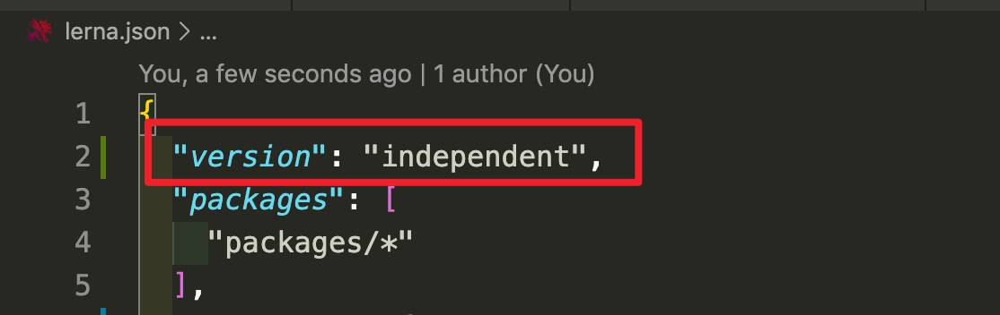
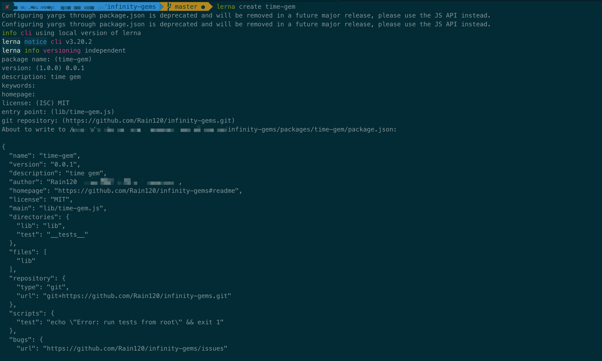
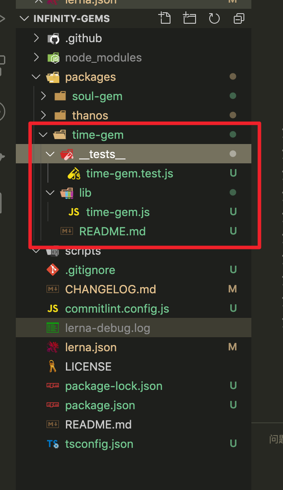

#### lerna 过滤器

用来过滤命令执行时的范围, 详见[`@lerna/filter-options`](https://www.npmjs.com/package/@lerna/filter-options)

| Filter                   | Description                                                  |
| ------------------------ | ------------------------------------------------------------ |
| `--scope <glob>`         | 仅包含`glob`所匹配到的`package`                              |
| `--ignore <glob>`        | 排除`glob`匹配到的`package`                                  |
| `--no-private`           | 排除私有`package`, 默认是包含的                              |
| `--since`                | 仅包括自指定`[ref]`之后已更改的软件包,如果没有传递参考, 则默认为最新标签。 |
| `--exclude-dependents`   | 运行命令时排除所有传递依赖项, 使用`--since`, 将覆盖默认的“更改”算法。 |
| `--include-dependents`   | 运行命令时包括所有传递依赖项, 无论`--scope`, `-ignore`或`--since` |
| `--include-dependencies` | 运行命令时包括所有传递依赖项, 无论`--scope`, `-ignore`或`--since` |
| `--include-merged-tags`  | 使用`--since`运行命令时, 包括来自合并分支的标签。            |


#### lerna init

创建一个新的`lerna`仓库或将现有的仓库升级到`Lerna`的当前版本。

##### 用法实例

```sh
lerna init
```

生成的目录结构如下

```sh
lerna-repo/
  packages/
  package.json
  lerna.json
```

##### 命令选项

```sh
命令选项：
  --exact            在package.json中指定lerna依赖版本而无需插入符号（^）[布尔]
  --independent, -i  独立版本包装                                    [布尔]
```

- `independent`: 使用独立的版本控制模式, 它将会忽略`lerna.json`中定义的`version`
- `Fixed/Locked``(default)`: `Fixed`模式下, 项目通过单一的版本进行控制。版本号放在项目根目录下的`lerna.json`文件的`version`这个字段。当你执行` lerna publish`, 如果有文件更新, 它将发布新的版本。



#### lerna create <name> [loc]

创建一个新的 `lerna` 管理包

##### 用法实例

```sh
lerna create soul-gem
```

##### 命令选项

```sh
<name>            软件包名称（包括范围）, 必须是本地唯一的_and_公开可用[字符串] [必填]
[loc]             自定义程序包位置, 默认为第一个配置的程序包位置[字串]

命令选项：
  --access        使用范围时, 设置publishConfig.access值[选择：“公共”, “受限制”] [默认值：公共]
  --bin           程序包具有可执行文件。使用--bin自定义<executabLername> [默认值：<name>]
  --description   程序包描述[字符串]
  --dependencies  软件包依赖关系的列表[数组]
  --es-module     初始化转译的ES模块
  --homepage      软件包主页, 默认为根的子路径pkg.homepage [字符串]
  --keywords      软件包关键字列表[array]
  --license       所需的软件包许可证（SPDX标识符）[默认：ISC]
  --private       将新软件包设为私有, 从未发布
  --registry      配置软件包的publishConfig.registry [string]
  --tag           配置软件包的publishConfig.tag [string]
  --yes            跳过所有提示, 接受默认值
```





#### lerna add <pkg> [globs..]

向匹配的软件包添加单个依赖项

##### 用法实例

```sh
# 安装 react 16.8.0 到 packages 所包含的 package 中
lerna add react@16.8.0

# 软件包/前缀-*将module-1软件包添加到“ prefix-”前缀文件夹中的软件包中
lerna add module-1

# 将module-1安装到module-2
lerna add module-1 --scope = module-2

# 在devDependencies中将module-1安装到module-2
lerna add module-1 --scope = module-2 --dev

# 在peerDependencies中将module-1安装到module-2
lerna add module-1 --scope = module-2 --peer

# 在module-1以外的所有模块中安装module-1
lerna add module-1

 # 跳过自动的“ lerna bootstrap”
lerna add module-1 --no-bootstrap

# 在所有模块中安装babel-core
lerna add babel-core
```

##### 命令选项

```sh
pkg    # 要添加为依赖项的程序包名称
 globs  # 匹配的可选软件包目录globs                           
命令选项：
  -D, --dev          保存到devDependencies
  -E, --exact        完全保存版本
  -P, --peer         保存到peerDependencies
  --registry         将指定的注册表用于所有npm客户端操作。
  --no-bootstrap     进行更改后, 不要自动链接“ lerna bootstrap”。
```

#### lerna bootstrap

在当前的`Lerna`存储库中引导软件包。安装它们的所有依赖性并链接任何交叉依赖性。

**此命令至关重要, 因为它使您可以使用软件包名称, require()就好像软件包已经存在并在您的node_modules文件夹中可用一样。**

##### 用法实例

```sh
lerna bootstrap
```

##### 命令选项

```sh

```

#### lerna import <dir>

将本地路径`<pathToRepo>`中的包导入具有提交历史记录的`package / <directory-name>`中, 将带有提交历史记录的包导入到 `monorepo` 中。

##### 用法实例

```sh
lerna import ./
```

##### 命令选项

```sh
dir # 外部git仓库的路径, 该仓库包含一个npm包[必需]

命令选项：
   --flatten          当导入具有合并提交的存储库时,导入命令将无法应用所有提交. 用户可以使用此标志来请求导入"flatten"历史,即每次合并提交, 作为单个合并的更改.
   --dest             导入外部git仓库的目标目录
   --preserve-commit  除了原始作者外, 还保留原始提交者
   -y, --yes          跳过所有确认提示
```

#### lerna publish

创建一个新版本的已更新的软件包。提示新版本并更新`git`和`npm`上的所有软件包。

##### 用法实例

```sh
lerna publish
```

##### 命令选项

`--npm-tag [tagname]`: 使用给定的`npm dist-tag`发布到`npm`（默认为最新）。

`--canary`/ `-c`: 创建一个`canary`版本。

`--skip-git` : 不要运行任何`git`命令。

`--force-publish [packages]`: 强制发布指定的软件包（以逗号分隔）或使用的所有软件包 `*`（跳过`git diff`检查更改的软件包）。

#### lerna changed

列出自上一个标记版本以来已更改的本地软件包。

##### 用法实例

`lerna changed`的输出,是包列表,给予`lerna version`或`lerna publish`执行的下一子项。

```sh
lerna changed
```

##### 命令选项

```sh
命令选项：
  --conventional-graduate   检测当前预发布的软件包, 这些软件包将更改为非预发布版本。
  --force-publish           在检测到已更改的软件包时始终包括目标软件包, 跳过默认逻辑。
  --ignore-changes          当检测到已更改的软件包时, 忽略与glob匹配的文件中的更改。通过--no-ignore-changes完全禁用。
  --include-merged-tags     当检测到更改的软件包时, 包括来自合并分支的标签。

输出选项：
  --json            将信息显示为JSON数组
  --ndjson          以换行符分隔的JSON显示信息
  -a, --all         显示通常隐藏的私人软件包
  -l, --long        显示扩展信息
  -p, --parseable   显示可解析的输出, 而不是列视图
  --toposort        按照目录的拓扑顺序而不是按词法对包进行排序
  --graph           将依赖关系图显示为JSON格式的邻接表
```

**Note**

- 不支持[过滤器选项](https://www.npmjs.com/package/@lerna/filter-options)
- `lerna.json`的配置影响了`lerna publish` 和 `lerna version`,同时也影响`lerna changed`

#### lerna diff [package?]

自上次发行以来, 比较所有软件包或单个软件包。

##### 用法实例

```sh
lerna diff soul-gem
```

##### 命令选项

```sh

```

#### lerna run [script]

在包含该脚本的每个软件包中 运行一个[npm](https://docs.npmjs.com/misc/scripts)脚本。

##### 用法实例

```sh
lerna run test
```

##### 命令选项

```sh

```

#### lerna link

将所有相互依赖的包符号链接在一起

##### 用法实例

```sh

```

##### 命令选项

```sh
命令：
   lerna link convert # 将本地同级版本范围替换为相对文件: 说明符

命令选项：
   --force-local 强制本地同级链接, 而不考虑版本范围是否匹配[布尔]
   --contents    用作符号链接源的子目录。 必须适用于所有包装
```

#### lerna list

列出当前`Lerna`存储库中的所有公共软件包。

##### 用法实例

```sh
lerna list

lerna ls
```

##### 命令选项

```sh
命令选项：
  --json          将信息显示为JSON数组
  --ndjson        以换行符分隔的JSON显示信息
  -a, --all       显示通常隐藏的私人软件包
  -l, --long      显示扩展信息
  -p, --parseable 显示可解析的输出, 而不是列视图
  --toposort      按照目录的拓扑顺序而不是按词法对包进行排序
  --graph         将依赖关系图显示为JSON格式的邻接表
```

#### lerna clean

从所有软件包中删除 `node_modules` 目录

##### 用法实例

```sh
lerna clean -y
```

##### 命令选项

```sh
-y, --yes  跳过所有确认提示
```

#### lerna bootstrap

将本地软件包链接在一起, 并安装剩余的软件包依赖项

#### 用法实例

```sh
lerna bootstrap
```

#### 命令选项

```sh
 --hoist               安装与[glob]匹配到repo root的外部依赖项
 --nohoist             不要提升将[glob]匹配到repo root的外部依赖项
 --ignore-prepublish   不要在引导程序包中运行预发布的生命周期脚本。 
 --ignore-scripts      不要在 bootstrap 程序包中运行_any_生命周期脚本
 --npm-client          可执行文件, 用于安装依赖项（npm, yarn, pnpm等）
 --registry            将指定的注册表用于所有npm客户端操作。
 --strict              提升时不允许警告, 因为它会导致更长的 bootstrap 时间和其他 issue。 
 --use-workspaces      启用与Yarn工作区的集成。 
 --force-local         强制本地同级链接, 而不考虑版本范围是否匹配
 --contents            用作任何链接源的子目录。必须适用于所有软件包。
```


#### lerna publish

在当前项目中发布软件包。

#### 用法实例

```sh
lerna publish [bump]
```

**bump: (位置)**

  通过显式版本_或_ semver关键字增加版本

  - 版本
    - major

    - minor

    - patch

    - premajor

    - preminor

    - prepatch

    - prerelease

    - from-git

    - from-package

#### 命令选项

```sh
  -c, --canary        每次成功合并后, 使用sha作为标签的一部分发布软件包。 [布尔]
  --preid             在发布预发行版本时指定预发行版本标识符。
  --contents          要发布的子目录。必须适用于所有软件包。 [字符串] [默认值：]。
  --dist-tag          使用指定的npm dist-tag发布软件包
  --legacy-auth       旧版Base64编码的用户名和密码。 [弦]
  --pre-dist-tag      使用指定的npm dist-tag发布预发行软件包。
  --git-head          打包tar包时将SHA显式设置为gitHead, 仅在'from-package'位置允许。 [弦]
  --graph-type        确定程序包层次结构时要使用的依赖项类型。 [任选值：“ all”, “ dependencies”]
  --ignore-prepublish 禁用不推荐使用的“预发布”生命周期脚本[布尔]
  --ignore-scripts    禁用所有生命周期脚本[布尔]
  --otp               提供一次性密码, 用于通过两因素身份验证进行发布。 [弦]
  --registry          将指定的注册表用于所有npm客户端操作。 [弦]
  --require-scripts   相对于软件包根目录执行./scripts/prepublish.js和./scripts/postpublish.js。 [布尔]
  --no-git-reset      发布完成后, 请勿将更改重置为工作树。 [布尔]
  --temp-tag          发布时创建一个临时标签。 [布尔]
  --no-verify-access  不验证当前npm用户的软件包读写权限。 [布尔]
  -y, --yes           跳过所有确认提示。
```

#### 参考资料

[Lerna 官方文档](https://lerna.js.org/)

