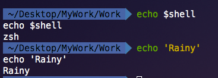
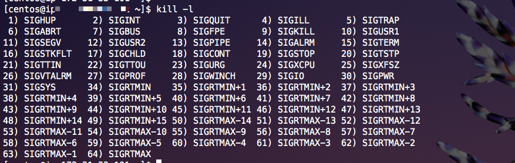

#### 新手入门`Linux`必知的`n`条命令

**1．[`echo`命令](http://man.linuxde.net/echo)**

`echo`命令用于在终端输出字符串或变量提取后的值，格式为`echo [字符串 | $变量]`。

```shell
echo $shell
echo 'Rainy'
```



**2. [`ps`命令](http://man.linuxde.net/ps)**

`ps`命令用于查看系统中的进程状态，格式为`ps [参数]`。

```shell
ps aux
ps -ef
```

常用的参数：

| 参数 | 作用                                                         |
| ---- | ------------------------------------------------------------ |
| -a   | 显示所有进程（包括其他用户的进程）                           |
| -e   | 列出程序时，显示每个程序所使用的环境变量，此选项的效果和指定`a`选项相同。。 |
| -f   | 显示`UID`,`PPIP`,`C`与`STIME`栏位。                          |
| -u   | 用户以及其他详细信息                                         |
| -x   | 显示没有控制终端的进程                                       |

在`Linux`系统中，有5种常见的进程状态，分别为运行、中断、不可中断、僵死与停止，其各自含义如下所示。

> **R（运行）：**进程正在运行或在运行队列中等待。
>
> **S（中断）：**进程处于休眠中，当某个条件形成后或者接收到信号时，则脱离该   状态。
>
> **D（不可中断）：**进程不响应系统异步信号，即便用`kill`命令也不能将其中断。
>
> **Z（僵死）：**进程已经终止，但进程描述符依然存在, 直到父进程调用`wait4()`系统函数后将进程释放。
>
> **T（停止）：**进程收到停止信号后停止运行。

**3. [`pidof`命令](http://man.linuxde.net/pidof)**

`pidof`命令用于查询某个指定服务进程的`PID`值。

参数列表：


| 参数 | 作用                           |
| ---- | ------------------------------ |
| -s   | 仅返回一个进程号               |
| -c   | 仅显示具有相同`root`目录的进程 |
| -x   | 显示由脚本开启的进程           |
| -o   | 指定不显示的进程`ID`           |

```shell
pidof [参数] [服务]
pidof nginx
```

**4. [`kill`命令](http://man.linuxde.net/kill)**

`kill`命令用于终止某个指定`PID`的服务进程。预设的信息为`SIGTERM(15)`,可将指定程序终止。若仍无法终止该程序，可使用`SIGKILL(9)`信息尝试强制删除程序。程序或工作的编号可利用[`ps`](http://man.linuxde.net/ps)指令或`job`指令查看。

参数列表：

| 参数                | 作用                                                    |
| ------------------- | ------------------------------------------------------- |
| -a                  | 当处理当前进程时，不限制命令名和进程号的对应关系        |
| -l <信息编号>       | 若不加<信息编号>选项，则`-l`参数会列出全部的信息名称    |
| -p                  | 指定`kill` 命令只打印相关进程的进程号，而不发送任何信号 |
| -s <信息名称或编号> | 指定要送出的信息                                        |
| -u                  | 指定用户                                                |

```shell
格式：kill [参数] [pid]
kill 9527
```

[`killall`](http://man.linuxde.net/killall)命令用于终止某个指定名称的服务所对应的全部进程。

```shell
kill [参数] [服务名称]
```

列出所有信号名称:

```shell
kill -l
```



只有第9种信号(`SIGKILL`)才可以无条件终止进程，其他信号进程都有权利忽略。

常用的一些信号

```
HUP     1    终端断线
INT     2    中断（同 Ctrl + C）
QUIT    3    退出（同 Ctrl + \）
TERM   15    终止
KILL    9    强制终止
CONT   18    继续（与STOP相反， fg/bg命令）
STOP   19    暂停（同 Ctrl + Z）
```

**5. [`ifconfig`命令](http://man.linuxde.net/ifconfig)**

被用于配置和显示`Linux`内核中网络接口的网络参数。

```shell
ifconfig [参数]
```

**6. [`uname`命令](http://man.linuxde.net/uname)**

用于打印当前系统相关信息（内核版本号、硬件架构、主机名称和操作系统类型等）。

参数列表：

| 参数 | 作用               |
| ---- | ------------------ |
| -a   | 显示全部的信息     |
| -v   | 显示操作系统的版本 |
| -o   | 输出操作系统名称   |
| -s   | 显示操作系统名称   |

直接使用`uname`默认参数是`-s`。

```shell
uname [参数]
```

**7. [`free`命令](http://man.linuxde.net/free)**

可以显示当前系统未使用的和已使用的内存数目，还可以显示被内核使用的内存缓冲区。

参数列表:

| 参数         | 作用                           |
| ------------ | ------------------------------ |
| -h           | 以`GB`为单位显示内存使用情况   |
| -m           | 以`MB`为单位显示内存使用情况   |
| -k           | 以`KB`为单位显示内存使用情况   |
| -b           | 以`Byte`为单位显示内存使用情况 |
| -o           | 不显示缓冲区调节列             |
| -s<间隔秒数> | 持续观察内存使用状况           |
| -t           | 显示内存总和列                 |
| -V           | 显示版本信息                   |

```shell
free [参数]
```

**8. [`who`命令](http://man.linuxde.net/who)**

显示目前登录系统的用户信息。执行`who`命令可得知目前有那些用户登入系统，单独执行`who`命令会列出登入帐号，使用的终端机，登入时间以及从何处登入或正在使用哪个显示器。

参数列表:

| 参数           | 作用                             |
| -------------- | -------------------------------- |
| -q / --count   | 只显示登入系统的帐号名称和总人数 |
| -H / --heading | 显示各栏位的标题信息列           |

```sh
who [参数]
```

**9. [`last`命令](http://man.linuxde.net/last)**

用于显示用户最近登录信息。单独执行`last`命令，它会读取`/var/log/wtmp`的文件，并把该给文件的内容记录的登入系统的用户名单全部显示出来。

参数列表:

| 参数                      | 作用                                             |
| ------------------------- | ------------------------------------------------ |
| -n<显示列数>或-<显示列数> | 设置列出名单的显示列数                           |
| -x                        | 显示系统关机，重新开机，以及执行等级的改变等信息 |

```shell
last (选项) [参数]
```

**10.[`history命令`](http://man.linuxde.net/history)**

用于显示指定数目的指令命令，读取历史命令文件中的目录到历史命令缓冲区和将历史命令缓冲区中的目录写入命令文件。

该命令单独使用时，仅显示历史命令，在命令行中，可以使用符号`!`执行指定序号的历史命令。例如，上一条命令`!!`,要执行第2个历史命令，则输入`!2`。

历史命令是被保存在内存中的，当退出或者登录`shell`时，会自动保存或读取。在内存中，历史命令仅能够存储1000条历史命令，该数量是由环境变量`HISTSIZE`进行控制。

参数选项:

| 参数 | 作用                                         |
| ---- | -------------------------------------------- |
| -c   | 清空当前历史命令                             |
| -r   | 将历史命令文件中的命令读入当前历史命令缓冲区 |
| -a   | 将历史命令缓冲区中命令写入历史命令文件中     |
| -w   | 将当前历史命令缓冲区命令写入历史命令文件中   |

参数：`n`: 打印最近的`n`条历史命令。

```shell
history (选项) [参数]
```


参考资料

[`Linux`命令大全](http://man.linuxde.net/)

