[目录 -> 学习笔记](notes/guide.md)

[目录 -> 上一级](notes/mobile/guide.md)

### 缘由

- 当前工作首次接触移动端
- 为了方便新接触的同学，帮忙填坑

#### Https抓包结果展示

错误结果

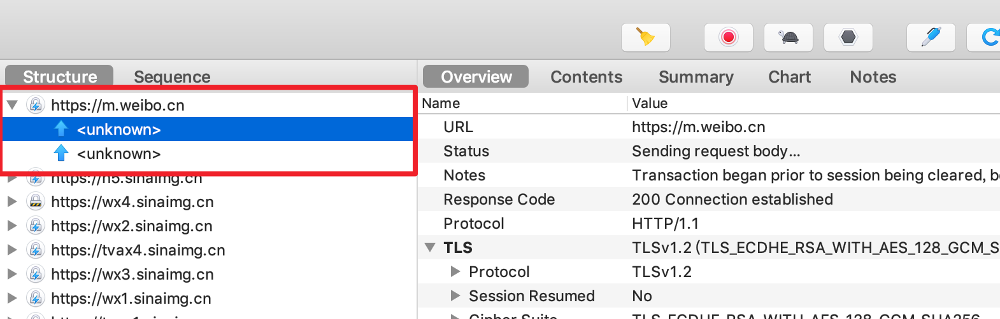

正确结果

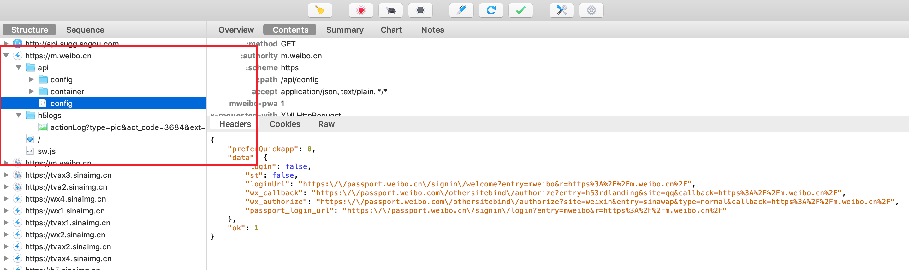

### 代理设置

```
Proxy
	-> macOS Proxy
```

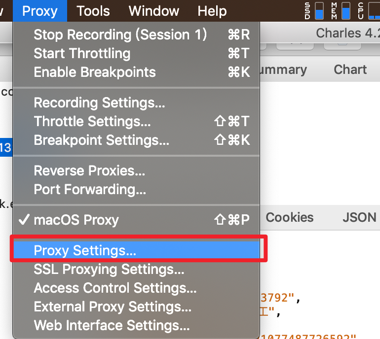

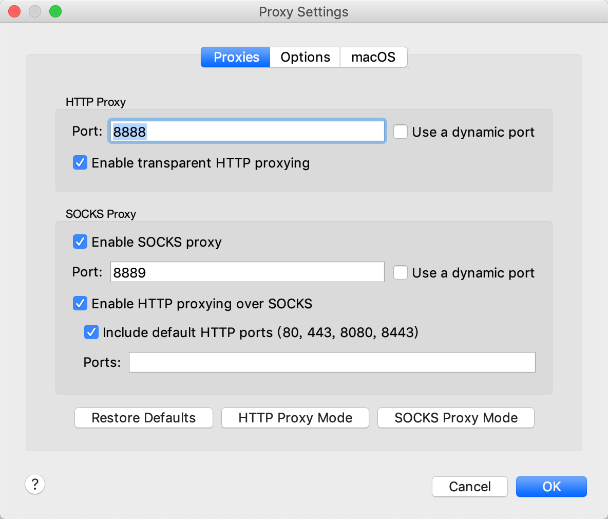

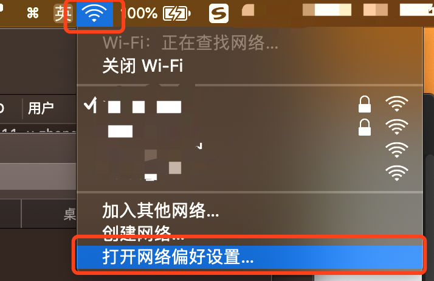

手机(移动端设备)

**Note:** 下载证书前务必先执行这一步

```
Wifi
	-> 代理
	-> 手动
	-> ip:port(👆设置的)
```

### 证书安装

#### 电脑证书安装

```
# 安装
help
	-> SSL Proxying
	-> install Charles Root Certificate

# 信任， 一般会自动跳出来，如果没有可以到设置开启证书信任
钥匙串访问
	-> 所有项目
	-> Charles Proxy CA
	-> 始终信任
```

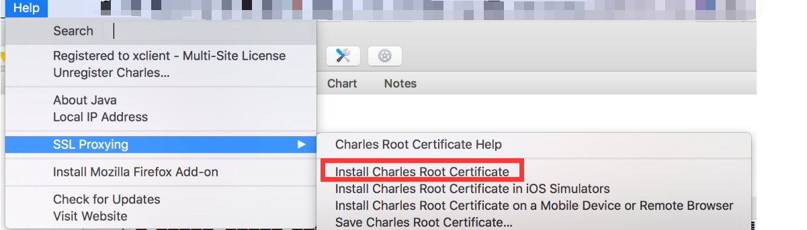


#### 手机证书安装

```
help
	-> SSL Proxying
	-> install Charles Root Certificate on a Mobile Device or Remote Browser
```

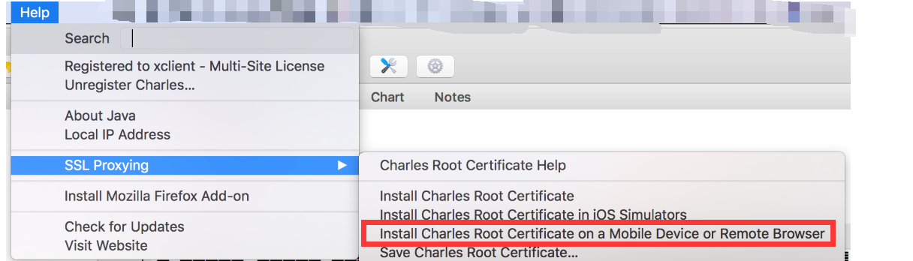

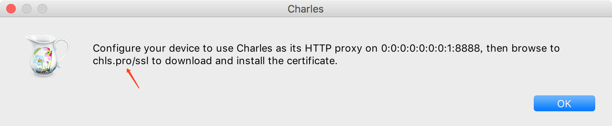

下载证书

**Note:** 请务必先将你手机(移动端设备)的网络和电脑的网络设置为同一个，而且将你手机(移动端设备)的代理设置为电脑的`ip`: `charles port`(默认为`8888`)，否则没法下载。

```http
http://chls.pro/ssl
```

安装证书

```
# iPhone
 设置
 	-> 通用
 	-> 关于本机
 	-> 证书信任设置
 	-> 信任证书
 	
 # Android
 # 自带浏览器下载的文件
 	-> getssl.crt
 	-> 设置
 	-> 更多设置
 	-> 系统安全
 	-> 从SD卡安装证书
 	
 # 第三方浏览器下载
 	-> charles-ssl-proxying-certificate.pem
 	-> 直接安装
```

### 客户端设置

- `Charles`开启`SSL Proxy`

  `port`设置端口是`https`的默认端口，如果你的测试环境是其他端口，需要在此处添加该端口, `eg:https://www.wodeduankouxiugaile.com:9527`，则`SSL Proxying`的可以添加一个`Location`为`*.9527`。
  
  ```
  Proxy
  	-> SSL Proxy Settings
  	-> SSL Proxying
  	-> [Add]按钮，并勾选Enable SSL Proxying
  	# https
  	# host: *
  	# port: 443
	# or custom port
  ```

  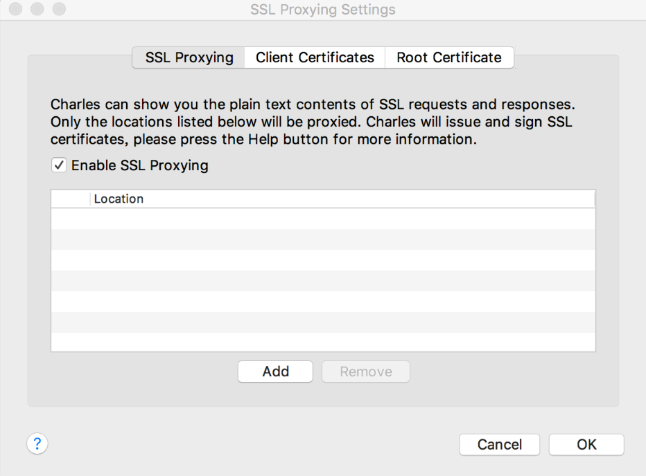

  
  
  

#### 通过`rewrite`将远程代理到本地

[rewrite的作用](https://www.charlesproxy.com/documentation/tools/rewrite/)

> The Rewrite tool enables you to create rules that modify requests and responses as they pass through Charles. Rules such as adding or changing a header or search and replace some text in the response body.

通过`rewrite`工具，您可以创建在通过`Charles`时修改请求和响应的规则。 添加或更改`header`或搜索和替换响应正文中的某些文本等规则。

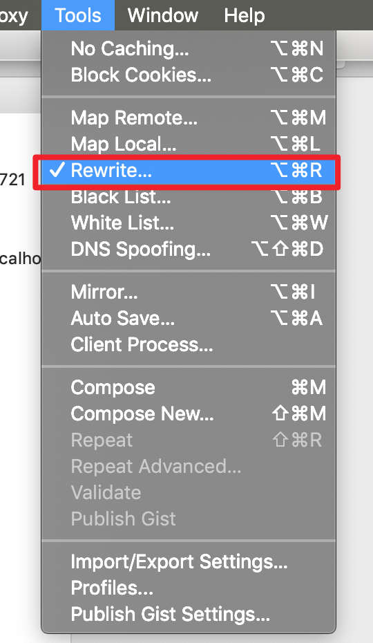

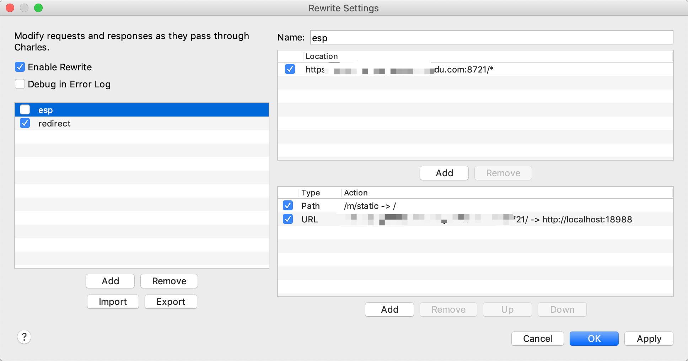