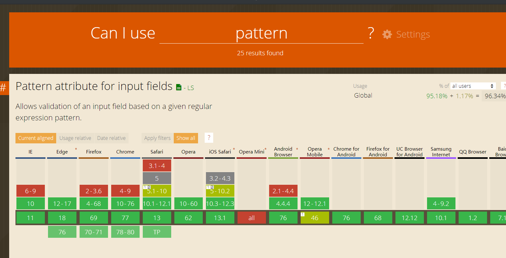

[目录 -> 学习笔记](notes/guide.md)

[目录 -> 上一级](notes/mobile/guide.md)

### 判断是否是`IPhoneX`系列产品

因为`IPhoneX`后的产品底部返回键: `34pt`, 大概`45px` `(px = pt * 4 / 3)`

`iPhone X`、`iPhone XS`、`iPhone XS Max`刘海头高度`30px`，`iPhone XR`刘海头高度`33px`

```javascript
export const isIPhoneX = () => {
    if (typeof window !== 'undefined' && window) {
        // iPhone X、iPhone XS
        let isIPhoneX = /iphone/gi.test(window.navigator.userAgent)
            && window.devicePixelRatio
            && window.devicePixelRatio === 3
            && window.screen.width === 375
            && window.screen.height === 812
        // iPhone XS Max
        let isIPhoneXSMax = /iphone/gi.test(window.navigator.userAgent)
            && window.devicePixelRatio
            && window.devicePixelRatio === 3
            && window.screen.width === 414
            && window.screen.height === 896
        // iPhone XR
        let isIPhoneXR = /iphone/gi.test(window.navigator.userAgent)
            && window.devicePixelRatio
            && window.devicePixelRatio === 2
            && window.screen.width === 414
            && window.screen.height === 896
        return isIPhoneX || isIPhoneXSMax || isIPhoneXR
    }
    return false
}

```

#### 调用移动端系统功能

```javascript
<!-- 拨号 -->
<a href="tel:10086">打电话给: 10086</a>

<!-- 发送短信 -->
<a href="sms:10086">发短信给: 10086</a>

<!-- 发送邮件 -->
<a href="mailto:839626987@qq.com">发邮件给：839626987@qq.com</a>

<!-- 选择照片或者拍摄照片 -->
<input type="file" accept="image/*">

<!-- 选择视频或者拍摄视频 -->
<input type="file" accept="video/*">

<!-- 多选 -->
<input type="file" multiple>
```

[H5移动端开发遇到的东西](https://juejin.im/post/5d6e1899e51d453b1e478b29)

### 弹起移动端的数字输入

```javascript
<!-- 有"#" "*"符号输入 -->
<input type="tel">

<!-- 纯数字 -->
<input type="number" pattern="\d"> 
<input type="number" pattern="[0-9]*">  
```

`iOS`中，只有`[0-9]\*`才可以调起九宫格数字键盘，`\d `无效
`Android 4.4`👇(包括微信所用的`X5`内核)，两者都调起数字键盘；
`Android 4.4.4`👆，只认 `type` 属性，也就是说，如果上面的代码将` type="number" `改为`type="text" `，将调起全键盘而不会是九宫格数字键盘。

常用的`pattern`[正则表达式](notes/javascript/regular_expression/common_reg_exps.md)

- 信用卡  `[0-9]{13,16}`
- 银联卡 ` ^62[0-5]\d{13,16}$`
- `Visa`: `^4[0-9]{12}(?:[0-9]{3})?$`



[caniuse - pattern](https://caniuse.com/#search=pattern)