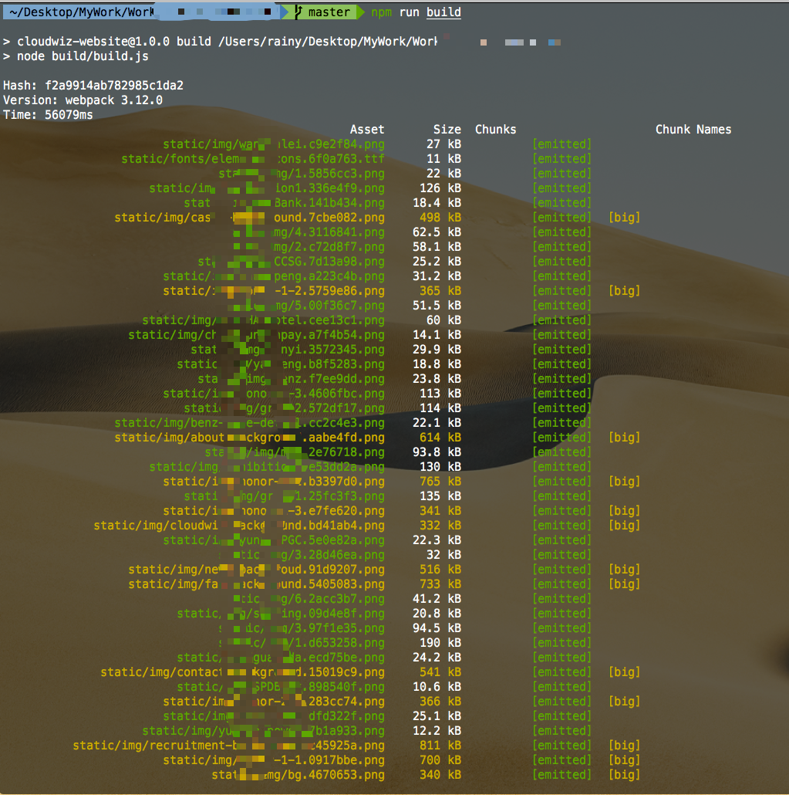
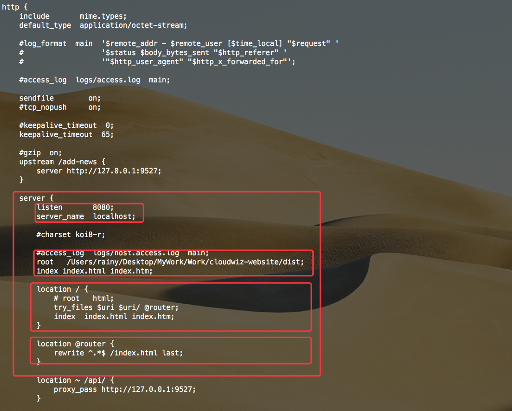
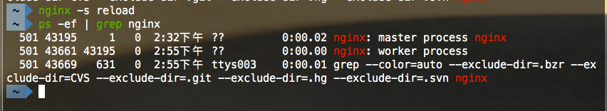

##### 本地Nginx + Node + Vue配置

```shell
npm run build
```



```shell
// Homebrew 安装 Nginx 
brew install nginx
cd /usr/local/etc/nginx
ll -al
vim nginx.conf
```


###### Nginx 参数列表

| 配置参数属性                 | 解释说明                                                     | 参数列表                                                     |
| ---------------------------- | ------------------------------------------------------------ | ------------------------------------------------------------ |
| user                         | 设置nginx服务的系统使用用户                                  | nobody                                                       |
| worker_processes             | 开启的线程数                                                 | 一般与服务器核数保持一致                                     |
| error_log                    | 定位全局错误日志文件                                         | 错误日志定义等级，[ debug \| info notice \| warn \| error \| crit ]，debug输出最多，crir输出最少 |
| pid                          | 指定进程id的存储文件位置                                     |                                                              |
| worker_rlimit_nofile         | 指定一个nginx进程打开的最多文件描述符数目，受系统进程的最大打开文件数量限制 |                                                              |
| events -> worker_connections | 定义每个进程的最大连接数,受系统进程的最大打开文件数量限制    | 单个后台worker process进程的最大并发链接数 （最大连接数= worker_processes * worker_connections）<br />在反向代理环境下：<br/>最大连接数 = worker_processes * worker_connections / 4 |
| events -> use                | 工作进程数                                                   | [ epoll \| /dev/poll \| poll \| eventport \| kqueue \| select \| rtsig ] |
| events -> multi_accept       | 一个新连接通知后接受尽可能多的连接                           |                                                              |
| http                         | Nginx http处理的所有核心特性                                 |                                                              |

###### HTTP

| 配置参数属性      | 解释说明                                                     | 参数列表                                                     |
| ----------------- | ------------------------------------------------------------ | ------------------------------------------------------------ |
| include           | 主模块指令，实现对配置文件所包含的文件的设定，可以减少主配置文件的复杂度，DNS主配置文件中的zonerfc1912,acl基本上都是用include语句 |                                                              |
| default_type      | 核心模块指令                                                 | 智力默认设置为二进制流，也就是当文件类型未定义时使用这种方式 |
| log_format        | 日志格式的设定                                               | 日志格式的名称，可自行设置，后面引用                         |
| access_log        | 引用日志                                                     | 引用log_format设置的名称                                     |
| keepalive_timeout | 设置客户端连接保存活动的超时时间                             | 0是无限制                                                    |
| sendfile          | 开启高效文件传输模式                                         | on / off                                                     |
| tcp_nopush        | 开启防止网络阻塞                                             | on / off                                                     |
| tcp_nodelay       | 开启防止网络阻塞                                             | on / off                                                     |
| upstream          | 负载均衡                                                     |                                                              |
| server            | Nginx的server虚拟主机配置                                    |                                                              |

###### upstream

| 配置参数属性       | 解释说明                                                     |
| ------------------ | ------------------------------------------------------------ |
| 轮询（默认）       | 每个请求按访问ip的hash结果分配，这样每个访客固定访问一个后端服务器，可以解决session的问题。 |
| weight             | 指定轮询几率，weight和访问比率成正比，用于后端服务器性能不均的情况 |
| ip_hash            | 每个请求按访问ip的hash结果分配，这样每个访客固定访问一个后端服务器，可以解决session的问题。 |
| fair（第三方）     | 按后端服务器的响应时间来分配请求，响应时间短的优先分配。     |
| url_hash（第三方） | 按访问url的hash结果来分配请求，使每个url定向到同一个后端服务器，后端服务器为缓存时比较有效。 |

weight 默认为1.weight越大，负载的权重就越大。

###### 状态


| 配置参数属性 | 解释说明                             |
| ------------ | ------------------------------------ |
| backup       | 预留的备份服务器                     |
| down         | 当前的server暂时不参与负载均衡       |
| fail_timeout | 经过max_fails 失败后，服务暂停的时间 |
| max_conns    | 限制最大的接收的连接数               |
| max_fails    | 允许请求失败的次数                   |

使用：在server中添加

```nginx
proxy_pass http://127.0.0.1:9527;
// 因为我的API接口是这个
location ~ /api/ {
    proxy_pass http://127.0.0.1:9527;
}
```


###### server


| 配置参数属性 | 解释说明                                   | 参数列表                  |
| ------------ | ------------------------------------------ | ------------------------- |
| listen       | 监听端口                                   | http -> 80 / https -> 443 |
| server_name  | 设置主机域名                               | localhost                 |
| charset      | 设置访问的语言编码                         |                           |
| access_log   | 设置虚拟主机访问日志的存放路径及日志的格式 |                           |
| location     | 设置虚拟主机的基本信息                     |                           |


####### location

| 配置参数属性 | 解释说明                   | 参数列表 |
| ------------ | -------------------------- | -------- |
| root         | 设置虚拟主机的网站根目录   |          |
| index        | 设置虚拟主机默认访问的网页 |          |

[Location配置](http://seanlook.com/2015/05/17/nginx-location-rewrite/)

修改 `http` `server`中的配置



重启`Nginx`

```shell
nginx -s reload
ps -ef | grep nginx
```



