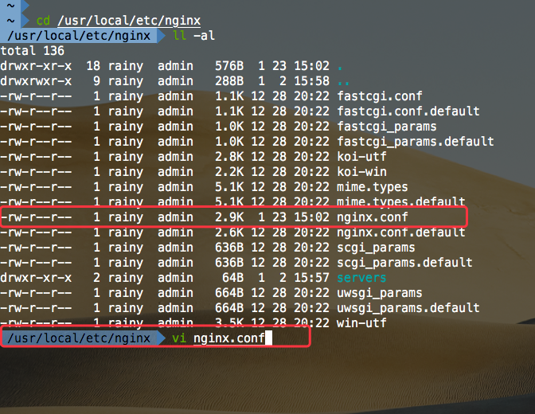

### 本地Nginx + Node + Vue配置

###### `Server Tree`

```
tree -C -L 3 -I '*node_modules*'

├── server
│   ├── app.js
│   ├── db
│   │   ├── db.js
│   │   └── newsSql.js
│   ├── package-lock.json
│   ├── package.json
│   └── routers
│       ├── news.js
│       └── router.js
```


#### `Node Server`

```js
npm init
npm install express mysql body-parser -S
```

##### `Mysql`配置

1. `app.js`

   ```javascript
   const express = require('express')
   const bodyParser = require('body-parser')
   const app = express()
   const router = require('./routers/router')
   
   const PORT = 9527
   
   app.use(bodyParser.json())
   app.use(bodyParser.urlencoded({ extended: true }))
   
   app.use(router)
   
   app.listen(PORT, () => {
     console.log(`Listen port at ${PORT}`)
   })
   
   ```

2. `db.js`

   ```javascript
   module.exports = {
     mysql: {
       host: 'localhost',
       user: 'root',
       password: 'xxxx',
       database: 'test',
       port: '3306'
     }
   }
   ```

3. `router.js`

   ```javascript
   const express = require('express')
   const router = express.Router()
   const news = require('./news')
   
   router.get('/api/news/queryAll', (req, res, next) => {
     news.queryAll(req, res, next)
   })
   
   router.get('/api/news/query', (req, res, next) => {
     news.queryById(req, res, next)
   })
   
   router.post('/api/news/add', (req, res, next) => {
     news.add(req, res, next)
   })
   
   router.post('/api/news/update', (req, res, next) => {
     news.update(req, res, next)
   })
   
   router.delete('/api/news/deleteNews', (req, res, next) => {
     news.deleteNews(req, res, next)
   })
   
   module.exports = router
   ```

4. `newSql.js`

   ```javascript
   module.exports = {
     createNews: `CREATE TABLE news (
       id int(255) NOT NULL AUTO_INCREMENT,
       type varchar(255) CHARACTER SET utf8 NOT NULL,
       title varchar(255) CHARACTER SET utf8 NOT NULL,
       description varchar(255) CHARACTER SET utf8 NOT NULL,
       occur_time varchar(255) CHARACTER SET utf8 NOT NULL,
       url varchar(255) NOT NULL,
       newsImg varchar(255) NOT NULL,
       PRIMARY KEY (id)
     )`,
     queryAll: 'SELECT * FROM news',
     queryById: 'SELECT * FROM news WHERE id = ?',
     add: 'INSERT INTO news (type, title, description, occur_time, url, newsImg) VALUES (?, ?, ?, ?, ?, ?)',
     update: 'UPDATE news SET type = ?, title = ?, description = ?, occur_time = ?, url = ?, newsImg = ? WHERE id = ?',
     delete: 'DELETE FROM news WHERE id = ?'
   }
   ```

5. `news.js`

   ```javascript
   const mysql = require('mysql')
   const db = require('../db/db')
   const $newsSql = require('../db/newsSql')
   
   let pool = mysql.createPool(db.mysql)
   
   let queryAll = (req, res, next) => {
     pool.getConnection((error, connect) => {
       if (error) {
         throw error
       } else {
         connect.query($newsSql.queryAll, (error, data) => {
           if (error) {
             throw error
           }
           res.json({
             code: '200',
             msg: 'success',
             data
           })
           connect.release()
         })
       }
     })
   }
   
   let queryById = (req, res, next) => {
     let id = +req.query.id
     pool.getConnection((error, connect) => {
       if (error) {
         throw error
       } else {
         connect.query($newsSql.queryById, id, (error, data) => {
           if (error) {
             throw error
           }
           res.json({
             code: '200',
             msg: 'success',
             data
           })
           connect.release()
         })
       }
     })
   }
   
   let add = (req, res, next) => {
     let rb = req.body
     let params = [rb.type, rb.title, rb.description, rb.occur_time, rb.url, rb.newsImg]
     pool.getConnection((error, connect) => {
       if (error) {
         throw error
       } else {
         connect.query($newsSql.add, params, (error, data) => {
           if (error) {
             throw error
           }
           res.json({
             code: '200',
             msg: 'success'
           })
           connect.release()
         })
       }
     })
   }
   
   let update = (req, res, next) => {
     let rb = req.body
     let params = [rb.type, rb.title, rb.description, rb.occur_time, rb.url, rb.newsImg, rb.id]
     pool.getConnection((error, connect) => {
       if (error) {
         throw error
       } else {
         connect.query($newsSql.update, [...params], (error, data) => {
           if (error) {
             throw error
           }
           res.json({
             code: '200',
             msg: 'success'
           })
           connect.release()
         })
       }
     })
   }
   
   let deleteNews = (req, res, next) => {
     let id = +req.query.id
     pool.getConnection((error, connect) => {
       if (error) {
         throw error
       } else {
         connect.query($newsSql.delete, id, (error, data) => {
           if (error) {
             throw error
           }
           res.json({
             code: '200',
             msg: 'success'
           })
           connect.release()
         })
       }
     })
   }
   
   module.exports = {
     queryAll,
     queryById,
     add,
     update,
     deleteNews
   }
   ```

##### `Vue`配置代理以及使用`api`

1. `config/index.js` 修改`proxyTable`

   ```javascript
   module.exports = {
     dev: {
       proxyTable: {
         '/api': {
           target: 'http://127.0.0.1:9527',
           changeOrigin: true,
           pathRewrite: {
             '^/api': '/api'
           }
         }
       }
     }
   }
   ```

2. 使用`axios`调用接口

   ```vue
   import axios from 'axios'
   export default {
     created () {
       this._getAllNews()
     },
     methods: {
       _getAllNews () {
         axios.get('/api/news/queryAll').then(res => {
               if (+res.data.code === SCC_CODE) {
                 this.news = res.data.data
               }
             })
         }
       }
   }
   ```

###### `Vue build`包

```shell
npm run build
```


##### `Mac` 安装`Nginx`

```shell
// 推荐使用`brew`, 安装`homebrew`
/usr/bin/ruby -e "$(curl -fsSL https://raw.githubusercontent.com/Homebrew/install/master/install)"
// Homebrew 安装 Nginx 
brew install nginx
cd /usr/local/etc/nginx
ll -al
vim nginx.conf
```

[`homebrew`详见](https://brew.sh/)



##### Nginx 参数列表

| 配置参数属性                 | 解释说明                                                     | 参数列表                                                     |
| ---------------------------- | ------------------------------------------------------------ | ------------------------------------------------------------ |
| user                         | 设置nginx服务的系统使用用户                                  | nobody                                                       |
| worker_processes             | 开启的线程数                                                 | 一般与服务器核数保持一致                                     |
| error_log                    | 定位全局错误日志文件                                         | 错误日志定义等级，[ debug \| info notice \| warn \| error \| crit ]，debug输出最多，crir输出最少 |
| pid                          | 指定进程id的存储文件位置                                     |                                                              |
| worker_rlimit_nofile         | 指定一个nginx进程打开的最多文件描述符数目，受系统进程的最大打开文件数量限制 |                                                              |
| events -> worker_connections | 定义每个进程的最大连接数,受系统进程的最大打开文件数量限制    | 单个后台worker process进程的最大并发链接数 （最大连接数= worker_processes * worker_connections）<br />在反向代理环境下：<br/>最大连接数 = worker_processes * worker_connections / 4 |
| events -> use                | 工作进程数                                                   | [ epoll \| /dev/poll \| poll \| eventport \| kqueue \| select \| rtsig ] |
| events -> multi_accept       | 一个新连接通知后接受尽可能多的连接                           |                                                              |
| http                         | Nginx http处理的所有核心特性                                 |                                                              |

##### HTTP

| 配置参数属性      | 解释说明                                                     | 参数列表                                                     |
| ----------------- | ------------------------------------------------------------ | ------------------------------------------------------------ |
| include           | 主模块指令，实现对配置文件所包含的文件的设定，可以减少主配置文件的复杂度，DNS主配置文件中的zonerfc1912,acl基本上都是用include语句 |                                                              |
| default_type      | 核心模块指令                                                 | 智力默认设置为二进制流，也就是当文件类型未定义时使用这种方式 |
| log_format        | 日志格式的设定                                               | 日志格式的名称，可自行设置，后面引用                         |
| access_log        | 引用日志                                                     | 引用log_format设置的名称                                     |
| keepalive_timeout | 设置客户端连接保存活动的超时时间                             | 0是无限制                                                    |
| sendfile          | 开启高效文件传输模式                                         | on / off                                                     |
| tcp_nopush        | 开启防止网络阻塞                                             | on / off                                                     |
| tcp_nodelay       | 开启防止网络阻塞                                             | on / off                                                     |
| upstream          | 负载均衡                                                     |                                                              |
| server            | Nginx的server虚拟主机配置                                    |                                                              |

##### upstream

| 配置参数属性       | 解释说明                                                     |
| ------------------ | ------------------------------------------------------------ |
| 轮询（默认）       | 每个请求按访问ip的hash结果分配，这样每个访客固定访问一个后端服务器，可以解决session的问题。 |
| weight             | 指定轮询几率，weight和访问比率成正比，用于后端服务器性能不均的情况 |
| ip_hash            | 每个请求按访问ip的hash结果分配，这样每个访客固定访问一个后端服务器，可以解决session的问题。 |
| fair（第三方）     | 按后端服务器的响应时间来分配请求，响应时间短的优先分配。     |
| url_hash（第三方） | 按访问url的hash结果来分配请求，使每个url定向到同一个后端服务器，后端服务器为缓存时比较有效。 |

weight 默认为1.weight越大，负载的权重就越大。

###### 状态


| 配置参数属性 | 解释说明                             |
| ------------ | ------------------------------------ |
| backup       | 预留的备份服务器                     |
| down         | 当前的server暂时不参与负载均衡       |
| fail_timeout | 经过max_fails 失败后，服务暂停的时间 |
| max_conns    | 限制最大的接收的连接数               |
| max_fails    | 允许请求失败的次数                   |

使用：在server中添加

```nginx
proxy_pass http://127.0.0.1:9527;
// 因为我的API接口是这个，such as /api/profile
location ~ /api/ {
    proxy_pass http://127.0.0.1:9527;
}
```

##### server

| 配置参数属性 | 解释说明                                   | 参数列表                  |
| ------------ | ------------------------------------------ | ------------------------- |
| listen       | 监听端口                                   | http -> 80 / https -> 443 |
| server_name  | 设置主机域名                               | localhost                 |
| charset      | 设置访问的语言编码                         |                           |
| access_log   | 设置虚拟主机访问日志的存放路径及日志的格式 |                           |
| location     | 设置虚拟主机的基本信息                     |                           |

##### location

| 配置参数属性 | 解释说明                   | 参数列表                                                     |
| ------------ | -------------------------- | ------------------------------------------------------------ |
| root         | 设置虚拟主机的网站根目录   | Vue项目的根目录/Users/rainy/Desktop/MyWork/Work/cloudwiz-website/dist |
| index        | 设置虚拟主机默认访问的网页 | index.html index.htm                                         |

- `=`: 开头表示精确匹配，如 `api` 中只匹配根目录结尾的请求，后面不能带任何字符串.
- `^~` :开头表示`uri`以某个常规字符串开头，不是正则匹配.
- `~`: 开头表示区分大小写的正则匹配.
- `~*`: 开头表示不区分大小写的正则匹配.
- `/` : 通用匹配, 如果没有其它匹配,任何请求都会匹配到.

匹配优先级(高到低)

1. `location =` 
2.  `location 完整路径`
3. `location ^~ 路径`
4. `location ~,~* 正则顺序`
5. `location 部分起始路径`  
6. `/`

[详见`Location`配置](http://seanlook.com/2015/05/17/nginx-location-rewrite/)

修改 `http` `server`中的配置


启动`Nginx`

```shell
nginx
ps -ef | grep nginx
```

重启`Nginx`

```shell
nginx -s reload
```

关闭`Nginx`

```shell
nginx -s stop
```

因为我已经启动了，所以就重启一下`Nginx`即可


#####  `Linux`安装`Nginx`

[`Linux`安装](http://www.runoob.com/linux/nginx-install-setup.html)

[常见的`Linux`命令](http://man.linuxde.net/par/2)

使用`pstree`查看当前服务器启动的进程

```shell
pstree
```


查找`Nginx`的位置

```shell
ps -aux | grep nginx
```


进入`nginx`的目录


然后配置`nginx.conf`文件即可

因为我的`Server`端是`Express`写的，启动`Server`需要使用`Node`，所以我们需要在服务器上安装`Node`.

`Linux`安装`Node 8.x`

```shell
# Using Ubuntu
curl -sL https://deb.nodesource.com/setup_8.x | sudo -E bash -
sudo apt-get install -y nodejs

# Using Debian, as root
curl -sL https://deb.nodesource.com/setup_8.x | bash -
apt-get install -y nodejs

# Using Centos
curl -sL https://rpm.nodesource.com/setup_8.x | bash -
yum install -y nodejs
```

[具体安装各版本的`Node`详见](https://my.oschina.net/idoop/blog/1545011)

启动`Node`

此处我之前的命令执行错误，所以我需要`kill`这个进程

```shell
nohup node website/server/app.js &
```


**`nohup`**:可以将程序以忽略挂起信号的方式运行起来，被运行的程序的输出信息将不会显示到终端。

无论是否将 `nohup `命令的输出重定向到终端，输出都将附加到当前目录的 `nohup.out`文件中。如果当前目录的 `nohup.out` 文件不可写，输出重定向到`$HOME/nohup.out`文件中。如果没有文件能创建或打开以用于追加，那么 [`command`](http://man.linuxde.net/command) 参数指定的命令不可调用。如果标准错误是一个终端，那么把指定的命令写给标准错误的所有输出作为标准输出重定向到相同的文件描述符。

