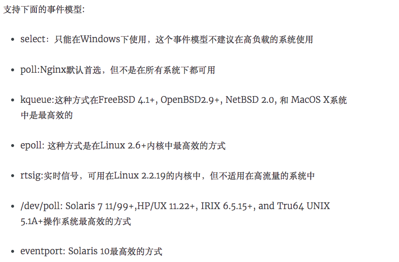
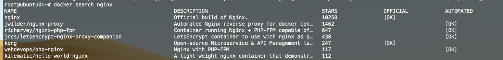
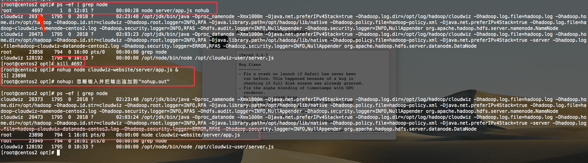

### [`Nginx`](https://www.nginx.com/) + [`Node`](https://nodejs.org/zh-cn/) + [`Vue`](https://vuefe.cn/) 部署初试

##### **`Nginx`**

1. [定义](https://www.nginx.com/resources/glossary/nginx/)

   异步框架的 [Web服务器](https://en.wikipedia.org/wiki/Web_server)，也可以用作[反向代理](https://en.wikipedia.org/wiki/Reverse_proxy)，[负载平衡器](https://en.wikipedia.org/wiki/Load_balancer) , [HTTP缓存](https://en.wikipedia.org/wiki/HTTP_cache), 媒体流等的开源软件。它最初是一个旨在实现最高性能和稳定性的`Web`服务器。除了`HTTP`服务器功能外，`NGINX`还可以用作电子邮件（`IMAP`，`POP3`和`SMTP`）的代理服务器以及`HTTP`，`TCP`和`UDP`服务器的反向代理和负载平衡器。

2. 特点

   - 更快
   - 高扩展性, `Nginx`的模块都是嵌入到二进制文件中执行
   - 高可靠性
   - 低内存消耗
   - 单机支持10万次的并发连接
   - 热部署, `master`管理进行与`work`工作进程分离设计，因此具备热部署功能
   - 最自由的`BSD`许可协议

3. 功能

   - 静态服务（`css` , `js` , `html`, `images`, `videos`）
   - `SSL` 和 `TLS SNI `支持
   - `HTTP/HTTPS`, `SMTP`, `IMAP/POP3` 反向代理
   - `FastCGI`反向代理
   - 负载均衡
   - 页面缓存（`CDN`）
   - 支持`gzip`、`expirse`
   - 支持 `keep-alive` 和管道连接
   - 基于 `PCRE` 的 `rewrite` 重写模块
   - 带宽限制
   - 基于`IP` 和名称的虚拟主机服务
   - 支持访问速率、并发限制
   - 反向代理（适用`2000WPV`、并发连接`1W`/秒），简单的负载均衡和容错
   - 基于客户端` IP` 地址和 `HTTP` 基本认证的访问控制

##### `Mac` 安装`Nginx`

```shell
// 推荐使用`brew`, 安装`homebrew`
/usr/bin/ruby -e "$(curl -fsSL https://raw.githubusercontent.com/Homebrew/install/master/install)"
// Homebrew 安装 Nginx 
brew install nginx
// Mac 下 Nginx的目录
cd /usr/local/etc/nginx
ll -al
vim nginx.conf
```

[`homebrew`详见](https://brew.sh/)


##### Nginx 参数列表

| 配置参数属性         | 解释说明                                                     | 参数列表                                                     |
| -------------------- | ------------------------------------------------------------ | ------------------------------------------------------------ |
| user                 | 设置nginx服务的系统使用用户                                  | `nobody`(注意：此处用户如果比启动`Nginx`的用户权限低，你需要使用当前用户重启`Nginx`)<br />`nginx -s stop` 关闭`nginx`-> `nginx` 启动-> `ps aux | grep nginx`查看启动用户 |
| worker_processes     | 开启的线程数                                                 | 一般与服务器核数保持一致                                     |
| error_log            | 定位全局错误日志文件                                         | 错误日志定义等级，[ debug \| info notice \| warn \| error \| crit ]，debug输出最多，crir输出最少 |
| pid                  | 指定进程id的存储文件位置                                     |                                                              |
| worker_rlimit_nofile | 指定一个nginx进程打开的最多文件描述符数目，受系统进程的最大打开文件数量限制 |                                                              |
| events               | 包含*Nginx*中所有处理连接的设置                              |                                                              |
| http                 | Nginx http处理的所有核心特性                                 |                                                              |

##### **`Event`**

| 配置参数属性       | 解释说明                                                  | 参数列表                                                     |
| ------------------ | --------------------------------------------------------- | ------------------------------------------------------------ |
| worker_connections | 定义每个进程的最大连接数,受系统进程的最大打开文件数量限制 | 单个后台worker process进程的最大并发链接数 （最大连接数= worker_processes * worker_connections）<br />在反向代理环境下：<br/>最大连接数 = worker_processes * worker_connections / 4 |
| use                | 工作进程数                                                | [ epoll \| /dev/poll \| poll \| eventport \| kqueue \| select \| rtsig ] |
| multi_accept       | 一个新连接通知后接受尽可能多的连接                        | on / off                                                     |
| accept_mutex       | 开启或者禁用使用互斥锁来打开sockets                       | on / off                                                     |

`Event Use`支持的事件模型



[`Events`详见](https://www.myfreax.com/nginx-event-module-introduction/)

##### **`HTTP`**

| 配置参数属性      | 解释说明                                                     | 参数列表                                                 |
| ----------------- | ------------------------------------------------------------ | -------------------------------------------------------- |
| include           | 主模块指令，实现对配置文件所包含的文件的设定，可以减少主配置文件的复杂度，DNS主配置文件中的zonerfc1912,acl基本上都是用include语句 |                                                          |
| default_type      | 核心模块指令                                                 | 默认设置为二进制流，也就是当文件类型未定义时使用这种方式 |
| log_format        | 日志格式的设定                                               | 日志格式的名称，可自行设置，后面引用                     |
| access_log        | 引用日志                                                     | 引用log_format设置的名称                                 |
| keepalive_timeout | 设置客户端连接保存活动的超时时间                             | 0是无限制                                                |
| sendfile          | 开启高效文件传输模式                                         | on / off                                                 |
| tcp_nopush        | 开启防止网络阻塞                                             | on / off                                                 |
| tcp_nodelay       | 开启防止网络阻塞                                             | on / off                                                 |
| upstream          | 负载均衡                                                     |                                                          |
| server            | Nginx的server虚拟主机配置                                    |                                                          |

##### **`Upstream`**

| 配置参数属性       | 解释说明                                                     |
| ------------------ | ------------------------------------------------------------ |
| 轮询（默认）       | 每个请求按访问ip的hash结果分配，这样每个访客固定访问一个后端服务器，可以解决session的问题。 |
| weight             | 指定轮询几率，weight和访问比率成正比，用于后端服务器性能不均的情况 |
| ip_hash            | 每个请求按访问ip的hash结果分配，这样每个访客固定访问一个后端服务器，可以解决session的问题。 |
| fair（第三方）     | 按后端服务器的响应时间来分配请求，响应时间短的优先分配。     |
| url_hash（第三方） | 按访问url的hash结果来分配请求，使每个url定向到同一个后端服务器，后端服务器为缓存时比较有效。 |

`weight` 默认为1.`weight`越大，负载的权重就越大。

###### `Nginx Upstream `状态

例如：

```nginx
upstream news {
    server 127.0.0.1:9527 backup;
    server 127.0.0.1:9527 weight=1 max_fails=2 fail_timeout=3;
    ...
}
```

| 配置参数属性 | 解释说明                             |
| ------------ | ------------------------------------ |
| backup       | 预留的备份服务器                     |
| down         | 当前的server暂时不参与负载均衡       |
| fail_timeout | 经过max_fails 失败后，服务暂停的时间 |
| max_conns    | 限制最大的接收的连接数               |
| max_fails    | 允许请求失败的次数                   |

`use location`：在`server`中添加

```nginx
proxy_pass http://127.0.0.1:9527;
// 因为我的API接口是这个，such as /api/profile
// location 具体匹配规则详见后面
location ~ /api/ {
    proxy_pass http://127.0.0.1:9527;
}
```

##### **`Server`**

| 配置参数属性 | 解释说明                                   | 参数列表                  |
| ------------ | ------------------------------------------ | ------------------------- |
| listen       | 监听端口                                   | http -> 80 / https -> 443 |
| server_name  | 设置主机域名                               | localhost                 |
| charset      | 设置访问的语言编码                         |                           |
| access_log   | 设置虚拟主机访问日志的存放路径及日志的格式 |                           |
| location     | 设置虚拟主机的基本信息                     |                           |

##### **`Location`**

| 配置参数属性 | 解释说明                                  | 参数列表                                                     |
| :----------- | ----------------------------------------- | ------------------------------------------------------------ |
| root         | 设置虚拟主机的网站根目录                  | Vue项目的根目录/Users/rainy/Desktop/MyWork/Work/cloudwiz-website/dist |
| index        | 设置虚拟主机默认访问的网页                | index.html index.htm                                         |
| proxy        | 通过不同协议将请求从NGINX传递到代理服务器 |                                                              |

- `=`: 开头表示精确匹配，如 `api` 中只匹配根目录结尾的请求，后面不能带任何字符串.
- `^~` :开头表示`uri`以某个常规字符串开头，不是正则匹配.
- `~`: 开头表示区分大小写的正则匹配.
- `~*`: 开头表示不区分大小写的正则匹配.
- `/` : 通用匹配, 如果没有其它匹配,任何请求都会匹配到.

匹配优先级(高到低)

1. `location =` 
2.  `location 完整路径`
3. `location ^~ 路径`
4. `location ~,~* 正则顺序`
5. `location 部分起始路径`  
6. `/`

[详见`Location`配置](http://seanlook.com/2015/05/17/nginx-location-rewrite/)

##### **`Reverse Proxy`**

当`NGINX`代理请求时，它会将请求发送到指定的代理服务器，获取响应并将其发送回客户端。可以使用指定的协议将请求代理到`HTTP`服务器（另一个`NGINX`服务器或任何其他服务器）或非`HTTP`服务器（可以运行使用特定框架（如`PHP`或`Python`）开发的应用程序）。

```nginx
location  / some / path /  {
    proxy_pass  http://www.example.com:8080;
    
    proxy_set_header  Host  $ host ; 
    proxy_set_header  X-Real-IP  $ remote_addr ;
    
    // 禁用特定位置的缓冲
    proxy_buffering  off ;
    proxy_buffers  16  4k ; 
    proxy_buffer_size  2k ;
    
    proxy_bind  127.0.0.2 ; // IP地址也可以用变量指定
}
```

将请求传递给非`HTTP`代理服务器，`**_pass`应使用相应的指令：

- [`fastcgi_pass`](http://nginx.org/en/docs/http/ngx_http_fastcgi_module.html#fastcgi_pass) 将请求传递给FastCGI服务器
- [`uwsgi_pass`](http://nginx.org/en/docs/http/ngx_http_uwsgi_module.html#uwsgi_pass) 将请求传递给uwsgi服务器
- [`scgi_pass`](http://nginx.org/en/docs/http/ngx_http_scgi_module.html#scgi_pass) 将请求传递给SCGI服务器
- [`memcached_pass`](http://nginx.org/en/docs/http/ngx_http_memcached_module.html#memcached_pass) 将请求传递给memcached服务器

| 配置参数属性                                                 | 解释说明                                         | 参数列                                                       |
| ------------------------------------------------------------ | ------------------------------------------------ | ------------------------------------------------------------ |
| proxy_pass                                                   | 将请求传递给HTTP代理服务器                       |                                                              |
| proxy_set_header                                             | 传递请求标头                                     | 默认情况下，NGINX在代理请求中重新定义两个头字段“Host”和“Connection”，并删除其值为空字符串的头字段。“Host”设置为`$proxy_host`变量，“Connection”设置为`close`。 |
| [`proxy_buffering`](http://nginx.org/en/docs/http/ngx_http_proxy_module.html?&_ga=2.89865052.677515471.1548386810-1443831467.1548386810#proxy_buffering) | 负责启用和禁用缓冲                               | on / off                                                     |
| proxy_buffers                                                | 请求分配的缓冲区的大小和数量                     |                                                              |
| proxy_buffer_size                                            | 代理服务器的响应的第一部分存储在单独的缓冲区大小 | 通常包含一个相对较小的响应头，并且可以比其余响应的缓冲区小。 |
| proxy_bind                                                   | 接受来自特定IP网络或IP地址范围的连接             | 指定[`proxy_bind`](http://nginx.org/en/docs/http/ngx_http_proxy_module.html#proxy_bind)必要网络接口的指令和IP地址 |

[详见`Proxy`](https://docs.nginx.com/nginx/admin-guide/web-server/reverse-proxy/)

##### **全局变量`Global Variable`**

| 变量名           | 变量含义                                                     |
| ---------------- | ------------------------------------------------------------ |
| $args            | 请求中的参数                                                 |
| $content_length  | `HTTP`请求信息里的`Content-Length`                           |
| $content_type    | 请求信息里的`Content-Type`                                   |
| $host            | 请求信息中的`Host`，如果请求中没有`Host`行，则等于设置的服务器名 |
| $http_cookie     | `cookie` 信息                                                |
| $http_referer    | 引用地址                                                     |
| $http_user_agent | 客户端代理信息                                               |
| $remote_addr     | 客户端地址                                                   |
| $remote_port     | 客户端端口号                                                 |
| $remote_user     | 客户端用户名，认证用                                         |
| $request_method  | 请求的方法，比如`GET`、`POST`等                              |
| $request_uri     | 完整的原始请求`URI`（带参数）                                |
| $scheme          | 请求方案，`http`或`https`                                    |
| $server_addr     | 接受请求的服务器的地址,如果没有用`listen`指明服务器地址，使用这个变量将发起一次系统调用以取得地址(造成资源浪费); |
| $server_protocol | 请求的协议版本，`HTTP/1.0`或`HTTP/1.1`                       |
| $uri             | 请求中的当前`URI`, `$uri`在请求处理期间 ，值可能会发生变化，例如在执行内部重定向或使用索引文件时 |

全局变量详见[`Alphabetical index of variables`](http://nginx.org/en/docs/varindex.html)

修改 `http` `server`中的配置


启动`Nginx`

```shell
nginx
ps -ef | grep nginx
```

重启`Nginx`

```shell
nginx -s reload
```

关闭`Nginx`

```shell
nginx -s stop
```

因为我已经启动了，所以就重启一下`Nginx`即可


#####  `Linux`安装`Nginx`

[`Linux`安装](http://www.runoob.com/linux/nginx-install-setup.html)

[常见的`Linux`命令](http://man.linuxde.net/par/2)

使用`pstree`查看当前服务器启动的进程

```shell
pstree
```


查找`Nginx`的位置

```shell
ps -aux | grep nginx
```


进入`nginx`的目录


然后配置`nginx.conf`文件即可

###### `Docker`安装`Nginx`

1. 查找 [Docker Hub](https://hub.docker.com/r/library/nginx/) 上的 `nginx`镜像

   ```nginx
   docker search nginx
   ```

   

2. 拉取官方镜像

   ```nginx
   docker pull nginx
   ```

   

3. 查看当前镜像

   ```nginx
   docker images nginx
   ```

   

##### `Server Tree`

```
tree -C -L 3 -I '*node_modules*'

├── server
│   ├── app.js
│   ├── db
│   │   ├── db.js
│   │   └── newsSql.js
│   ├── package-lock.json
│   ├── package.json
│   └── routers
│       ├── news.js
│       └── router.js
```


#### `Node Server`

```js
npm init
npm install express mysql body-parser -S
```

1. `app.js`

   ```javascript
   const express = require('express')
   const bodyParser = require('body-parser')
   const app = express()
   const router = require('./routers/router')
   
   const PORT = 9527
   
   app.use(bodyParser.json())
   app.use(bodyParser.urlencoded({ extended: true }))
   
   app.use(router)
   
   app.listen(PORT, () => {
     console.log(`Listen port at ${PORT}`)
   })
   
   ```

2. `db.js` -> ` Mysql`配置

   ```javascript
   module.exports = {
     mysql: {
       host: 'localhost',
       user: 'root',
       password: 'xxxx',
       database: 'test',
       port: '3306'
     }
   }
   ```

1. `router.js`

   ```javascript
   const express = require('express')
   const router = express.Router()
   const news = require('./news')
   
   router.get('/api/news/queryAll', (req, res, next) => {
     news.queryAll(req, res, next)
   })
   
   router.get('/api/news/query', (req, res, next) => {
     news.queryById(req, res, next)
   })
   
   router.post('/api/news/add', (req, res, next) => {
     news.add(req, res, next)
   })
   
   router.post('/api/news/update', (req, res, next) => {
     news.update(req, res, next)
   })
   
   router.delete('/api/news/deleteNews', (req, res, next) => {
     news.deleteNews(req, res, next)
   })
   
   module.exports = router
   ```

2. `newSql.js`

   ```javascript
   module.exports = {
     createNews: `CREATE TABLE news (
       id int(255) NOT NULL AUTO_INCREMENT,
       type varchar(255) CHARACTER SET utf8 NOT NULL,
       title varchar(255) CHARACTER SET utf8 NOT NULL,
       description varchar(255) CHARACTER SET utf8 NOT NULL,
       occur_time varchar(255) CHARACTER SET utf8 NOT NULL,
       url varchar(255) NOT NULL,
       newsImg varchar(255) NOT NULL,
       PRIMARY KEY (id)
     )`,
     queryAll: 'SELECT * FROM news',
     queryById: 'SELECT * FROM news WHERE id = ?',
     add: 'INSERT INTO news (type, title, description, occur_time, url, newsImg) VALUES (?, ?, ?, ?, ?, ?)',
     update: 'UPDATE news SET type = ?, title = ?, description = ?, occur_time = ?, url = ?, newsImg = ? WHERE id = ?',
     delete: 'DELETE FROM news WHERE id = ?'
   }
   ```

3. `news.js`

   ```javascript
   const mysql = require('mysql')
   const db = require('../db/db')
   const $newsSql = require('../db/newsSql')
   
   let pool = mysql.createPool(db.mysql)
   
   let queryAll = (req, res, next) => {
     pool.getConnection((error, connect) => {
       if (error) {
         throw error
       } else {
         connect.query($newsSql.queryAll, (error, data) => {
           if (error) {
             throw error
           }
           res.json({
             code: '200',
             msg: 'success',
             data
           })
           connect.release()
         })
       }
     })
   }
   
   let queryById = (req, res, next) => {
     let id = +req.query.id
     pool.getConnection((error, connect) => {
       if (error) {
         throw error
       } else {
         connect.query($newsSql.queryById, id, (error, data) => {
           if (error) {
             throw error
           }
           res.json({
             code: '200',
             msg: 'success',
             data
           })
           connect.release()
         })
       }
     })
   }
   
   let add = (req, res, next) => {
     let rb = req.body
     let params = [rb.type, rb.title, rb.description, rb.occur_time, rb.url, rb.newsImg]
     pool.getConnection((error, connect) => {
       if (error) {
         throw error
       } else {
         connect.query($newsSql.add, params, (error, data) => {
           if (error) {
             throw error
           }
           res.json({
             code: '200',
             msg: 'success'
           })
           connect.release()
         })
       }
     })
   }
   
   let update = (req, res, next) => {
     let rb = req.body
     let params = [rb.type, rb.title, rb.description, rb.occur_time, rb.url, rb.newsImg, rb.id]
     pool.getConnection((error, connect) => {
       if (error) {
         throw error
       } else {
         connect.query($newsSql.update, [...params], (error, data) => {
           if (error) {
             throw error
           }
           res.json({
             code: '200',
             msg: 'success'
           })
           connect.release()
         })
       }
     })
   }
   
   let deleteNews = (req, res, next) => {
     let id = +req.query.id
     pool.getConnection((error, connect) => {
       if (error) {
         throw error
       } else {
         connect.query($newsSql.delete, id, (error, data) => {
           if (error) {
             throw error
           }
           res.json({
             code: '200',
             msg: 'success'
           })
           connect.release()
         })
       }
     })
   }
   
   module.exports = {
     queryAll,
     queryById,
     add,
     update,
     deleteNews
   }
   ```

##### `Vue`配置代理以及使用`api`

1. `config/index.js` 修改`proxyTable`

   ```javascript
   module.exports = {
     dev: {
       proxyTable: {
         '/api': {
           target: 'http://127.0.0.1:9527',
           changeOrigin: true,
           pathRewrite: {
             '^/api': '/api'
           }
         }
       }
     }
   }
   ```

2. 使用`axios`调用接口

   ```vue
   import axios from 'axios'
   export default {
     created () {
       this._getAllNews()
     },
     methods: {
       _getAllNews () {
         axios.get('/api/news/queryAll').then(res => {
               if (+res.data.code === SCC_CODE) {
                 this.news = res.data.data
               }
             })
         }
       }
   }
   ```

###### `Vue build`打包

```shell
npm run build
```


因为我的`Server`端是`Express`写的，启动`Server`需要使用`Node`，所以我们需要在服务器上安装`Node`.

##### `Linux`安装`Node 8.x`

```shell
# Using Ubuntu
curl -sL https://deb.nodesource.com/setup_8.x | sudo -E bash -
sudo apt-get install -y nodejs

# Using Debian, as root
curl -sL https://deb.nodesource.com/setup_8.x | bash -
apt-get install -y nodejs

# Using Centos
curl -sL https://rpm.nodesource.com/setup_8.x | bash -
yum install -y nodejs
```

[具体安装各版本的`Node`详见](https://my.oschina.net/idoop/blog/1545011)

启动`Node`

此处我之前的命令执行错误，所以我需要`kill`这个进程

```shell
nohup node website/server/app.js &
```



**`nohup`**:可以将程序以忽略挂起信号的方式运行起来，被运行的程序的输出信息将不会显示到终端。

无论是否将 `nohup `命令的输出重定向到终端，输出都将附加到当前目录的 `nohup.out`文件中。如果当前目录的 `nohup.out` 文件不可写，输出重定向到`$HOME/nohup.out`文件中。如果没有文件能创建或打开以用于追加，那么 [`command`](http://man.linuxde.net/command) 参数指定的命令不可调用。如果标准错误是一个终端，那么把指定的命令写给标准错误的所有输出作为标准输出重定向到相同的文件描述符。


到这里，我们的`Web`，`Node Server` ，`Nginx`都已经配置并启动好了，我们只需要到浏览器输入`你的服务器IP:8080`即可.

[`Nginx`众多概念详见官方词汇表](https://www.nginx.com/resources/glossary/)


- [什么是应用交付？](https://www.nginx.com/resources/glossary/application-delivery/)
- [什么是应用交付控制器（ADC）？](https://www.nginx.com/resources/glossary/application-delivery-controller/)
- [什么是应用程序服务器与Web服务器？](https://www.nginx.com/resources/glossary/application-server-vs-web-server/)
- [什么是缓存？](https://www.nginx.com/resources/glossary/caching/)
- [什么是云负载平衡？](https://www.nginx.com/resources/glossary/cloud-load-balancing)
- [什么是聚类？](https://www.nginx.com/resources/glossary/clustering/)
- [什么是DevOps？](https://www.nginx.com/resources/glossary/devops/)
- [什么是分布式拒绝服务（DDoS）？](https://www.nginx.com/resources/glossary/distributed-denial-of-service/)
- [什么是DNS负载平衡？](https://www.nginx.com/resources/glossary/dns-load-balancing/)
- [什么是全局服务器负载平衡？](https://www.nginx.com/resources/glossary/global-server-load-balancing/)
- [什么是高可用性？](https://www.nginx.com/resources/glossary/high-availability/)
- [什么是HTTP？](https://www.nginx.com/resources/glossary/http/)
- [什么是HTTP / 2？](https://www.nginx.com/resources/glossary/http2/)
- [什么是混合负载均衡？](https://www.nginx.com/resources/glossary/hybrid-load-balancing/)
- [什么是第4层负载均衡？](https://www.nginx.com/resources/glossary/layer-4-load-balancing/)
- [什么是第7层负载平衡？](https://www.nginx.com/resources/glossary/layer-7-load-balancing/)
- [什么是负载平衡？](https://www.nginx.com/resources/glossary/load-balancing/)
- [什么是媒体服务器？](https://www.nginx.com/resources/glossary/media-server/)
- [什么是微服务？](https://www.nginx.com/resources/glossary/microservices/)
- [什么是网络负载均衡器？](https://www.nginx.com/resources/glossary/network-load-balancer/)
- [什么是NGINX？](https://www.nginx.com/resources/glossary/nginx/)
- [什么是渐进式下载？](https://www.nginx.com/resources/glossary/progressive-download/)
- [什么是反向代理服务器？](https://www.nginx.com/resources/glossary/reverse-proxy-server/)
- [什么是反向代理与负载均衡器？](https://www.nginx.com/resources/glossary/reverse-proxy-vs-load-balancer/)
- [什么是循环负载平衡？](https://www.nginx.com/resources/glossary/round-robin-load-balancing/)
- [什么是面向服务的体系结构（SOA）？](https://www.nginx.com/resources/glossary/service-oriented-architecture/)
- [什么是会话持久性？](https://www.nginx.com/resources/glossary/session-persistence/)
- [什么是SSL负载均衡器？](https://www.nginx.com/resources/glossary/ssl-load-balancer/)
- [什么是Web加速？](https://www.nginx.com/resources/glossary/web-acceleration/)
- [什么是Web服务器？](https://www.nginx.com/resources/glossary/web-server/)