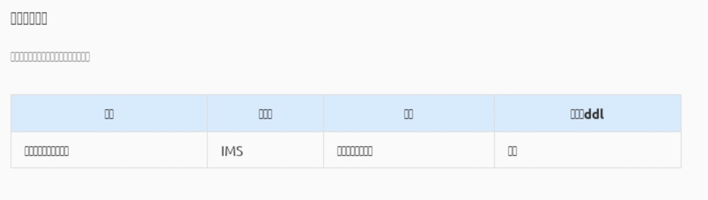

#### 无法正确安装、下载 chromium

```shell
# 跳过安装
PUPPETEER_SKIP_CHROMIUM_DOWNLOAD=1 npm ci

# 使用taobao源安装
PUPPETEER_DOWNLOAD_HOST=https://npm.taobao.org/mirrors npm install

# 设置 npm config
npm config set puppeteer_download_host=https://npm.taobao.org/mirrors
npm install
```

#### 服务器上(Linux系统)报错

> (node:24206) UnhandledPromiseRejectionWarning: Error: Failed to launch chrome! blabla....

一般是机器上缺少对应的依赖库，安装补上即可。`Puppeteer` 自带的 `Chromium` 是非常纯粹的，它不会安装除了自身作为浏览器外的其他东西。

通过 `ldd(List Dynamic Dependencies)` 命令可查看运行 `Chromium` 运行所需但缺少的 `shared object dependencies`。

```shell
ldd node_modules/puppeteer/.local-chromium/linux-641577/chrome-linux/chrome | grep not
```

安装依赖

```sh
apt-get update && apt-get install -y build-essential libnss3 libpng-dev gconf-service libasound2 libatk1.0-0 libatk-bridge2.0-0 libc6 libcairo2 libcups2 libdbus-1-3 libexpat1 libfontconfig1 libgcc1 libgconf-2-4 libgdk-pixbuf2.0-0 libglib2.0-0 libgtk-3-0 libnspr4 libpango-1.0-0 libpangocairo-1.0-0 libstdc++6 libx11-6 libx11-xcb1 libxcb1 libxcomposite1 libxcursor1 libxdamage1 libxext6 libxfixes3 libxi6 libxrandr2 libxrender1 libxss1 libxtst6 ca-certificates fonts-liberation libappindicator1 lsb-release xdg-utils
```

如果有问题，试试使用 `sudo` 安装

#### 页面乱码



那是因为系统缺少中文字体，`Chromium` 无法正常渲染。你需要安装中文字体，通过包管理工具或者手动下载安装。

```shell
apt-get update && apt-get install fonts-arphic-ukai fonts-arphic-uming fonts-ipafont-mincho fonts-ipafont-gothic fonts-unfonts-core

apt-get update && apt-get install -y --force-yes --no-install-recommends fonts-wqy-microhei ttf-wqy-zenhei
```

如果是`Dockerfile`镜像，可以添加以下内容

```dockerfile
# blabla ...

# install locales
RUN apt-get update && \
    apt-get install -y locales locales-all

ENV LC_ALL en_US.UTF-8
ENV LANG en_US.UTF-8
ENV LANGUAGE en_US.UTF-8

# add additional fonts
RUN apt-get update && \
    apt-get install -y \
    fonts-arphic-ukai \
    fonts-arphic-uming \
    fonts-ipafont-mincho \
    fonts-ipafont-gothic \
    fonts-unfonts-core

RUN apt-get update && \
    apt-get install -y \
    --force-yes \
    --no-install-recommends \
    fonts-wqy-microhei \
    ttf-wqy-zenhei

# blabla ...
```

[Installing Asian Fonts on Ubuntu & Debian](https://help.accusoft.com/PCC/v11.2/HTML/Installing%20Asian%20Fonts%20on%20Ubuntu%20and%20Debian.html)

#### sandbox 的问题

`Linux` 上 `Puppeteer` 启动 `Chromium` 时可能会看到如下的错误提示：

```
[xxxxx] Running as root without --no-sandbox is not supported. See https://crbug.com/638180.
```

错误信息已经很明显，所以在启动时加上 `--no-sandbox` 参数即可。

```js
const browser = await puppeteer.launch({
  args: ["--no-sandbox"]
});
```

但考虑到安全问题，`Puppeteer` 是[强烈不建议](https://github.com/GoogleChrome/puppeteer/blob/master/docs/troubleshooting.md#setting-up-chrome-linux-sandbox)在无沙盒环境下运行，除非加载的页面其内容是绝对可信的。

如果需要设置在沙盒中运行，可参考[文档中的两种方法](https://github.com/GoogleChrome/puppeteer/blob/master/docs/troubleshooting.md#recommended-enable-user-namespace-cloning)。

#### 参考链接

[Puppeteer troubleshooting](https://github.com/puppeteer/puppeteer/blob/main/docs/troubleshooting.md)

[Stackoverflow Puppeteer](https://stackoverflow.com/questions/tagged/puppeteer)

[How to Update and Install Latest Chrome in Linux/Ubuntu](https://linoxide.com/linux-how-to/install-latest-chrome-run-terminal-ubuntu/)

[How to Manually Install, Update, and Uninstall Fonts on Linux](https://medium.com/source-words/how-to-manually-install-update-and-uninstall-fonts-on-linux-a8d09a3853b0)

