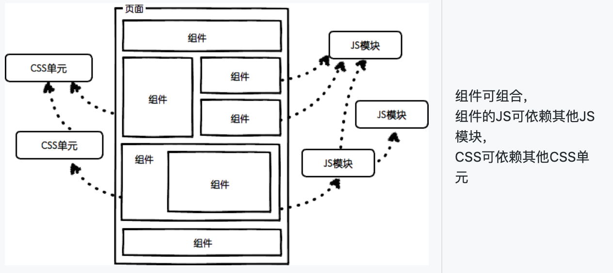

#### 前端模块化和组件化

- **什么是模块化？**

  ​		模块化是一种处理复杂系统分解成为更好的可管理模块的方式，它可以把系统代码划分为一系列职责单一，高度解耦且可替换的模块，系统中某一部分的变化将如何影响其它部分就会变得显而易见，系统的可维护性更加简单易得。

  ​		优点: 保持输出一致性、提高开发效率、适用性强便于维护、便于协作。

  ​		`Javascript`模块化: `AMD`, `CommonJS`, `UMD`, `ES6 Module`

  ​		`CSS`模块化: 在`less`、`sass`、`stylus`等预处理器的`import/mixin`特性支持

- **什么是组件化？**

  ​		对数据逻辑层的业务代码，把一些业务逻辑代码封装在组件内部，并对外提供接口，为了解决后端的复杂多变的功能。

  ​		优点: 独立统一, 分拆封装, 可移植性(拔插性)。

- **区别？**

​		组件化是在设计层面上，对于`UI`的拆分，它更多关注的`UI`部分，而模块化侧重的功能的封装，主要是针对`Javascript`代码，隔离、组织复制的`javascript`代码，将它封装成一个个具有特定功能的的模块。

​		组件具有独立性，因此组件与组件之间可以自由组合，而模块应该是职责单一、相互独立、低耦合高内聚且可替换的离散功能块。

​		模块化是组件化的基石，模块化解决了分而治之的问题，组件化解决了代码复用的问题。

### 为什么要开发一个组件库？

- 传统开发方式效率低以及维护成本高的主要原因在于很多时候是将一个系统做成了整块应用， 而且往往随着业务的增长或者变更，系统的复杂度会呈现指数级的增长， 经常出现的情况就是一个小小的改动或者一个小功能的增加可能会引起整体逻辑的修改，造成牵一发而动全身。
- 针对此弊端，其实业界早就有了一些探索，我们希望一个大且复杂的场景能够被分解成几个小的部分， 这些小的部分彼此之间互不干扰，可以单独开发，单独维护，而且他们之间可以随意的进行组合。这种化繁为简的思想在后端开发中的体现是微服务，而在前端开发中的体现就是组件化。

>  解决多人多团队协作难， 提高前端开发效率，降低前端维护成本

#### 组件化的原则

- **标准化**

  多人协作如果不制定一套标准的话，显然是进行不下去的，任何一个组件都应该遵守一套标准，可以使得不同区域的开发人员据此标准开发出一套标准统一的组件。（组建命名规则、就近原则、样式分离独立文件）

- **重用性**

  组件内部应该是高聚合的，任何一个组件都应该是一个可以独立的单元，可以扩展到其他不同的应用场景。

- **组合性**

  组件必定是需要相互嵌套组合的，这就需要组件间具有相互的独立性以及有良好的接口，这也是一个组件最基本的构成。

- **可维护性**

  任何一个组件应该都具有一套自己的完整的稳定的功能，仅包含自身的，与其它组件无关的逻辑，使其更加的容易理解，使其更加的容易理解，同时大大减少发生bug的几率。

#### 参考资料

[前端开发的模块化和组件化的定义，以及两者的关系？](https://www.zhihu.com/question/37649318)

[设计师！你为什么要用模块化设计？](http://www.woshipm.com/pd/1574045.html)

[前端工程——基础篇](https://github.com/fouber/blog/issues/10)

[前端组件化开发实践](https://tech.meituan.com/2015/07/10/frontend-component-practice.html)