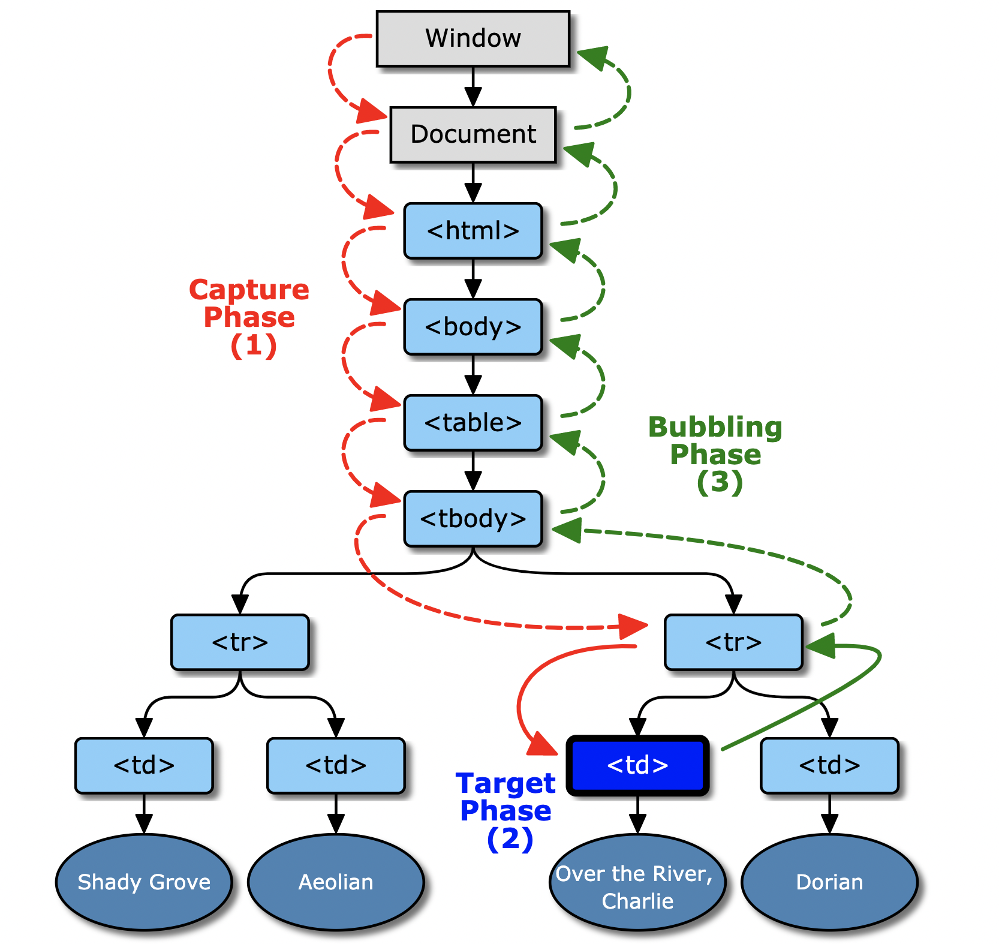

#### 前言

- 什么是事件
- 什么是事件流
- 原生 `DOM` 事件类型
- 原生 `DOM` 事件的执行顺序
- `React` 事件系统
- 什么是 `React` 合成事件
- `React` 事件与原生事件区别

#### 事件

[事件](https://developer.mozilla.org/zh-CN/docs/Learn/JavaScript/Building_blocks/Events)是你在编程时系统内发生的动作或者发生的事情，系统响应事件后，如果需要，您可以某种方式对事件做出回应。

#### 事件流

**事件流描述的是从页面中接受事件的顺序**，`IE`的事件流是 事件冒泡流，标准的浏览器事件流是 事件捕获流。`W3C`为了制定标准，采取了折中的方式: **先捕获再冒泡**。



[img reference](https://www.w3.org/TR/uievents/#event-flow)

#### 原生 `DOM` 事件流级别

`DOM`事件流分为三个阶段：`捕获阶段`、`目标阶段`、`冒泡阶段`。先调用捕获阶段的处理函数，其次调用目标阶段的处理函数，最后调用冒泡阶段的处理函数。

**目标元素**: 触发事件的元素

##### 捕获阶段

**自上而下**, 由 `window` 到 目标元素

##### 目标阶段

触发事件阶段

##### 冒泡阶段

**自下而上**, 由 目标元素 到 `window` 

##### 阻止捕获、冒泡、默认行为

- `event.stopPropagation()`: 阻止捕获、冒泡阶段。
- `event.preventDefault()`: 阻止默认行为。
- `event.stopImmediatePropagation()`: 同样可以阻止捕获、冒泡，并阻止相同事件的其它监听函数；

**Note:** 如果有多个相同类型事件的事件监听函数绑定到同一个元素，当该类型的事件触发时，它们会按照被添加的顺序执行。如果其中某个监听函数执行了 `event.stopImmediatePropagation()` 方法，则当前元素剩下的监听函数将不会被执行。

##### 事件级别

- [`DOM0`级事件](https://www.w3.org/TR/DOM-Level-2-Events/glossary.html#dt-DOM-Level-0)

  **定义**

  在`DOM0`级事件处理程序，事件名以`'on'`开头

  **使用**

  ```html
  <button id='btn' onclick="alert('Hello World!')">点我</button>
  ```

  缺点: `HTML`和`JS`强耦合

  或者通过获取`DOM`对他添加`on[type]`事件

  ```js
  var btn = document.getElementById('btn');
  // 事件绑定
  btn.onclick = function() {
  	alert(Hello World!);
  }
  // 事件移除绑定
  btn.onclick = null
  ```

  缺点: 无法同时绑定多个处理函数

- [`DOM2`级事件](https://www.w3.org/TR/DOM-Level-2-Events/events.html)

  **定义**

  `DOM2`事件模型的设计有两个主要目标。 第一个目标是通用事件系统的设计，该系统允许事件处理程序的注册，通过树结构描述事件流，并为每个事件提供基本的上下文信息。 此外，该规范将为用户界面控制和文档变更通知提供事件的标准模块，包括为每个事件模块定义的上下文信息。

  第二个目标是提供[`DOM0`级事件](https://www.w3.org/TR/DOM-Level-2-Events/glossary.html#dt-DOM-Level-0)浏览器中使用的当前事件系统的公共子集。 这旨在促进现有脚本和内容的互操作性。 不能期望通过完全向后兼容来实现此目标。

  `DOM2`级事件 通过[`addEventListener`](https://developer.mozilla.org/zh-CN/docs/Web/API/EventTarget/addEventListener)来定义执行事件, 通过[`removeEventListener`](https://developer.mozilla.org/zh-CN/docs/Web/API/EventTarget/removeEventListener)来移除事件。

  **Note**: 使用 `removeEventListener` 时保证和 `addEventListener` 是同一个引用。

  **使用**

  ```js
  var btn = document.getElementById('btn');
  // target.addEventListener(type, listener, options);
  // target.addEventListener(type, listener, useCapture);
  // target.addEventListener(type, listener, useCapture, wantsUntrusted  );  // Gecko/Mozilla only
  // listener
  function btnOnClick() {}
  
  btn.addEventListener('click', btnOnClick, false);
  btn.removeEventListener('click', btnOnClick, false);
  ```

- [`DOM3`级事件](https://www.w3.org/TR/2013/WD-DOM-Level-3-Events-20131105/)

  **定义**

  `DOM3`级事件在DOM2级事件的基础上添加了更多的事件类型：

  - UI事件: 当用户与页面上的元素交互时触发，如: `load`、`scroll`
  - 焦点事件: 当元素获得或失去焦点时触发，如: `blur`、`focus`
  - 鼠标事件: 当用户通过鼠标在页面执行操作时触发如: `dbclick`、`mouseup`
  - 滚轮事件: 当使用鼠标滚轮或类似设备时触发，如: `mousewheel`
  - 文本事件: 当在文档中输入文本时触发，如: `textInput`
  - 键盘事件: 当用户通过键盘在页面上执行操作时触发，如: `keydown`、`keypress`
  - 合成事件: 当为`IME` (输入法编辑器)输入字符时触发，如: `compositionstart`
  - 变动事件: 当底层`DOM`结构发生变化时触发，如: `DOMsubtreeModified`

  同时`DOM3`级事件也允许使用者自定义一些事件。使用 `Event` 构造函数创建自定义事件如下

  ```js
  // 创建自定义事件
  var event = new Event('custom');
  // 绑定事件
  elem.addEventListener('custom', function (e) { ... });
  // 触发事件
  elem.dispatchEvent(event);
  ```

#### 原生 `DOM` 事件的执行顺序

**`DOM`事件的执行顺序与注册事件的顺序是相关的。**

测试HTML

```html
<!DOCTYPE html>
<html lang="en">
  <head>
    <meta charset="UTF-8">
    <meta name="viewport" content="width=device-width, initial-scale=1.0">
    <meta http-equiv="X-UA-Compatible" content="ie=edge">
    <title>Static Template</title>
  </head>
  <body>
    <h4>
      先注册捕获事件，再注册冒泡事件
    </h4>
    <div id="outside" style="border: 1px solid green">
      <p>先注册捕获事件，再注册冒泡事件: 父元素</p>
      <button id='inside' onclick="console.log('先注册捕获事件，再注册冒泡事件: 子元素被点击')">先注册捕获事件，再注册冒泡事件: 子元素</button>
    </div>
    <hr />
    <h4>
      先注册冒泡事件，再注册捕获事件
    </h4>
    <div id="outside1" style="border: 1px solid red">
      <p>先注册冒泡事件，再注册捕获事件: 父元素</p>
      <button id='inside1' onclick="console.log('先注册冒泡事件，再注册捕获事件: 子元素被点击')">先注册冒泡事件，再注册捕获事件: 子元素</button>
    </div>
  </body>
  </html>
</html>
```

#### 先注册捕获事件，再注册冒泡事件

```js
document.getElementById('inside').addEventListener("click", () => {
  console.log('先注册捕获事件，再注册冒泡事件: inside, 冒泡')
}, false);
document.getElementById('inside').addEventListener("click", () => {
  console.log('先注册捕获事件，再注册冒泡事件: inside, 捕获')
}, true);
document.getElementById('outside').addEventListener("click", () => {
  console.log('先注册捕获事件，再注册冒泡事件: outside, 冒泡')
}, false);
document.getElementById('outside').addEventListener("click", () => {
  console.log('先注册捕获事件，再注册冒泡事件: outside, 捕获')
}, true);
```

**结果**

```
先注册捕获事件，再注册冒泡事件: outside, 捕获 
先注册捕获事件，再注册冒泡事件: 子元素被点击 
先注册捕获事件，再注册冒泡事件: inside, 冒泡 
先注册捕获事件，再注册冒泡事件: inside, 捕获 
先注册捕获事件，再注册冒泡事件: outside, 冒泡 
```

##### 先注册冒泡事件，再注册捕获事件

```js
document.getElementById('inside1').addEventListener("click", () => {
  console.log('先注册冒泡事件，再注册捕获事件: inside, 捕获')
}, true);
document.getElementById('inside1').addEventListener("click", () => {
  console.log('先注册冒泡事件，再注册捕获事件: inside, 冒泡')
}, false);
document.getElementById('outside1').addEventListener("click", () => {
  console.log('先注册冒泡事件，再注册捕获事件: outside, 捕获')
}, true);
document.getElementById('outside1').addEventListener("click", () => {
  console.log('先注册冒泡事件，再注册捕获事件: outside, 冒泡')
}, false);
```

**结果**

```js
先注册冒泡事件，再注册捕获事件: outside, 捕获 
先注册冒泡事件，再注册捕获事件: 子元素被点击 
先注册冒泡事件，再注册捕获事件: inside, 捕获 
先注册冒泡事件，再注册捕获事件: inside, 冒泡 
先注册冒泡事件，再注册捕获事件: outside, 冒泡 
```

[Demo](https://codesandbox.io/s/test-demo-opqou)

#### React 事件系统

```js
/**
 * React和事件系统概述:
 *
 * +------------+    .
 * |    DOM     |    .
 * +------------+    .
 *       |           .
 *       v           .
 * +------------+    .
 * | ReactEvent |    .
 * |  Listener  |    .
 * +------------+    .                         +-----------+
 *       |           .               +--------+|SimpleEvent|
 *       |           .               |         |Plugin     |
 * +-----|------+    .               v         +-----------+
 * |     |      |    .    +--------------+                    +------------+
 * |     +-----------.--->|EventPluginHub|                    |    Event   |
 * |            |    .    |              |     +-----------+  | Propagators|
 * | ReactEvent |    .    |              |     |TapEvent   |  |------------|
 * |  Emitter   |    .    |              |<---+|Plugin     |  |other plugin|
 * |            |    .    |              |     +-----------+  |  utilities |
 * |     +-----------.--->|              |                    +------------+
 * |     |      |    .    +--------------+
 * +-----|------+    .                ^        +-----------+
 *       |           .                |        |Enter/Leave|
 *       +           .                +-------+|Plugin     |
 * +-------------+   .                         +-----------+
 * | application |   .
 * |-------------|   .
 * |             |   .
 * |             |   .
 * +-------------+   .
 *                   .
 */

```

#### React 合成事件

##### 为什么React要自定义 events

- **抹平浏览器之间的兼容性差异**

  最主要的动机。

- **事件"合成", 事件自定义**

  事件合成既可以处理兼容性问题，也可以用来自定义事件

- **抽象跨平台事件机制**

  类似 `VirtualDOM` 抽象了跨平台的渲染方式，合成事件(`SyntheticEvent`)提供一个抽象的跨平台事件机制。

- **性能优化**

  简化了 `DOM` 事件处理逻辑，减少了内存开销。**React自己模拟一套事件冒泡的机制。**

- **干预事件的分发, 简化事件逻辑**

  `React v16`引入 `Fiber` 架构，`React` 可以通过干预事件的分发以优化用户的交互体验。不同类型的事件有不同的优先级，比如高优先级的事件可以中断渲染，让用户代码可以及时响应用户交互。

##### 定义

`React` 根据 [W3C 规范](https://www.w3.org/TR/DOM-Level-3-Events/) 来定义自己的事件系统，其事件被称之为[合成事件 (`SyntheticEvent`)](https://zh-hans.reactjs.org/docs/events.html)，它在`DOM`事件体系基础上做了很大改进，减少了**内存消耗**，**简化了事件逻辑**，并最大化的解决了`IE`等浏览器的不兼容问题。

#### React 事件与原生事件区别

**WIP**: `React`自己模拟一套事件冒泡的机制

#### 参考资料

[Github: React](https://github.com/facebook/react)

[MDN Events](https://developer.mozilla.org/zh-CN/docs/Web/Events)

[W3C DOM 0级事件](https://www.w3.org/TR/uievents/#dom-level-0)

[W3C DOM 3级事件](https://www.w3.org/TR/DOM-Level-3-Core/)

[冒泡和捕获](https://zh.javascript.info/bubbling-and-capturing)


