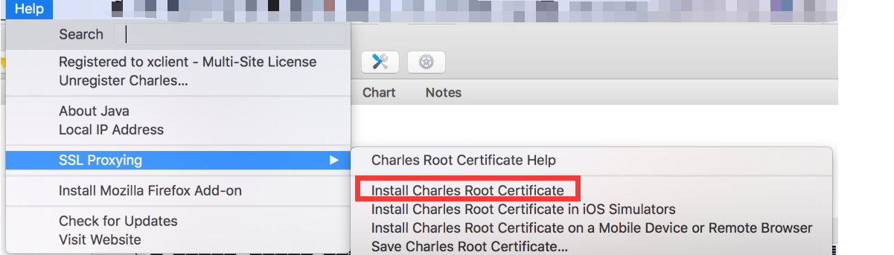
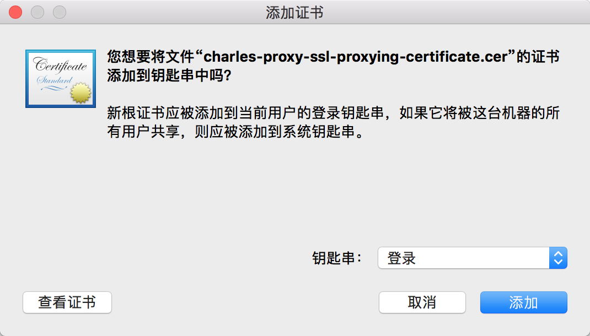
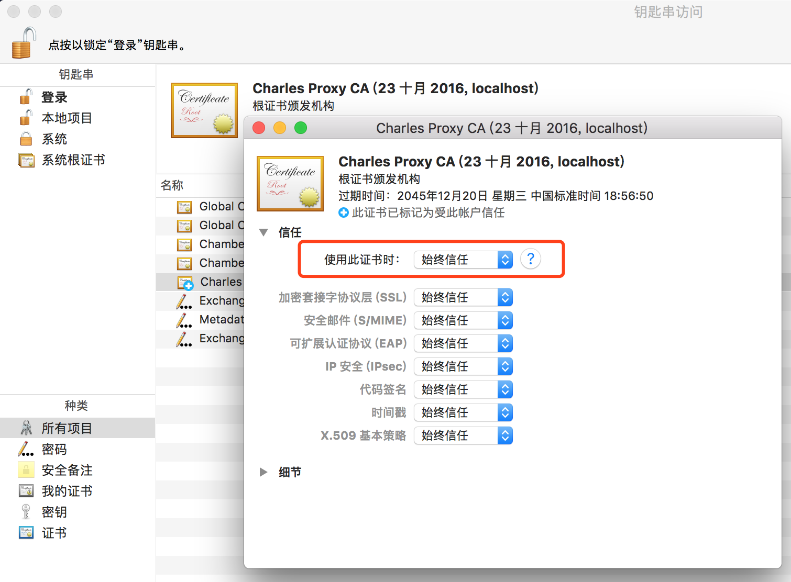
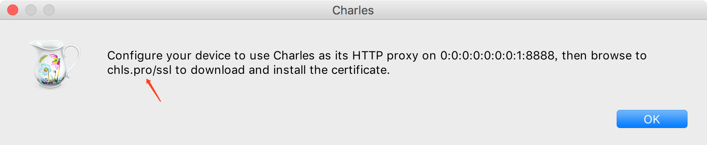
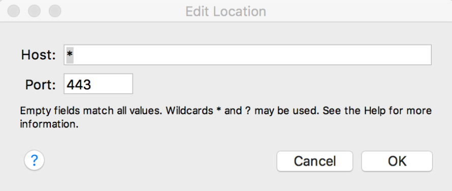

### 缘由

- 当前工作首次接触移动端
- 越难受越要死肛

### 证书安装

#### 电脑证书安装

```
# 安装
help
	-> SSL Proxying
	-> install Charles Root Certificate

# 信任， 一般会自动跳出来，如果没有可以到设置开启证书信任
钥匙串访问
	-> 所有项目
	-> Charles Proxy CA
	-> 始终信任
```







#### 手机证书安装

```
help
	-> SSL Proxying
	-> install Charles Root Certificate on a Mobile Device or Remote Browser
```




下载证书

```http
http://chls.pro/ssl
```

安装证书

```
# iPhone
 设置
 	-> 通用
 	-> 关于本机
 	-> 证书信任设置
 	-> 信任证书
 	
 # Android
 # 自带浏览器下载的文件
 	-> getssl.crt
 	-> 设置
 	-> 更多设置
 	-> 系统安全
 	-> 从SD卡安装证书
 	
 # 第三方浏览器下载
 	-> charles-ssl-proxying-certificate.pem
 	-> 直接安装
```


### 客户端设置

- `Charles`开启`SSL Proxy`

  ```
  Proxy
  	-> SSL Proxy Settings
  	-> SSL Proxying
  	-> [Add]按钮，并勾选Enable SSL Proxying
  	# https
  	# host: *
  	# port: 443
  	# or custom port
  ```

  

  

  