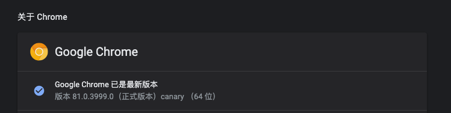
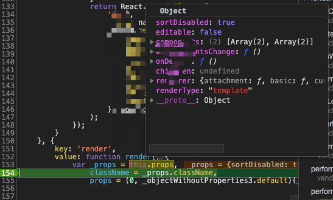

#### Chrome 79 调试器工具提示不起作用

从 `Chrome` 10月的`bate`版本就有这个问题了

问题版本:

`79.0.3945.29 - 88`

如果不慎更新`Chrome 79`版本了，可以下载 [Canary 版本](https://www.google.com/intl/en/chrome/canary/) 或者  [Google Chrome 开发版](https://www.google.com/chrome/dev/)先用着, 知道问题修复。

[问题反馈及其解决方案](https://support.google.com/chrome/thread/16855096?msgid=23079275)

