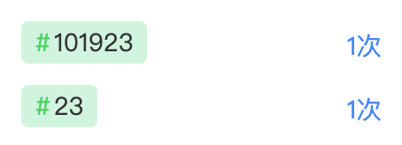

#### `ios`端`fixed`遇上`transition`会失效

```
如果设置fixed元素的父级或祖先级元素设置为transform属性，则fixed相对于该元素定位。
因为设置transform属性的元素建立了一个新的坐标系
```

#### 实现兼容性的CSS粗虚线边框(dashed)效果

```scss
.border_dashed {
    width:260px;
    height:180px;
    border-width:6px;
    /*IE*/
    border:2px dashed red\9;
   /*Firefox*/
    -moz-border-image:url(http://www.zhangxinxu.com/study/image/dashed_red.png) 6 repeat;
    /*Chrome & Safari*/
    -webkit-border-image:url(http://www.zhangxinxu.com/study/image/dashed_red.png) 6 repeat;
   /*Opera*/
    border-image:url(http://www.zhangxinxu.com/study/image/dashed_red.png) 6 repeat;
    background:yellow;
}
```

[参考资料](https://www.zhangxinxu.com/wordpress/2010/05/实现兼容性的css粗虚线边框dashed效果/)

#### `flex` 在`safari`上出现压缩

```
设置flex 布局的子元素 flex-shrink: 0;
```

#### 实现不规则两端对齐布局



`HTML`

```html
<div class='wrapper'>
  <li class='left'>#101923</li>
  <li class='right'>1次</li>
</div>
```

`CSS`

```less
.wrapper {
  display: flex;
  width: 100%;
  .right {
    margin-left: auto;
  }
}
```


