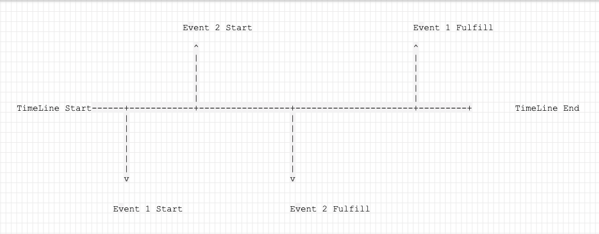
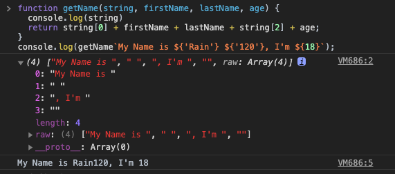

### Js长按图片

##### 原理: 监听`touchstart`到`touchend`的时间差

```javascript
let imgs = document.querySelectorAll('img');
let timeout = 0;
this.longPress({
  ctx: imgs,
  () => {}
})
  
export function longPress({
  ctx = [],
  logpressCallback = () => null,
  clickCallback = () => null,
  time = 500
}) {
  let timeout = null;
  for (let i = 0; i < ctx.length; i++) {
    if (ctx[i] && logpressCallback) {
      ctx[i].addEventListener('touchstart', e => {
        console.log('touchstart')
        timeout = setTimeout(logpressCallback, time);
        return false;
      }, false);
      
      ctx[i].addEventListener('touchmove', e => {
        e.preventDefault()
        console.log('touchmove')
        clearTimeout(this.imgTouchTimer)
				timeout = 0;
      }
      
      ctx[i].addEventListener('touchend', e => {
        console.log('touchend')
        clearTimeout(this.imgTouchTimer)
        if (timeout !== 0) {
          clickCallback && clickCallback();
        }
        return false;
      }, false);
    }
  }
}
```

#### JS给当前元素增加父元素

##### 原理: 复制当前元素，给复制的元素添加父元素，并将该元素替换原有的元素即可

```javascript
let catalogueDrawer = document.querySelector('.catalogue-drawer')
if (catalogueDrawer) {
    let tables = catalogueDrawer.querySelectorAll('table')

    if (tables && tables.length) {
        for (let index = 0; index < tables.length; index++) {
            let table = tables[index]
            let node = table.cloneNode(true)
            let tableWrapper = document.createElement('div')
            tableWrapper.setAttribute('class', 'content-table-wrapper')
            tableWrapper.appendChild(node)
            table.parentNode.replaceChild(tableWrapper, table)
        }
    }
}
 
```

#### `encodeURI`、 `encodeURIComponent`的区别

- `encodeURI`用于编码整个`URI`,因为`URI`中的合法字符都不会被编码转换。
- `encodeURIComponent`方法在编码单个`URIComponent`（指请求参数）应当是最常用的，它可以将参数中的中文、特殊字符进行转义，而不会影响整个`URL`。转义除了字母、数字、`(`、`)`、`.`、`!`、`~`、`*`、`'`、`-`和`_`之外的所有字符。

[MDN encodeURI](https://developer.mozilla.org/zh-CN/docs/Web/JavaScript/Reference/Global_Objects/encodeURI)

[MDN encodeURIComponent](https://developer.mozilla.org/zh-CN/docs/Web/JavaScript/Reference/Global_Objects/encodeURIComponent)

#### `decodeURI`、`decodeURIComponent`的区别

- `decodeURI`: 解码一个由[`encodeURI`](https://developer.mozilla.org/zh-CN/docs/Web/JavaScript/Reference/Global_Objects/encodeURI) 先前创建的统一资源标识符（URI）或类似的例程。
- `decodeURIComponent`: 解码由 [`encodeURIComponent`](https://developer.mozilla.org/zh-CN/docs/Web/JavaScript/Reference/Global_Objects/encodeURIComponent) 方法或者其它类似方法编码的部分统一资源标识符（URI）

[MDN decodeURI](https://developer.mozilla.org/zh-CN/docs/Web/JavaScript/Reference/Global_Objects/decodeURI)

[MDN decodeURIComponent](https://developer.mozilla.org/zh-CN/docs/Web/JavaScript/Reference/Global_Objects/decodeURIComponent)

#### JS 缓慢回到顶部

原生`Javascript`实现

```javascript
const isWebkit = navigator.userAgent.toLowerCase().match(/webkit\/([\d.]+)/);
const requestAnimationFrame =
  window.requestAnimationFrame ||
  window.mozRequestAnimationFrame ||
  window.webkitRequestAnimationFrame ||
  window.msRequestAnimationFrame;

function backTop() {
  function step() {
    let currentScroll = document.documentElement.scrollTop || document.body.scrollTop;
    if (currentScroll > 0) {
      requestAnimationFrame(step);
      window.scrollTo (0, currentScroll - (currentScroll / 5));
    }
  }

  requestAnimationFrame(step);
}
```

`Jquery`实现

```javascript
<script src="https://cdn.jsdelivr.net/npm/jquery/dist/jquery.min.js"></script>
<script>
    let fadeTime = 1500;
    let animateTime = 1000;
    let height = 100;
    $(function() {
            $(function () {
                $(window).scroll(function() {
                    if ($(window).scrollTop() > height) {
                        $("#back-to-top").fadeIn(fadeTime);
                    } else {
                        $("#back-to-top").fadeOut(fadeTime);
                    }
                });
                $("#back-to-top").click(function() {
                if ($('html').scrollTop()) {
                    $('html').animate({ scrollTop: 0 }, animateTime);
                    return false;
                }
                $('body').animate({ scrollTop: 0 }, animateTime);
                    return false;            
              });       
        })   
    });
  </script>
```

#### 让当前的元素滚动到浏览器窗口的可视区域内。

```javascript
var element = document.getElementById("box");

element.scrollIntoView();
element.scrollIntoView(false);
element.scrollIntoView({block: "end"});
element.scrollIntoView({behavior: "instant", block: "end", inline: "nearest"});
```

[Element.scrollIntoView 方法](https://developer.mozilla.org/zh-CN/docs/Web/API/Element/scrollIntoView)

#### 文件上传预览文件

##### 单文件

**HTML**

```html
<input type="file" onchange="previewFile()"><br>

```

**JavaScript**

```javascript
function previewFile() {
  var preview = document.querySelector('img');
  var file    = document.querySelector('input[type=file]').files[0];
  var reader  = new FileReader();

  reader.addEventListener("load", function () {
    preview.src = reader.result;
  }, false);

  if (file) {
    reader.readAsDataURL(file);
  }
}
```

##### 多文件

**HTML**

```html
<input id="browse" type="file" onchange="previewFiles()" multiple>
<div id="preview"></div>
```

**JavaScript**

```javascript
function previewFiles() {

  var preview = document.querySelector('#preview');
  var files   = document.querySelector('input[type=file]').files;

  function readAndPreview(file) {

    // 确保 `file.name` 符合我们要求的扩展名
    if ( /\.(jpe?g|png|gif)$/i.test(file.name) ) {
      var reader = new FileReader();

      reader.addEventListener("load", function () {
        var image = new Image();
        image.height = 100;
        image.title = file.name;
        image.src = this.result;
        preview.appendChild( image );
      }, false);

      reader.readAsDataURL(file);
    }

  }

  if (files) {
    [].forEach.call(files, readAndPreview);
  }

}
```

[FileReader](https://developer.mozilla.org/zh-CN/docs/Web/API/FileReader)

[readAsDataURL](https://developer.mozilla.org/zh-CN/docs/Web/API/FileReader/readAsDataURL)

```javascript
const video = document.getElementById('video');
const obj_url = window.URL.createObjectURL(blob);
video.src = obj_url;
video.play()
window.URL.revokeObjectURL(obj_url);
```

[createObjectURL](https://developer.mozilla.org/zh-CN/docs/Web/API/URL/createObjectURL)

[在web应用程序中使用文件](https://developer.mozilla.org/zh-CN/docs/Web/API/File/Using_files_from_web_applications#Example.3A_Using_object_URLs_to_display_images)

#### 不同时序的请求，cancel先触发的请求

**场景**



**解决思路**

```javascript
const requests = {
  /**
   * key: 任意key值，对应用户触发的事件
   * value: 对应该类事件的请求队列，可设置maxSize来限制队列请求数，如果是互斥结果，可以直接替换该 promise，并将该请求的 promise cancel
   **/
  [click]: [promise],
  [mouse]: [promise],
}

Event 1 ==> click promise (cancel)

Event 2 ==> click promise (trigger)

Event3 ==> mouse promise (trigger)
```

就是当用户的请求使用到`requests`中相同的`key`值就是想将之前相同`key`值对应的请求`cancel`掉

#### JS 如何查找树形结构的数据

```javascript
function findTreeNode({
    data,
    value,
    key
}) {
    let result = null;
    let children = [];
    for (let item of data) {
        // decide your unique key
        if (item[key]) {
          return `${key} is undefined at the data`
        }
        if (item[key] === value) {
            result = item;
            break;
        }
        if (item.children) {
            children = [...children, ...item.children];
        }
    }
    if (!result && children.length) {
        result = findTreeNode({
            data: children,
            value,
            key
        });
    }
    return result;
}
let arr = [
    {
        id: 1,
        children: [{
            id: 2
        }]
    },
    {
        id: 3,
        children: [{
            id: 4,
            children: [{
                id: 5
            }]
        }]
    },
    {
        id: 6,
        children: [{
            id: 7,
            children: [{
                id: 8
            }]
        }]
    },
]
let id = 4;
console.log(findTreeNode({
    data: arr,
    value: id,
    key: 'id'
}))
```

#### 带标签的模板字符串

标签使您可以用函数解析模板字符串。标签函数的第一个参数包含一个字符串值的数组。其余的参数与表达式相关。

```javascript
function getName(string, firstName, lastName, age) {
  console.log(string)
  return string[0] + firstName + lastName + string[2] + age;
}
console.log(getName`My Name is ${'Rain'} ${'120'}, I'm ${18}`);
```

按照[RFC3986](http://wiki.jabbercn.org/RFC3986)文档规定，`Url`中只允许包含`英文字母(a-zA-Z)`、`数字(0-9)`、`-_.~`4个特殊字符以及所有保留字符。

**使用场景**

1. 过滤 `HTML` 字符串，防止用户输入恶意内容
2. 多语言转换 (国际化处理)
3. 在 `JavaScript` 语言之中嵌入其他语言



[参考](https://developer.mozilla.org/zh-CN/docs/Web/JavaScript/Reference/template_strings)

[RFC 3986](https://tools.ietf.org/html/rfc3986)

