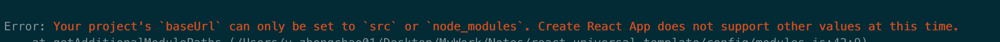
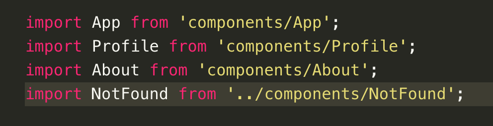

[目录 -> 学习笔记](notes/guide.md)

[目录 -> 上一级](notes/tips/guide.md)

### Typescript 绝对文件引入 -> `react + typescript`

```shell
// 旧版本
npx create-react-app my-app --scripts-version=react-scripts-ts

// 新版本
npx create-react-app my-app --typescript
```




- [create-react-app启动报错](https://github.com/facebook/create-react-app/issues/6850)

  设置`tsconfig.json`

  ```json
  {
    "baseUrl": "src",
  }
  ```



旧版本

```javascript
resolve: {
  alias: {
      'src': path.join(__dirname, '../src') // path
  }
}
```

新版本的`create-react-app`创建的项目

```json
// tsconfig.json

{
  "paths": {
    "src": ["src"],
    "components": ["components"],
    "common": ["common"]
  }
}
```

### 参考

[typescript-absolute-imports](https://create-react-app.dev/docs/importing-a-component#absolute-imports)