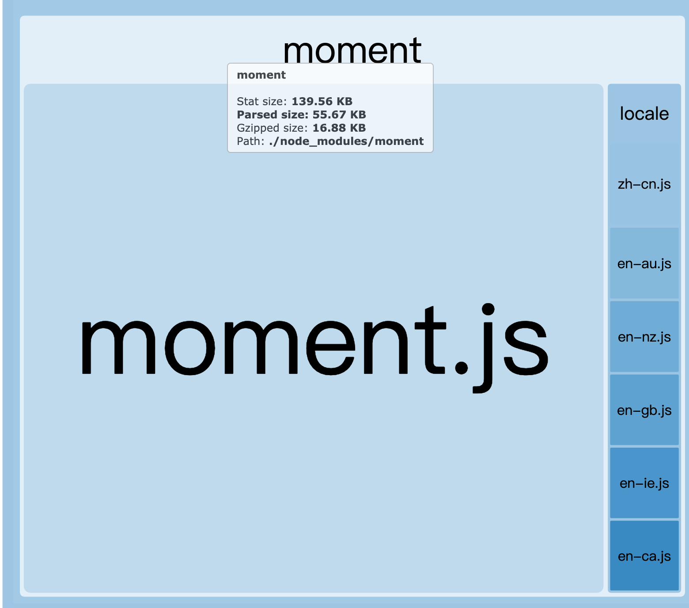
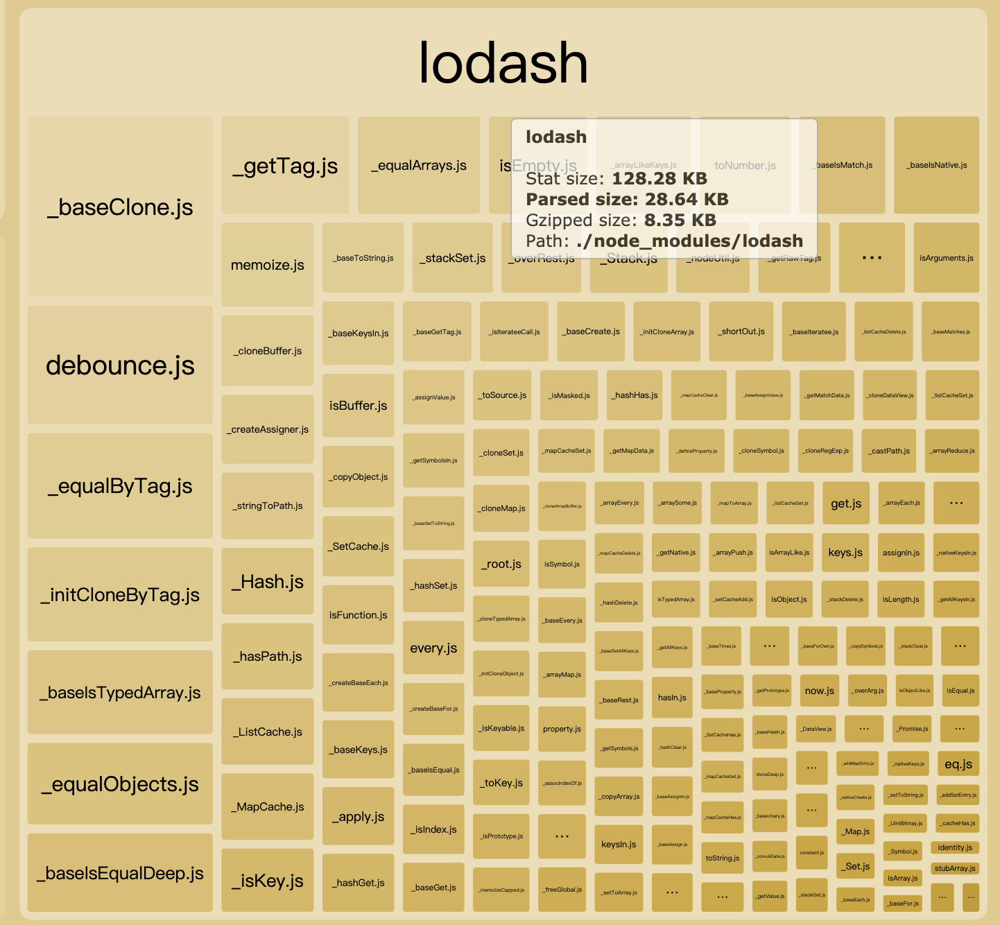

## webpack 打包优化

#### moment 按需加载语言包

```javascript
// webpack.config.js => 只需要加载中文和英文语言包
plugins: [
  new webpack.ContextReplacementPlugin(
    /moment[/\\]locale$/,
    /zh-cn|en/
  ),
]
```



#### Usage

```javascript
new webpack.ContextReplacementPlugin(
  resourceRegExp: RegExp,
  newContentResource?: string,
  newContentRecursive?: boolean,
  newContentRegExp?: RegExp
)
```

### `Documentation`

[Webpack ContextReplacementPlugin](https://webpack.docschina.org/plugins/context-replacement-plugin/)

## Lodash 按需加载

1. `cherry pick`

```javascript
import get from 'lodash/get'
```

2. `Plugin`: `babel-plugin-lodash` 

   ```javascript
   // .babelrc
   {
     "env": {
       "development": {
         "plugins": [
           "lodash"
         ]  
       },
       "production": {
         "plugins": [
           "lodash"
         ]  
       }
     }
   }
   ```

   ### `Documentation`

   [babel-plugin-import](https://github.com/ant-design/babel-plugin-import#options)



## Webpack DefinePlugin 相关问题

`DefinePlugin` 允许创建一个在**编译**时可以配置的全局常量。这可能会对开发模式和生产模式的构建允许不同的行为非常有用。如果在开发构建中，而不在发布构建中执行日志记录，则可以使用全局常量来决定是否记录日志。这就是 `DefinePlugin` 的用处，设置它，就可以忘记开发环境和生产环境构建的规则。

```javascript
if (process.env.NODE_ENV !== 'production') {
 	require('moment')   
 }

const env = process.env;

if (env.NODE_ENV !== 'production') {
 	require('moment')   
 }

// webpack 转换成 => 
if (false) {}

// env.js
module.export = process.env;
if (require('env.js').NODE_ENV !== 'production') {
 	require('moment')   
 }

// webpack 不转换
```

注意，因为这个插件直接执行文本替换，给定的值必须包含字符串本身内的**实际引号**。通常，有两种方式来达到这个效果，使用`'"production"'`, 或者使用 `JSON.stringify('production')`。

### `Documentation`

[Webpack DefinePlugin](https://webpack.docschina.org/plugins/define-plugin/)

## process.env

首先我们先理解什么是[`process`](http://nodejs.cn/api/process.html#process_process)?

`process` 对象是一个全局变量，它提供有关当前 Node.js 进程的信息并对其进行控制。 作为一个全局变量，它始终可供 Node.js 应用程序使用，无需使用 `require()`。 

[`process env`](http://nodejs.cn/api/process.html#process_process_env)属性返回包含用户环境的对象。

此对象的示例如下所示:

```shell
> console.log(process.env)
{
  TERM: 'xterm-256color',
  SHELL: '/usr/local/bin/bash',
  USER: 'maciej',
  PATH: '~/.bin/:/usr/bin:/bin:/usr/sbin:/sbin:/usr/local/bin',
  PWD: '/Users/maciej',
  EDITOR: 'vim',
  SHLVL: '1',
  HOME: '/Users/maciej',
  LOGNAME: 'maciej',
  _: '/usr/local/bin/node'
  ...
}
```

在`Webpack`中，会区分两种 类型的`process`的全局变量，一种是`node.js`，另一种是`browser`。

```text
                +-----------> Node.js +----------+ process.env
                |
                |
    Webpack     +
(target: 'web') +
                +
                |
                +-----------> Client +----------+ process.env
               							(Browser)
                                        (From https://www.npmjs.com/package/node-libs-browser)
```

`webpack`通过`DefinePlugin`插件允许用户创建一些全局变量，语法如下:

```javascript
new webpack.DefinePlugin({
    // ...
})
```

在我们的`webpack.config.js`中，我们会这样使用

```javascript
plugins: [
  new Webpack.DefinePlugin({
    'production': process.env.NODE_ENV === 'production',
		'process.env': {
      NODE_ENV: JSON.stringify(mode)
    }
  })
]
```

在`webpack@4.x`中，会需要配置`mode`属性为`development`或者`production`，我们可以通过这个属性来确定我们的环境。

那么`webpack`是如何来让`browser`来运行一个类似`node`的环境？

> 在`webpack`的`package.json`中，我们发现`webpack`是使用[node-libs-browser](https://github.com/webpack/node-libs-browser)来在`browser`中模拟`node`运行的。

### cross-env

当你使用`NODE_ENV=production`类似设置环境变量时，大多数Windows命令提示将会阻塞 。不同设备在如何利用环境变量的使用方式也有所不同。

`cross-env`这使得你可以拥有一个命令，而无需担心为平台正确设置或使用环境变量。[How to Usage it?](https://www.npmjs.com/package/cross-env#usage)

### `Documentation`

[Node process](http://nodejs.cn/api/process.html)

[cross-env](https://www.npmjs.com/package/cross-env)

#### Webpack 打包某些包报错 `ERROR in xxx.js from UglifyJs Unexpected token punc`

```
ERROR in xxx.js from UglifyJs
Unexpected token punc «(», expected punc «:» [./~/xxx-test-module/xxx/xxx.js:3,7]
```

1. `uglify-js` 版本太低，不支持`ES6`语法

解决：`uglifyjs-webpack-plugin`插件包支持`ES6`

2. 有可能是`babel-loader`未配置解析`ES6`

解决办法:

安装`babel-preset-es2015`

```sh
npm install babel-preset-es2015 -S
```


```javascript
// webpack.config.js

module.exports = {
  // ...
  module: {
    rules: [
      {
        test: '/\.js/$',
        loader: 'babel-loader',
        options: {
          presets: [
            'ES2015'
          ]
        }
      }
    ]
  }
}
```

配置`babel`

```json
// .babelrc
{
  presets: ['ES2015']
}
```


3. 可能是引用的包内部是`ES6`, 而`babel-loader` 不会对其进行转换，导致打包出错，比如说 `smooth-scroll`

解决办法:

需要将你需要打包的文件路径`includes`到`babel-loader`配置中

```javascript
// webpack.config.js

module.exports = {
  // ...
  module: {
    rules: [
      {
        test: '/\.js/$',
        loader: 'babel-loader',
        includes: [
          resolve('src'),
          resolve('node_modules/smooth-scroll')
        ]
      }
    ]
  }
}
```

[Webpack issue 1542](https://github.com/webpack/webpack/issues/1542#issuecomment-308747244)


