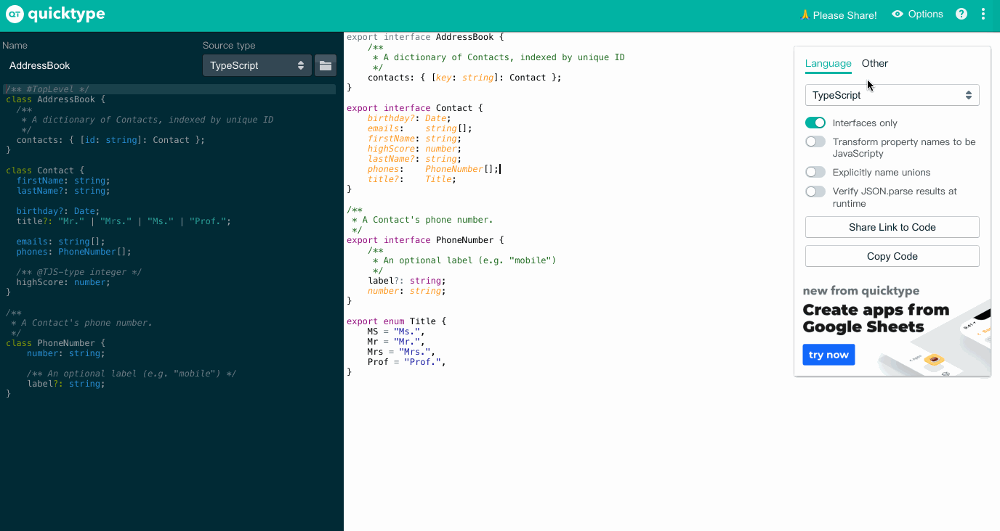
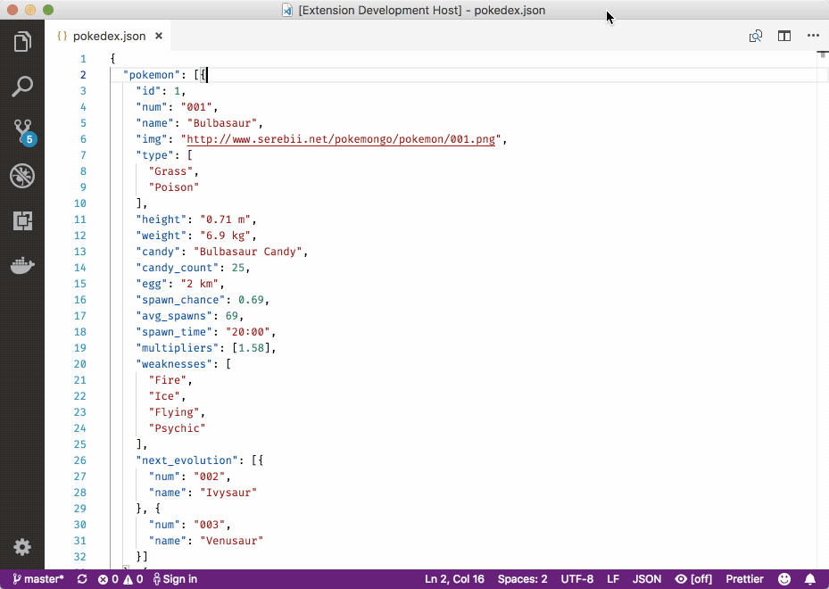
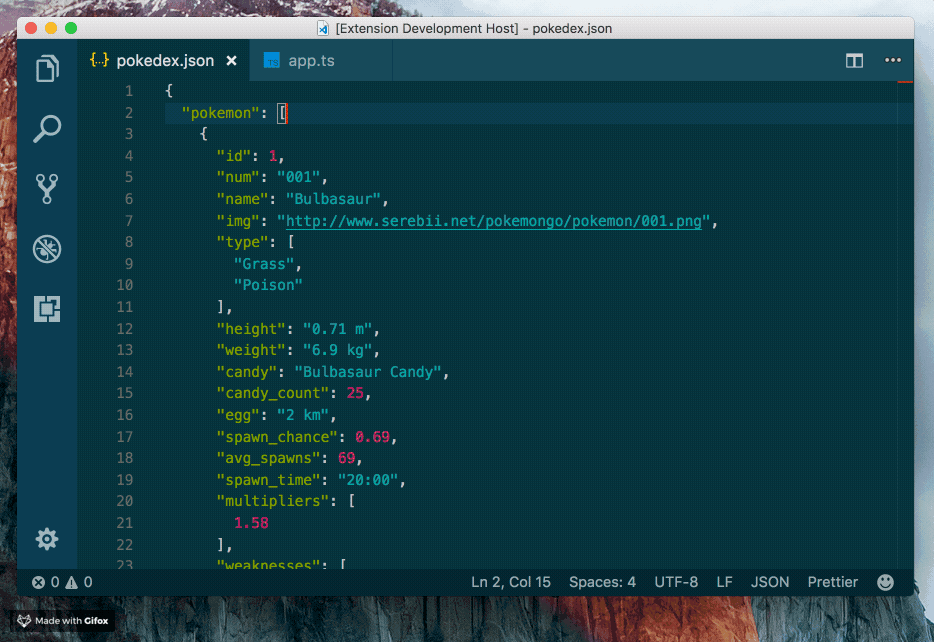

#### 前言

为什么我上班大半天，别人才刚来; 别人已经下班，我却还在拼死拼活的敲代码？

还不是因为你没来看到这篇📒🐴

接下来，我将给大家推荐两个东西`(其实是一个🤗🤗🤗)`，让大家通过`JSON`快速进行`TS`， `JSON`等多种数据结构的定义，`Let's Go`。

#### 快捷生成定义

`quicktype`通过`JSON`，`JSON Schema`，`TypeScript`和[GraphQL查询](https://blog.quicktype.io/graphql-with-quicktype/)生成强类型的模型和序列化[程序](https://blog.quicktype.io/graphql-with-quicktype/)，从而使在许多编程语言中安全地使用JSON类型变得轻而易举。

**它支持** `TypeScript`，`Python`，`Go`，`Ruby`，`C#`，`Java`，`Swift`，`Rust`，`Kotlin`，`C++`，`Flow`，`Objective-C`，`JavaScript`，`Elm`，和`JSON Schema`。

- 从`JSON`，`JSON Schema`和`TypeScript`交互式生成类型和（反）序列化代码
- 将`JSON / JSON Schema / TypeScript`粘贴为代码

##### 可视化操作

##### VSCode 插件

[安装 Paste JSON as Code 👉👉👉](https://marketplace.visualstudio.com/items?itemName=quicktype.quicktype)

一键将 `JSON` 文件转换为一个目标语言的类型定义。

#### 参考资料

[Quick Type 可视化](https://app.quicktype.io/)

[Github quicktype](https://github.com/quicktype/quicktype)

[QuickType Help](http://blog.quicktype.io/first-look/)

