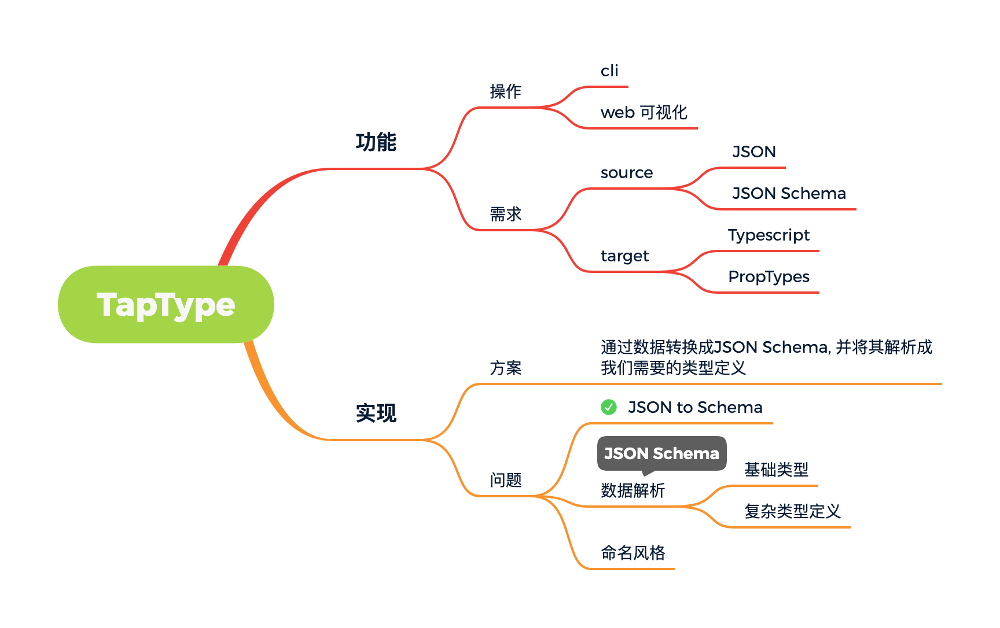

#### 前言

##### 为什么会有这个想法？

- 后端接口使用`fastjson`过滤导致前端很多莫名的兼容和`bug`
  - 有没有办法快速定义接口的数据结构
- 大量的`JSON`数据快速完成类型定义

#### 基础设计

#### 参考资料

[to-json-schema](https://github.com/imcuttle/to-json-schema/blob/master/index.js)

[quicktype](https://github.com/quicktype/quicktype)

[transform](https://github.com/ritz078/transform)