#### 补全代码

[TabNine](https://marketplace.visualstudio.com/items?itemName=TabNine.tabnine-vscode)

**TabNine** 是一个自动补全的编码插件，不同于一般的自动补全插件，它使用了**深度学习** 来帮助我们补全代码。并且开箱即用，不需要额外配置。他支持23种语言及5种主流编辑器。

[各种编辑器安装](https://www.tabnine.com/install)

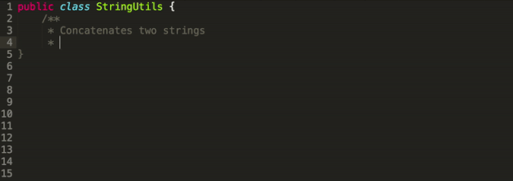

#### Git

[Git Lens](https://marketplace.visualstudio.com/items?itemName=eamodio.gitlens)

`GitLens`增强了`VS Code`中内置的`Git`功能。 它可以帮助您通过`Git`责备注释和代码镜头一目了然地看到代码作者的身份，无缝地导航和浏览`Git`存储库，通过功能强大的比较命令获得有价值的见解，等等。


[Git History](https://marketplace.visualstudio.com/items?itemName=donjayamanne.githistory)


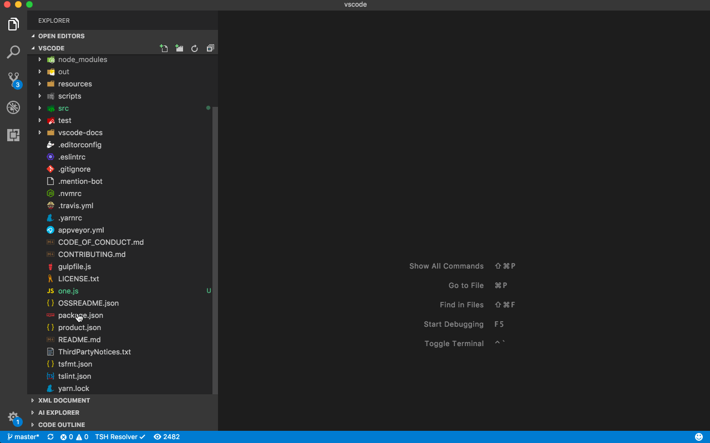

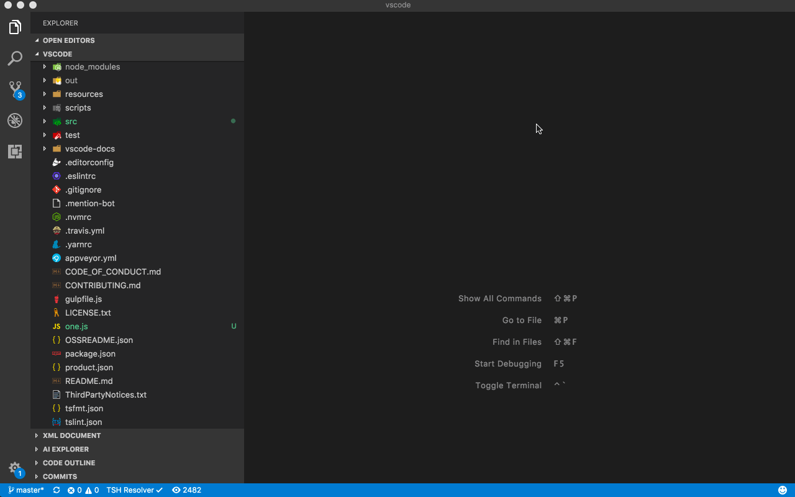

[Git Graph](https://marketplace.visualstudio.com/items?itemName=mhutchie.git-graph)

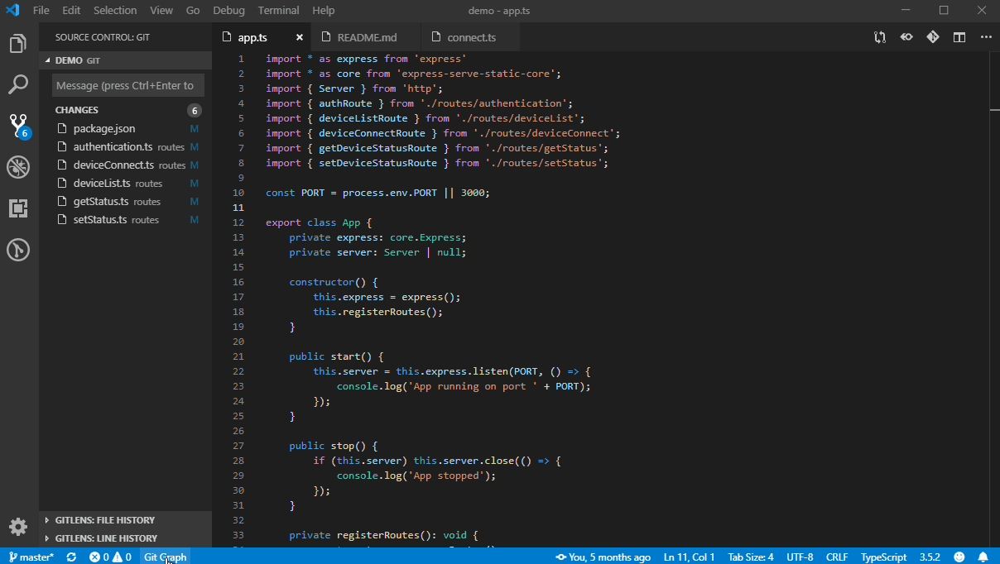

#### React

[Typescript React code snippets](https://marketplace.visualstudio.com/items?itemName=infeng.vscode-react-typescript)

该扩展包含`React with Typescript`的代码片段

[ES7 React/Redux/GraphQL/React-Native snippets](https://marketplace.visualstudio.com/items?itemName=dsznajder.es7-react-js-snippets)

该扩展为您提供`ES7`中的`JavaScript`和`React / Redux`片段，以及针对`VS Code`的`Babel`插件功能

[Jest](https://marketplace.visualstudio.com/items?itemName=Orta.vscode-jest)

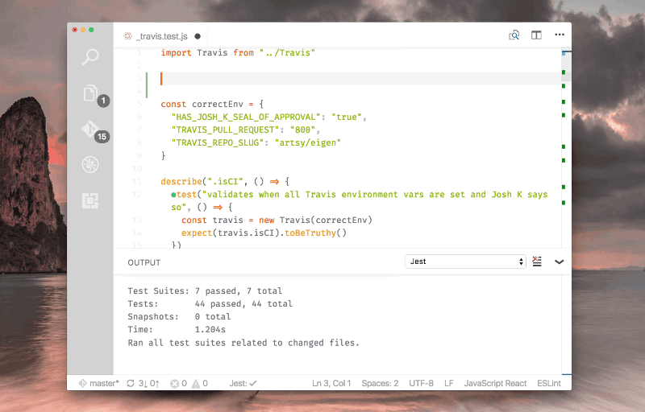

[Import Cost](https://marketplace.visualstudio.com/items?itemName=wix.vscode-import-cost)

该扩展名将在编辑器中内联显示导入包的大小。 该扩展程序利用带有`babili-webpack-plugin`的`webpack`来检测导入的大小。


[Indent-Rainbow](https://marketplace.visualstudio.com/items?itemName=oderwat.indent-rainbow)

此扩展名使文本前面的缩进着色，每步交替四种不同的颜色。 有些人可能会发现它对于编写`Nim`或`Python`的代码很有帮助。


[Auto Import](https://marketplace.visualstudio.com/items?itemName=steoates.autoimport)

自动查找，解析并提供所有可用导入的代码操作和代码完成。 与`Typescript`和`TSX`一起使用。

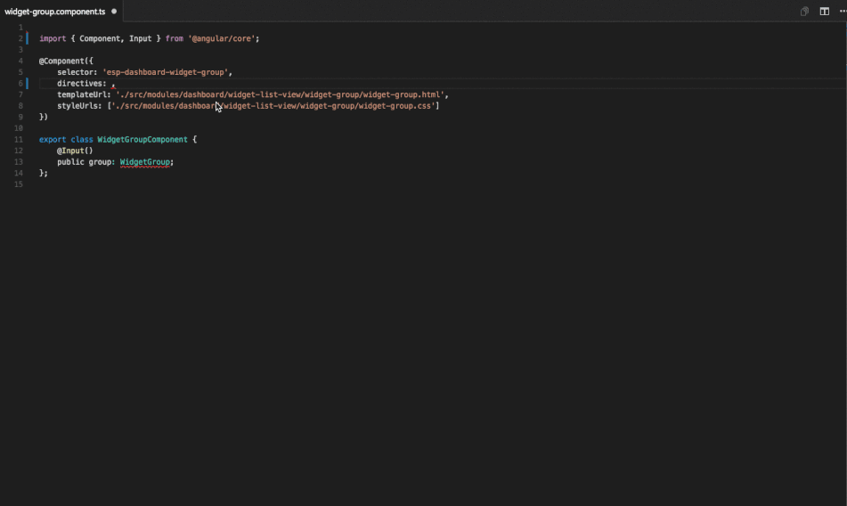

#### Node.js

[npm Intellisense](https://marketplace.visualstudio.com/items?itemName=christian-kohler.npm-intellisense)

可自动完成导入语句中的`npm`模块。

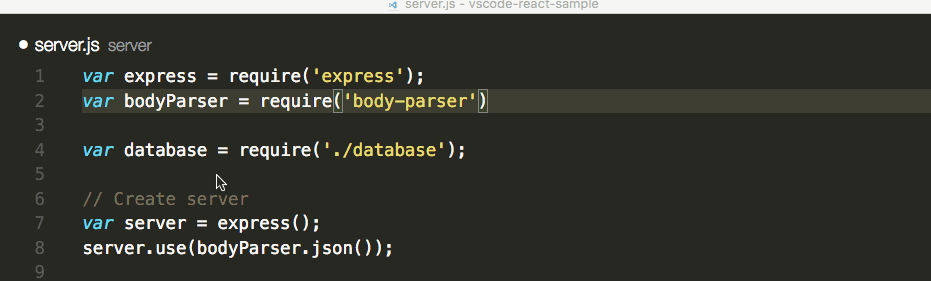

#### HTML + CSS + Javascript

[IntelliSense for CSS class names in HTML](https://marketplace.visualstudio.com/items?itemName=Zignd.html-css-class-completion)

基于在工作区中找到的定义或通过link元素引用的外部文件中的`HTML`类属性提供`CSS`类名称完成。

[Bracket Pair Colorizer](https://marketplace.visualstudio.com/items?itemName=CoenraadS.bracket-pair-colorizer)

此扩展名允许用颜色标识匹配的括号。 用户可以定义要匹配的字符以及要使用的颜色。


~~[SVG Viewer](https://marketplace.visualstudio.com/items?itemName=cssho.vscode-svgviewer)~~


[TODO Highlight](https://marketplace.visualstudio.com/items?itemName=wayou.vscode-todo-highlight)


[TODO tree](https://marketplace.visualstudio.com/items?itemName=Gruntfuggly.todo-tree)

该扩展程序快速在您的工作空间中搜索注释标签（例如`TODO`和`FIXME`），并将其显示在资源管理器窗格的树状视图中。 单击树中的`TODO`将打开文件，并将光标放在包含`TODO`的行上。

找到的待办事项也可以在打开的文件中突出显示。


[CSS Peek](https://marketplace.visualstudio.com/items?itemName=pranaygp.vscode-css-peek)


[Highlight Matching Tag](https://marketplace.visualstudio.com/items?itemName=vincaslt.highlight-matching-tag)

突出显示匹配的开始或结束标签


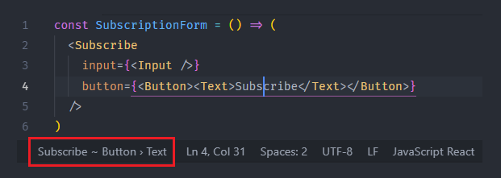

[Image Preview](https://marketplace.visualstudio.com/items?itemName=kisstkondoros.vscode-gutter-preview)

图片实时预览


[Code Spell Checker](https://marketplace.visualstudio.com/items?itemName=streetsidesoftware.code-spell-checker)

检查拼写是否错误

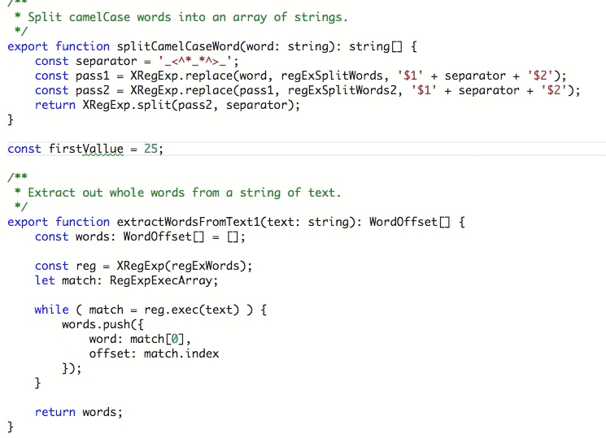


#### 代码管理相关

[Debugger for Chrome](https://marketplace.visualstudio.com/items?itemName=msjsdiag.debugger-for-chrome)


[Prettier - Code formatter](https://prettier.io/)

[插件地址](https://marketplace.visualstudio.com/items?itemName=esbenp.prettier-vscode)

`Prettier`是一个自以为是的代码格式化程序。 它通过解析代码并使用自己的规则（考虑最大行长）重新打印代码，从而实现一致的样式，并在必要时包装代码。

[TSLint](https://marketplace.visualstudio.com/items?itemName=ms-vscode.vscode-typescript-tslint-plugin)

检查 `typescript` 语法规范

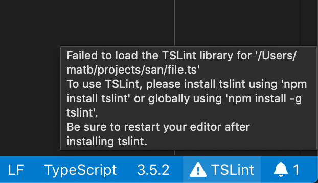

[ESLint](https://marketplace.visualstudio.com/items?itemName=dbaeumer.vscode-eslint)

检查 `js` 语法规范，有如下规范[airbnb](https://www.npmjs.com/package/eslint-config-airbnb), [standard](https://github.com/standard/eslint-config-standard), [google](https://github.com/google/eslint-config-google)

[StyleLint](https://marketplace.visualstudio.com/items?itemName=dbaeumer.vscode-eslint)

检查 `CSS/SCSS/Less` 语法规范


#### 字体

[FiraCode](https://github.com/tonsky/FiraCode)

```json
{
  "editor.fontFamily": "'Fira Code',Menlo, Monaco, 'Courier New', monospace", // 设置字体显示
	"editor.fontLigatures": false,//控制是否启用字体连字，true启用，false不启用
}
```


#### VS Code

[vscode-icons](https://marketplace.visualstudio.com/items?itemName=robertohuertasm.vscode-icons)


[Draw.io](https://marketplace.visualstudio.com/items?itemName=hediet.vscode-drawio)

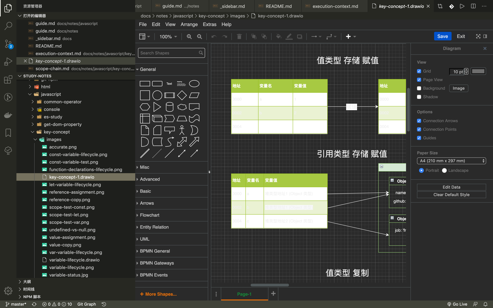

[Paste JSON as Code](https://marketplace.visualstudio.com/items?itemName=quicktype.quicktype)

一键将 `JSON` 文件转换为一个目标语言的类型定义, [可视化生成](https://app.quicktype.io/)


